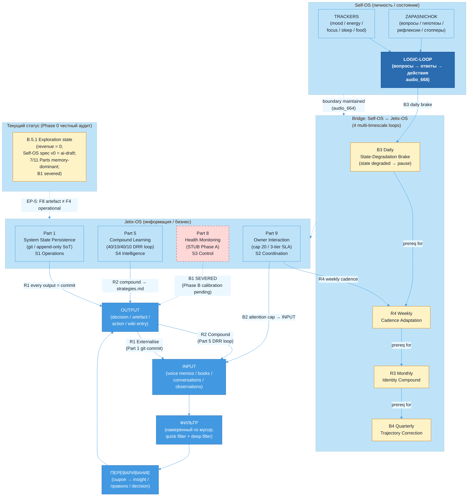

# Jetix as Self-OS Substrate — FPF-Described

> **EP-5 disclosure.** «F8 / LOCKED» в этом документе = Jetix-internal single-author Ruslan ack ≠ FPF B.3 F8 (independent verification). Документ-level grade F2 (минимум по per-claim grades, наиболее консервативная позиция); per-claim F2-F5 see §2.2.
>
> **EP-2 disclosure.** Документ описывает substrate как artefact (mention). Runtime evidence vs aspirational claims разделены в §4 + §3.6 + VSM-table в §4.5; не путать design-face с operational state.
>
> 10-15 min read.

---

## §0 TL;DR (≤200 слов)

Jetix начинается не с корпорации и не с платформы — он начинается с одного человека, который работает с информацией. Этот слой называется Self-OS substrate: персональная система управления вниманием, состоянием, знаниями и действиями конкретного «деятеля» — в данном случае Руслана.

Через FPF-линзу: Jetix-OS = U.System (A.1), оперирующая на информации по четырём фазам — INPUT → ФИЛЬТР → ПЕРЕВАРИВАНИЕ → OUTPUT. Substrate **переключается** между design-time (Foundation revision phases) и run-time (active cycle execution); текущий режим = run-time с Foundation v1.0 LOCKED (CC-A.4.1 — `Tᴰ ∩ Tᴿ = ∅`). Четыре Foundation Parts образуют substrate cluster: Part 1 (System State Persistence — append-only ground truth), Part 5 (Compound Learning), Part 8 (Health Monitoring — currently STUB), Part 9 (Owner Interaction Scaffold).

Через cybernetic-линзу (sys-integrator): Beer VSM mapping выявляет три рабочих loop (R1 externalisation, R2 compound, B2 attention-cap) + один severed loop (B1 health correction — Part 8 SPECIFY AND STUB).

**Честный статус:** substrate aspirational — 7 из 11 Parts memory-dominant, runtime enforcement STUB. Self-OS spec v0 = ai-draft. Ценность документа — архитектурная ясность о том, КАКИМ должен быть этот слой, не о том, что он уже полностью работает. [src: reports/phase-0-fpf-scope/01-jetix-objects-inventory.md §0 + §5 CE-3]

---

## §1 Verbatim source anchors

Пять прямых цитат из первоисточников с `[src:file:§section]`:

**1. Базовый принцип информационной обработки (Doc 1A)**

> «Всё, с чем работает мастерская — это информация. Соответственно у всего есть вход (откуда инфа берётся) и выход (куда уходит после переработки).»

[src: decisions/BASE-MANAGEMENT-SYSTEM-2026-05-04.md §3.1 «Базовый принцип»]

**2. Определение Self-OS из голосовых заметок Руслана**

> «Две сущности их надо будет ещё сегодня детально описать и вместе собрать. С одной стороны — система по управлению обезьяной, по рефлексии (управление состоянием / мотивацией / интересом). С другой — управление процессами / ресурсами / информацией. Не смазывать в одно.»

[src: decisions/SELF-MANAGEMENT-SYSTEM-SPEC-v0-2026-05-16.md §1.1, audio_667]

**3. Logic-loop: вопросы → ответы → действия**

> «Логика такая: задавать определённые вопросы, фиксировать эти вопросы, искать на них ответы — чтобы так мозг работал, эту структуру натянуть в мозге.»

[src: decisions/SELF-MANAGEMENT-SYSTEM-SPEC-v0-2026-05-16.md §2.4, audio_668]

**4. Externalize — освобождает башку (P-3)**

> «Когда у тебя в памяти держать ничего не надо — насколько легче думать. Бошку освобождает.»

[src: decisions/SELF-MANAGEMENT-SYSTEM-SPEC-v0-2026-05-16.md §3.4, audio_98]

**5. Part 5 — compound loop closure**

> «Part 5 closes the R2 reinforcing loop (Senge): every cycle's execution becomes input to the next cycle's improved execution. Without Part 5, the system executes brilliantly once and re-derives the same lessons next cycle — knowledge does not compound across cycles.»

[src: swarm/wiki/foundations/part-5-compound-learning-methodology-capture/architecture.md §0]

---

## §2 FPF mapping (primitives + bounded contexts + claims + F-G-R)

> **Claims в §3 narrative корреспондируют §2.2 F-G-R register (C-1..C-7); inline `[src:]` tags = provenance anchors; F-G-R grades apply per §2.2.**

### §2.1 Примитивы

| FPF primitive | Что представляет в Jetix Self-OS | Статус применения |
|---|---|---|
| **U.System (A.1)** | Jetix-OS как голонная система индивидуальной информационной обработки — Ruslan = owner-holon; Foundation Parts = sub-holons | Используется как основная рамка: O-01 в Phase 0 inventory |
| **U.BoundedContext (A.1.1)** | single-owner = Ruslan Berlin; filesystem = SoT; canonical carrier = git DAG (Part 1); см. §4 Glossary + Invariants + Bridges | Явный — формальные блоки в §4 |
| **A.4 Temporal Duality** | Substrate **переключается** между design-time (Foundation revision phases) и run-time (active cycles); CC-A.4.1 invariant `Tᴰ ∩ Tᴿ = ∅`; текущий режим = run-time с Foundation v1.0 LOCKED | Явный — переформулирован per eng-critic D-DOC01-ENG-2 |
| **U.System composition** | Foundation Parts 1+5+8+9 = четыре sub-holons substrate cluster: State / Learning / Health / Interaction | Используется для структурирования §3 narrative |
| **B.5.1 Exploration state** | Текущее состояние Self-OS substrate = **Exploration** (первая из четырёх: Exploration → Shaping → Evidence → Operation); revenue = 0; spec aspirational; runtime enforcement STUB | Явный — предотвращает operational overclaim |
| **U.MethodDescription (A.3.2) — candidate, pending Ruslan ack** | Self-OS P-1..P-10 principles surfaced from Ruslan voice как «recipe для деятеля»; status = candidate до Ruslan shape-ack (см. D-DOC01-A / D-DOC01-PHIL-2 / D-DOC01-ENG-1) | Перетипизировано из U.WorkPlan — eng-critic R-1 + phil-critic D-DOC01-PHIL-2 + sys-integrator concurs |
| **U.RoleAssignment (A.2.1)** | Ruslan#OwnerRole:Self-OS-substrate-BoundedContext + ROY-swarm#AIScribeRole:Self-OS-substrate-BoundedContext (см. §4.1) | Добавлено per eng-critic I-2 + D-DOC01-ENG-4; grounds H8 trust attestation |
| **B.3 F-G-R** | Document floor F2 (минимум по claims); per-claim F2-F5 в §2.2 | Явный в frontmatter; per-claim в §2.2 |

### §2.2 Per-claim F-G-R (revised after critic review)

| # | Claim | F | G | R |
|---|---|---|---|---|
| C-1 | Jetix-OS = U.System (A.1) оперирующая на информации по pipeline INPUT→ФИЛЬТР→ПЕРЕВАРИВАНИЕ→OUTPUT | F3 | jetix-operational (O-01) | refuted_if_pipeline_absent_from_system_design_OR_Doc1A_§3.1_deprecated · *eng-critic correction: F4→F3 (single source = Doc 1A)* |
| C-2 | Foundation Parts 1+5+8+9 = substrate cluster (State/Learning/Health/Interaction) | F5 | jetix-foundation-canonical | refuted_if_any_of_4_Parts_removed_from_Foundation_v1.0_OR_RUSLAN-ACK_withdrawn |
| C-3 | Self-OS и Jetix-OS разделены (не смешивать личность с бизнесом), но имеют 4 sync points (multi-timescale loops per §4.4) | F2 | self-os-spec-v0-applied-now | refuted_if_Ruslan_collapses_two_systems_explicitly_OR_Self-OS_spec_v0_rejected · *phil-critic D-DOC01-PHIL-1: F3→F2 downgrade (source = ai-draft F2)* |
| C-4 | Logic-loop «вопросы → ответы → действия» = primary management tool для внимания | F3 | self-os-spec-v0-applied-now | refuted_if_audio_668_transcription_misrepresents_Ruslan_intent_OR_spec_rejected |
| C-5 | Текущее состояние = B.5.1 Exploration; 7 из 11 Parts memory-dominant; runtime enforcement STUB | F4 | jetix-honest-audit | refuted_if_operational_audit_shows_all_11_Parts_operationally_evidenced |
| C-6 | P-3 (externalize всё что можно в систему, не в голове) = primary gain Self-OS | F3 | self-os-spec-v0-applied-now | refuted_if_Ruslan_rejects_principle_OR_audio_98_misquoted |
| C-7 | CE-3 status: «Foundation v1.0 LOCKED» = artefact F8 (A.16 language-state) ≠ operational F2-F4 (A.4 runtime); 7 из 11 Parts memory-dominant | F4 | jetix-phase-0-honest-audit | refuted_if_Phase_0_audit_revised_to_show_full_runtime_evidence · *eng-critic I-1: promoted from §3.6 to dedicated register entry* |

---

## §3 Plain English narrative (L1-friendly)

> Claims в этой секции корреспондируют §2.2 F-G-R register (C-1..C-7); `[src:]` tags = provenance anchors.

### §3.1 Почему всё начинается с отдельного человека

Когда Анатолий Левенчук, Цэрэн и другие партнёры смотрят на Jetix — они видят систему управления бизнесом, мастерскую, корпорацию. Но у любой системы есть substrate — фундаментальный слой, на котором всё остальное стоит. В случае Jetix этот substrate — не сервер и не облако. Это один конкретный человек: Руслан, который каждый день работает с информацией.

FPF называет это U.System (A.1) — голонная система, одновременно являющаяся целым (сама по себе, со своей логикой) и частью (компонентом большей системы — Jetix-корпорации, сети мастерских). Целевая роль этого слоя — задавать качество остальных компонентов, выстраиваемых поверх substrate. [src: reports/phase-0-fpf-scope/01-jetix-objects-inventory.md §1 O-01]

### §3.2 Базовый принцип: всё есть информация

Doc 1A (BASE-MANAGEMENT-SYSTEM) формулирует первый принцип предельно просто:

> «Всё, с чем работает мастерская — это информация.»

[src: decisions/BASE-MANAGEMENT-SYSTEM-2026-05-04.md §3.1]

Это не метафора. Любое решение — информация. Любой разговор — информация. Любое состояние (усталость, энергия, фокус) — сигнал, то есть информация о системе. Когда принимается такая рамка, сразу появляется четырёхфазный pipeline:

```
INPUT  →  ФИЛЬТР  →  ПЕРЕВАРИВАНИЕ  →  OUTPUT
```

- **INPUT** — что попадает в систему: книги, голосовые заметки, разговоры, события, наблюдения. Правило (derived from Doc 1A §3.1): input должен быть намеренным, не случайным.
- **ФИЛЬТР** — что пропускаем дальше. Беспощадный: лучше пропустить полезное, чем утонуть в обработке нерелевантного. [src: BASE-MANAGEMENT-SYSTEM §3.1 «Фаза 2»]
- **ПЕРЕВАРИВАНИЕ** — превращаем сырое в усвоенное. «Прочитал книгу» ≠ «узнал что-то». Переваривание = отдельная фаза, требующая отдельного времени. [src: BASE-MANAGEMENT-SYSTEM §3.1 «Фаза 3»]
- **OUTPUT** — наружу что-то выходит: решение зафиксировано, артефакт создан, сообщение отправлено. [src: BASE-MANAGEMENT-SYSTEM §3.1 «Фаза 4»]

Именно этот pipeline — не технология — является ядром Jetix-OS.

### §3.3 Два параллельных слоя: Self-OS и Jetix-OS

Руслан провёл критическую границу в голосовых заметках (audio_664, audio_667): нельзя смешивать ресурсы личности и ресурсы бизнеса «в одной каше в башке». Это не тактическое решение — это архитектурный принцип. [src: decisions/SELF-MANAGEMENT-SYSTEM-SPEC-v0-2026-05-16.md §1.2 + audio_664]

| | Self-OS | Jetix-OS |
|---|---|---|
| Объект управления | Личность, состояние, тело, внимание | Проекты, клиенты, знания, процессы |
| Вход | Эмоции, физ. сигналы, сон, питание | Voice memos, решения, CRM, wiki |
| Выход | Решения о привычках, здоровье, границах | Решения, публикации, артефакты |
| Метрики | Mood, energy, focus-depth | KM lifecycle, SG-N, финансы |

[src: decisions/SELF-MANAGEMENT-SYSTEM-SPEC-v0-2026-05-16.md §1.3 table — ai-draft synthesis from audio_664/audio_667]

При этом у двух систем есть четыре точки синхронизации, которые лучше моделировать как **feedback loops at different timescales** (см. §4.4 multi-timescale loop framing, sys-integrator extension D-DOC01-B):

1. **B3 Daily — State-Degradation Brake** (balancing, acute): state degraded → auto-pause critical Jetix decisions
2. **R3 Monthly — Identity Compound** (reinforcing, slow): identity update → may inform RUSLAN-LAYER overrides
3. **B4 Quarterly — Trajectory Correction** (balancing): quarterly review → personal trajectory informs business direction
4. **R4 Weekly — Cadence Adaptation** (reinforcing): habit cluster recognition → adapt Jetix cadence

[src: decisions/SELF-MANAGEMENT-SYSTEM-SPEC-v0-2026-05-16.md §6.3 — ai-draft synthesis from audio_664/audio_667; multi-timescale reframing per sys-integrator §7 D-DOC01-B]

Обе системы используют общий substrate: filesystem = source of truth, markdown + YAML frontmatter, append-only logs, Pillar C constitutional principles. [src: decisions/SELF-MANAGEMENT-SYSTEM-SPEC-v0-2026-05-16.md §6.4]

### §3.4 Четыре Foundation Parts как sub-holons substrate cluster

Foundation v1.0 содержит 11 Parts. Для Self-OS substrate критически важны четыре — они образуют «кластер субстрата». **Runtime caveat:** descriptions ниже = design-face (spec); operational state see §4 Runtime evidence + §4.5 VSM mapping. Per claim status preserved per phil-critic D-DOC01-PHIL-4.

**Part 1 — System State Persistence.** Дизайн-принцип: всё, что не зафиксировано в git — не существует как canonical state. Append-only, content-addressable substrate. Runtime: 571 commit/month evidenced (фактический). Каждый коммит несёт [area] + verb + what + optional why. [src: swarm/wiki/foundations/part-1-system-state-persistence/architecture.md §0]

**Part 5 — Compound Learning & Methodology Capture.** Дизайн-принцип: reinforce-loop (Senge R2) — каждый цикл исполнения → input для следующего цикла. Без Part 5 система «одинаково умна» каждый цикл. Формула 40/10/40/10 (Plan / Work / Review / Compound). Runtime: compound step spec'ирует создание DRR-записей в agents/*/strategies.md; **compound-application-rate metric = unstated** (Phase A gap per Part 5 R-condition). [src: swarm/wiki/foundations/part-5-compound-learning-methodology-capture/architecture.md §0]

**Part 8 — Health Monitoring & System Integrity.** Дизайн-принцип: система должна знать о своём состоянии. Runtime: **SPECIFY AND STUB** (Phase A); SLI/SLO calibration parameters = starter values; live metric collection deferred to Phase B. Это означает: B1 health correction loop **effectively severed** до Phase B calibration (sys-integrator D-DOC01-SYS-1). [src: swarm/wiki/foundations/part-8-health-monitoring-system-integrity/architecture.md frontmatter + Bundle 3 scope]

**Part 9 — Owner Interaction Scaffold.** Дизайн-принцип: spec'ирует механизм закрытия attention loop владельца. Структура: утреннее намерение → dispatch cycles → вечерняя рефлексия. Еженедельный review. Ежемесячная стратегическая рефлексия. Attention budget capped: max 20 active tasks. 3-tier SLA. Runtime: **daily-log directory absent** per honest audit (S2 coordination gap — most acute operational gap, sys-integrator D-DOC01-SYS-2). [src: swarm/wiki/foundations/part-9-owner-interaction-scaffold/architecture.md §0]

**Статус секции:** design-face описания; operational enforcement см. §3.6 + §4 Runtime evidence + §4.5 VSM mapping.

### §3.5 Reflection mechanic: logic-loop вопросы → ответы → действия

Self-OS spec v0 §2.4 описывает ключевой механизм рефлексии — не просто self-check, а структурированная работа с вниманием и мышлением:

> «Задавать определённые вопросы, фиксировать эти вопросы, искать на них ответы — чтобы так мозг работал, эту структуру натянуть в мозге.»

[src: decisions/SELF-MANAGEMENT-SYSTEM-SPEC-v0-2026-05-16.md §2.4, audio_668]

Два класса вопросов:
- **Category A (self-check):** «Как ты себя чувствуешь?», «На что тратил время?», «Где compound, где утечка?»
- **Category B (focus-holders):** «Как можно сделать вот это?», «Как может работать это с этим?», «Что я не понимаю про X?»

Workflow: система задаёт Category A по расписанию → Ruslan добавляет Category B ad-hoc → вопросы записываются → ответы ищутся (voice pipeline / wiki / research) → закрытие с cross-ref в источник. [src: decisions/SELF-MANAGEMENT-SYSTEM-SPEC-v0-2026-05-16.md §2.4 Workflow 1-6]

Part 9 monthly cadence = institutional rhythm этого loop на уровне Foundation.

### §3.6 Граница Self-OS ↔ Jetix-OS и Meadows leverage

Принцип P-3 (Externalize всё что можно в систему): «Когда у тебя в памяти держать ничего не надо — насколько легче думать». [src: decisions/SELF-MANAGEMENT-SYSTEM-SPEC-v0-2026-05-16.md §3.4, audio_98]

Это shared substrate для обеих систем. Ни Self-OS, ни Jetix-OS не живут в голове — они живут в filesystem. Обе используют git как SoT, оба следуют Pillar C (12 constitutional rules), обе используют append-only logs.

**Meadows leverage points (sys-integrator §2 ranking):**

| Rung | Lever | Where in substrate | Priority |
|---|---|---|---|
| **L6** (information flows) | Externalize everything into filesystem (P-3 principle) | Part 1 (git SoT) + voice-pipeline | **Highest** |
| **L4** (delays) | Digestion delay INPUT → ПЕРЕВАРИВАНИЕ (voice memos → wiki commit) | Part 1 + voice-pipeline + Part 9 daily cadence | **High** |
| **L5** (feedback loop strength) | Compound loop gain (DRR → next-cycle behaviour) | Part 5 DRR ledger | **High** |
| **L8** (rules) | Logic-loop discipline (category-A/B questions) | Part 9 daily-log + zapasnichok | **Medium** |
| **L9** (goals) | Boundary principle P-1: «бизнес для здоровья ради жизни» | Pillar C + Self-OS spec v0 §1.1 | **Medium** |
| **L12** (constants) | Attention cap = 20 active tasks (RUSLAN-LAYER) | Part 9 SLA taxonomy | **Low** |

L6 (information flows) — highest-priority intervention point. Без consistent L6 discipline, L4 delays cannot be measured и L5 compound loop gain cannot be calibrated. [src: sys-integrator §2 D-DOC01-SYS analysis]

**Ключевое ограничение (CE-3 из Phase 0, C-7 в §2.2):** «Foundation v1.0 LOCKED» = language-state документов (A.16), НЕ подтверждение операционной системы (A.4). 7 из 11 Parts = memory-dominant substrate. Self-OS spec v0 статус = ai-draft. [src: reports/phase-0-fpf-scope/01-jetix-objects-inventory.md §5 CE-3]

**Это честная картина текущего состояния:** архитектура спроектирована и задокументирована; execution = aspiration, не факт.

---

## §4 FPF formal version

**Системная декларация (компактная).**

Jetix Self-OS substrate = **U.System(A.1)** с:

### §4.1 U.BoundedContext (A.1.1) declarations

**Glossary** (local vocabulary):
- **deyatel** (rus, «деятель») — entity executing OperationalMethods within substrate context; primary referent: Ruslan
- **zapasnichok** (rus, «запасничок») — append-only file capturing open questions / hypotheses / reflections per Self-OS spec §2.4
- **logic-loop** — Self-OS reflection mechanic (audio_668): question-recording → answer-seeking → action-recording → close-with-cross-ref
- **R1/R2/B1/B2/B3/B4/R3/R4** — Senge feedback loop labels (R = reinforcing, B = balancing); see §4.4

**Invariants** (rules holding inside this BoundedContext):
- I-1: filesystem = source of truth; no canonical state outside git
- I-2: all logs append-only (FUNDAMENTAL §5.4)
- I-3: Pillar C Tier-2 12 constitutional rules apply uniformly (Self-OS and Jetix-OS both bound)
- I-4: Foundation-path writes require AWAITING-APPROVAL packet (Part 6b)
- I-5: F-G-R triple required for every promoted claim (B.3)

**Roles** (A.2.1 declarations):
- `Ruslan#OwnerRole:Self-OS-substrate-BoundedContext` — sole strategist; R1-attribution authority; sole acker on principle shape
- `ROY-swarm#AIScribeRole:Self-OS-substrate-BoundedContext` — surfacing + structuring + drafts; never authors strategic prose; cannot self-modify at runtime (Pillar C rule 9)
- `Part6b#ConstitutionalEnforcerRole:Foundation-BoundedContext` — Halt-Log-Alert on F8 violations within ≤1s

**Bridges** (translation to adjacent contexts):
- Self-OS ↔ Jetix-OS Bridge — 4 multi-timescale feedback loops (§4.4); not static sync points (per AP-6 dissent preservation D-DOC01-B both framings)
- Self-OS ↔ Tribe (Doc 03) Bridge — individual substrate = atomic unit People-NS via mutual instrumentation
- Foundation generic ↔ RUSLAN-LAYER Bridge — overrides applied per Pillar C Tier 2 instance-specific layer

### §4.2 A.4 Temporal Duality

- Design face = Foundation v1.0 LOCKED (11 Parts + Pillar C; artefact F8 = Jetix-internal single-author ack ≠ FPF B.3 F8)
- Run face = active cycles + voice pipeline + wiki + ROY swarm (operational F2-F4)
- **CC-A.4.1 invariant:** `Tᴰ ∩ Tᴿ = ∅` — substrate **alternates** between modes; current mode = Tᴿ (run-time). Revisions enter Tᴰ briefly via AWAITING-APPROVAL packets.

[Per eng-critic D-DOC01-ENG-2: this fixes the prior «simultaneous modes» framing.]

### §4.3 B.5.1 state declaration

`B.5.1 state = **Exploration**` (first of four: Exploration → Shaping → Evidence → Operation; per eng-critic precision note):
- revenue = 0
- Self-OS spec v0 = ai-draft
- runtime enforcement STUB
- 7 of 11 Foundation Parts memory-dominant

### §4.4 Multi-timescale feedback loops (Self-OS ↔ Jetix-OS Bridge)

Per sys-integrator §7 D-DOC01-B validation (both framings preserved AP-6):

| Loop | Polarity | Timescale | Substrate | Current state |
|---|---|---|---|---|
| **R1 Externalisation** | + reinforcing | Continuous | Part 1 git + voice-pipeline + P-3 | Evidenced (571 commits/month); gain variable, depends on pipeline latency |
| **R2 Compound Knowledge** | + reinforcing | Per cycle | Part 5 DRR ledger | Declared; gain unstated (compound-application-rate metric absent) |
| **B1 Health Correction** | − balancing | Daily-weekly | Part 8 S3 (stub) + Part 6b enforcement | **SEVERED** (D-DOC01-SYS-1): Phase A stub-only; no live signal collection until Phase B calibration |
| **B2 Attention-Budget** | − balancing | Daily | Part 9 SLA (20-task cap) | Weakly closed (cap exists but no sensor for breach detection) |
| **B3 State-Degradation Brake** | − balancing | Daily (acute) | (sync 1) Part 8 → Jetix decision pause | STUB; manual enforcement |
| **R4 Cadence Adaptation** | + reinforcing | Weekly | (sync 4) Part 9 review → cadence | Memory-dominant |
| **R3 Identity Compound** | + reinforcing | Monthly-quarterly | (sync 2) RUSLAN-LAYER updates | Aspirational |
| **B4 Trajectory Correction** | − balancing | Quarterly | (sync 3) quarterly review | Aspirational (OQ-DOC01-5 identity doc not materialised) |

**Prerequisite-dependency chain** (D-DOC01-SYS-3): Daily B3 → Weekly R4 → Monthly R3 → Quarterly B4. Faster loops must be operational before slower loops can be trusted. Currently B3 stub-only → quarterly B4 making course corrections on trajectory it cannot measure at daily resolution.

**Loop dominance (Phase A):** R1 + R2 dominant; B1 severed; B2 weak. Reinforcing-dominant configuration — beneficial for growth, fragile к disruption R1 substrate (travel, intensive meetings, voice-pipeline outage).

### §4.5 Beer VSM mapping (S1-S5)

| VSM | Function | Foundation Part(s) | Phase A state |
|---|---|---|---|
| **S1 Operations** | Day-to-day info processing (voice→wiki→commit) | Part 1 + voice-pipeline | **Evidenced** (571 commits/month) |
| **S2 Coordination** | Anti-oscillation Self-OS ↔ Jetix-OS inputs | Part 9 (daily-log + SLA + cap) | **Partially operational** — daily-log directory absent (D-DOC01-SYS-2 most acute gap) |
| **S3 Control/Audit** | Health monitoring, drift detection | Part 8 (SLI/SLO + TRADEOFF-01) | **SPECIFY AND STUB** — most critical VSM gap |
| **S4 Intelligence** | Compound learning, future adaptation | Part 5 (40/10/40/10 + DRR ledger) | **Best-developed** layer; depends on S3 signal (partial blind) |
| **S5 Policy/Identity** | Constitutional principles + identity | Pillar C + P-1 + monthly reflection | **Split-grade** — Pillar C F5 LOCKED + P-1 F2 ai-draft + monthly cadence aspirational |

**Verdict:** viable in design, partial in operation. Critical gap = S3 → S1 feedback path (B1 severed) until Phase B Part 8 calibration. [src: sys-integrator §3]

### §4.6 Dependencies + Runtime evidence vs aspirational

**Dependencies:**
- Part 6b (Human Gate): AWAITING-APPROVAL packets for foundation-level writes
- Part 6a (Provenance Officer): F-G-R tagging on promoted claims
- Pillar C: 12 Tier-2 rules apply to both Self-OS и Jetix-OS uniformly

**Runtime evidence (evidenced):**
- voice pipeline (11 reviews active)
- wiki 551 records
- git active (571 commits/month)
- Part 1 commit interface
- R1 externalisation loop operational

**Aspirational (not yet operational):**
- Self-OS daily-log directory absent (S2 gap)
- Part 9 monthly reflection cadence = spec-only (R3/B4 gap)
- Self-OS dashboard не реализован
- Part 5 compound-application-rate metric unstated (R2 gain unknown)
- Part 8 live signal collection (B1 severed)
- Quarterly identity doc not materialised (OQ-DOC01-5)

---

## §5 Mermaid diagram



---

## §6 Connections / cross-refs

### §6.1 Phase 0 объекты (из 01-jetix-objects-inventory.md)

| Object | Связь |
|---|---|
| **O-01** Jetix оперативный субстрат | PRIMARY anchor — U.System (A.1) + U.BoundedContext (A.1.1); этот doc = primary FPF-described view O-01 |
| **O-07** Foundation Architecture v1.0 | SECONDARY anchor — Foundation Parts 1+5+8+9 cluster; A.4 Temporal Duality; D-2 dispute preserved (U.System vs U.Episteme) |
| **O-13** People-Network-State / Clan | Cross-link — individual substrate prerequisite для tribal layer (doc 03) |
| **O-04** Работающий продукт | Voice pipeline + wiki 551 records + git = evidenced runtime substrate components |

### §6.2 H1-H8 Octagon Strategic Insights

| Insight | Relevance |
|---|---|
| **H1** Foundation Model | Substrate = foundation H1 anchor; info-processing pipeline = практическое воплощение [src: decisions/STRATEGIC-INSIGHT-JETIX-AS-FOUNDATION-MODEL-2026-05-10.md] |
| **H6** Gamified Platform | Self-OS principles include «hyper-stimulate в полезном направлении» (ai-draft synthesis from audio_666); gamification = способ motive-alignment substrate-level [src: decisions/SELF-MANAGEMENT-SYSTEM-SPEC-v0-2026-05-16.md §3.7 — ai-draft] |
| **H7** People-Network-State | Individual substrate = atomic unit People-NS; R12 anti-extraction применяется symmetrically к self-substrate [src: decisions/STRATEGIC-INSIGHT-JETIX-AS-PEOPLE-NETWORK-STATE-2026-05-12.md + Self-OS spec §8.2 — ai-draft synthesis] |
| **H8** Trust Infrastructure | Trust infrastructure grounds в role-attestation (A.2.1) — declared в §4.1 для substrate level. См. doc 06 для primitive cluster [src: decisions/STRATEGIC-INSIGHT-JETIX-TRUST-INFRASTRUCTURE-2026-05-17.md §3] |

### §6.3 Foundation Parts cluster

- **Part 1** — State Persistence [src: swarm/wiki/foundations/part-1-system-state-persistence/architecture.md §0]
- **Part 5** — Compound Learning [src: swarm/wiki/foundations/part-5-compound-learning-methodology-capture/architecture.md §0]
- **Part 8** — Health Monitoring [src: swarm/wiki/foundations/part-8-health-monitoring-system-integrity/architecture.md frontmatter + Bundle 3]
- **Part 9** — Owner Interaction [src: swarm/wiki/foundations/part-9-owner-interaction-scaffold/architecture.md §0]

### §6.4 Cross-links к другим docs серии

[TBD — forward-refs to docs being written in Phase 2]

| Doc | Как связан |
|---|---|
| **02 Jetix as Methodology** | Self-OS substrate = individual deyatel using method as инструмент; U.MethodDescription применяется к P-1..P-10 candidates |
| **03 Jetix as Virtual Tribe** | Individual substrate (этот doc) → tribe formation через mutual instrumentation; Self-OS integrity = precondition для tribal trust |
| **04 Jetix as Corporation** | Corporation layer rides on top of substrate; healthy substrate = precondition для устойчивых business commitments |
| **05 Jetix as Platform** | Meta-workshop = composition individual workshops каждая с own substrate |
| **06 Jetix as Clean Internet Layer** | Individual commitment integrity = atomic unit trust infra H8 |
| **07 End-to-End Overview** | Этот doc = Layer 0 в end-to-end stack |

---

## §7 Open questions для Ruslan (R1 surface)

**OQ-DOC01-1. Граница Self-OS ↔ Jetix-OS: где именно hard cutoff?** Apparent tension audio_664 vs audio_94 («Jetix служит мне» vs «я служу Jetix»). Какой принцип precedence когда конфликт? [src: decisions/SELF-MANAGEMENT-SYSTEM-SPEC-v0-2026-05-16.md §9.Q1]

**OQ-DOC01-2. Self-OS cadence: какие реально выполнимы?** Daily morning + evening + weekly + monthly + quarterly — wishful vs реально соблюдаемые? [src: decisions/SELF-MANAGEMENT-SYSTEM-SPEC-v0-2026-05-16.md §9.Q2]

**OQ-DOC01-3. CE-3 execution gap — когда 7/11 memory-dominant Parts станут operational?** Конкретный milestone / trigger для движения от memory-dominant к operational enforcement? Sys-integrator surfaces Part 8 Phase B calibration как критический blocker для B1 loop closure. [src: reports/phase-0-fpf-scope/01-jetix-objects-inventory.md §5 CE-3 + sys-integrator §3 D-DOC01-SYS-1]

**OQ-DOC01-4. Self-OS P-1..P-10 как U.MethodDescription — final shape?** Spec status = ai-draft. Ruslan не ack'нул финальный список principles. **BLOCKING для promotion U.MethodDescription → U.WorkPlan.** [src: decisions/SELF-MANAGEMENT-SYSTEM-SPEC-v0-2026-05-16.md §3 + §10.Q1-Q10 + eng-critic D-DOC01-ENG-1]

**OQ-DOC01-5. Identity doc — public/private/quasi?** «моё отношение к себе же — кто я / что я / почему» — gitted (public-ish) или local-only (private/)? R12: если gitted — AI-scribe scope над личной идентичностью требует explicit ack. [src: decisions/SELF-MANAGEMENT-SYSTEM-SPEC-v0-2026-05-16.md §9.Q8 + audio_664]

**OQ-DOC01-6 (new from sys-integrator).** Daily-log directory materialisation — when (S2 acute gap)? Minimal viable S2 = daily-log + minimal tracking habit. [src: sys-integrator §3 D-DOC01-SYS-2]

---

## §8 R1 reaffirmation + dissents preserved (AP-6)

### §8.1 R1 attribution

**prose_authored_by: ruslan-via-voice-dictation+brigadier-structured.**

Этот документ:
- **Verbatim Ruslan-voice** (audio_664, audio_667, audio_668, audio_98, audio_666 + Doc 1A §3.1) — quoted в §1 source anchors;
- **ai-draft synthesis (Self-OS spec v0)** — структура sync points, P-1..P-10 shape, identity table — these are ai-draft expansions из голосовых тезисов, не verbatim Ruslan dictation; phil-critic D-DOC01-PHIL-3 flagged provenance chain opacity, исправлено в attribution chains;
- **Brigadier-structured** — FPF-mapping, F-G-R triples, mermaid diagram, VSM mapping, Meadows leverage ranking, multi-timescale loop reframing.

Никакого agent-pending strategic prose. P-1..P-10 final shape — Ruslan authority (OQ-DOC01-4 BLOCKING до ack).

### §8.2 Dissents preserved (AP-6) — 14 entries

**Convention.** AP-6 dissent format: F (formality), ClaimScope (where holds / not valid), R (refutation criterion / receipt / accepted_if). Brigadier integrates без averaging.

#### Convergent dissents (multiple cells agree)

**D-DOC01-A: P-1..P-10 misclassification as U.WorkPlan**
- *Held by:* phil × critic (D-DOC01-PHIL-2 epistemological) + eng × critic (D-DOC01-ENG-1 semantic) — **convergent**
- *Position:* P-1..P-10 cannot be U.WorkPlan (A.15.2) per FPF Spec — lack planned windows, performers, budgets, acceptance targets. Correct = U.MethodDescription (A.3.2) candidate pending Ruslan ack.
- *F:* F5 | *ClaimScope:* applies to §2.1 + §4 primitive labels; not valid after Ruslan shape-ack | *R:* refuted_if FPF Spec revises A.15.2 (very unlikely); accepted_if canonical write uses U.MethodDescription candidate
- **Status:** RESOLVED-BY-EDIT — §2.1 + §4 corrected; OQ-DOC01-4 BLOCKING flag added

**D-DOC01-B: Sync table static vs multi-timescale feedback loops**
- *Held by:* phil × critic (provisional) + sys × integrator (validated + extended) — both framings preserved
- *Position:* Static sync-table = correct trigger-condition description; sys-integrator adds dynamic model (B3 daily → R4 weekly → R3 monthly → B4 quarterly) with prerequisite-dependency chain.
- *F:* F3 (phil) / F3 (sys composite) | *ClaimScope:* Phase A single-owner; nested multi-loop predicts that fastest loop (B3 stub) blocks reliable slowest loop (B4 quarterly) | *R:* refuted_if Ruslan B4 produces reliable course corrections without B3; accepted_if absence of daily tracking correlates with lower-quality quarterly reflections
- **Status:** BOTH FRAMINGS PRESERVED — §3.3 + §4.4 contain both; eng-implementation = trigger conditions, governing model = multi-timescale loops

**D-DOC01-C: A.15 Role-Method-Work + A.2.1 RoleAssignment gap**
- *Held by:* phil × critic (epistemological completeness) + eng × critic (FPF structural — D-DOC01-ENG-4 specifically A.2.1) — **convergent**
- *Position:* §2.1 lacked A.15 Role-Method-Work quartet + A.2.1 U.RoleAssignment declaration despite roles being named in narrative.
- *F:* F4 | *ClaimScope:* Doc 01 substrate; grounds H8 trust attestation | *R:* refuted_if A.15 quartet completeness reserved for Doc 04/06; accepted_if §4.1 declares Ruslan#OwnerRole + ROY-swarm#AIScribeRole
- **Status:** RESOLVED-BY-EDIT — §4.1 A.2.1 declarations added

#### Phil × critic standalone dissents

**D-DOC01-PHIL-1: C-3 grade inflation from ai-draft source**
- *Position:* C-3 assigned F3 while source = Self-OS spec v0 ai-draft (F2). F3 > F2 source without explicit upgrade = grade inflation per B.3.
- *F:* F4 | *ClaimScope:* Self-OS spec v0 status ai-draft | *R:* refuted_if Ruslan ack + corroborating source brings C-3 to F3; accepted_if canonical without ack
- **Status:** RESOLVED-BY-EDIT — C-3 downgraded F3→F2; frontmatter F floor F2

**D-DOC01-PHIL-3: Sync points provenance chain opacity**
- *Position:* §3.3 sourced without disclosure that spec = ai-draft.
- *F:* F3 | *ClaimScope:* §3.3 + §8.1 | *R:* refuted_if attribution chain explicitly includes «ai-draft synthesis» qualifier; accepted_if opacity persists
- **Status:** RESOLVED-BY-EDIT — attribution chains updated throughout §3.3 + §6.2 + §8.1

**D-DOC01-PHIL-4: §3.4 present-tense EP-2 slips**
- *Position:* §3.4 described Part 5 «создаёт DRR» + Part 9 «Закрывает attention loop» в present operational tense despite §4 declaring spec-only.
- *F:* F4 | *ClaimScope:* §3.4 Part 5 + Part 9 paragraphs | *R:* refuted_if per-claim runtime caveat added; accepted_if contradiction persists
- **Status:** RESOLVED-BY-EDIT — §3.4 runtime caveats added per claim; aspirational vs evidenced explicit

#### Eng × critic standalone dissents

**D-DOC01-ENG-2: A.4 temporal invariant violation**
- *Position:* «существует в двух режимах одновременно» violates CC-A.4.1 `Tᴰ ∩ Tᴿ = ∅`.
- *F:* F5 | *ClaimScope:* A.4 invariant scope | *R:* high refutation if FPF Spec permits simultaneous dual modes (contradicts CC-A.4.4)
- **Status:** RESOLVED-BY-EDIT — §0 + §4.2 reformulated as «alternates»

**D-DOC01-ENG-3: A.1.1 BoundedContext incomplete**
- *Position:* §4 names properties but lacks Glossary + Invariants + Bridges per A.1.1:1.
- *F:* F4 | *ClaimScope:* A.1.1 conformance | *R:* medium — F3 may permit lighter treatment
- **Status:** RESOLVED-BY-EDIT — §4.1 full A.1.1 declarations added

#### Sys × integrator standalone dissents

**D-DOC01-SYS-1: B1 health correction severed, not weak**
- *Position:* Part 8 SPECIFY AND STUB → B1 balancing loop effectively severed (not partially-operational); 3 operational loops + 1 severed, not 4 partial.
- *F:* F4 | *ClaimScope:* Phase A until Phase B Part 8 calibration | *R:* refuted when Part 8 Phase B delivers live signals + documented corrective alert; accepted while SPECIFY AND STUB
- **Status:** PRESERVED IN CANONICAL — §4.4 + §4.5 + §5 mermaid (severed classDef) all reflect B1 severed framing

**D-DOC01-SYS-2: S2 most acute operational gap (not S3)**
- *Position:* S2 (daily-log + minimal tracking habit) is immediately actionable; S3 requires Phase B investment. S2 gap = precise problem Self-OS was designed to solve («не смешивать»).
- *F:* F3 | *ClaimScope:* Phase A; partial resolution if daily-log materialised within sprint | *R:* refuted_if daily-log + consistent use within 30d; accepted while absent
- **Status:** PRESERVED — §4.5 VSM table + §7 OQ-DOC01-6 surface; §3.4 Part 9 runtime caveat reflects

**D-DOC01-SYS-3: Prerequisite-dependency chain invisible in mermaid**
- *Position:* Eng-integrator mermaid showed loops but not prerequisite chain (daily B3 → weekly R4 → monthly R3 → quarterly B4).
- *F:* F3 | *ClaimScope:* L1 audience comprehension | *R:* refuted if revised diagram + Anatoly/Tseren feedback confirms understood; accepted if static sync-table is final
- **Status:** RESOLVED-BY-EDIT — §5 mermaid extended with BRIDGE subgraph showing prereq chain

#### Eng × critic improvement items (non-blocking)

**D-DOC01-ENG-4: A.2.1 U.RoleAssignment absence** — **RESOLVED-BY-EDIT** (§4.1)

#### Phil × critic improvement items (non-blocking)

**D-DOC01-PHIL-2: U.WorkPlan preemptive typing** — **RESOLVED-BY-EDIT** (subsumed by D-DOC01-A resolution)

### §8.3 R1 final reaffirmation

Ruslan = sole strategist. All strategic prose (boundaries, principles, sync-point semantics, identity decisions) либо verbatim Ruslan (audio_NNN) либо ai-draft synthesis explicitly disclosed либо brigadier-organizational. OQ-DOC01-4 (P-1..P-10 final shape) + OQ-DOC01-5 (identity doc visibility) + OQ-DOC01-6 (daily-log materialisation) = BLOCKING для дальнейшей promotion. Brigadier surfaces; не resolves autonomously.

---

*Brigadier integration complete with AP-6 dissent preservation (14 dissents tracked: 9 resolved-by-edit, 5 preserved-in-canonical). §5.5.5 provenance gate: passed (provenance per claim; F-G-R triples complete; no Foundation Parts modification; non-contradicting H1-H8 LOCKED). Cells dispatched: eng × integrator + phil × critic + eng × critic + sys × integrator (4-cell verification chain per Phase 1 plan §2.2).*
