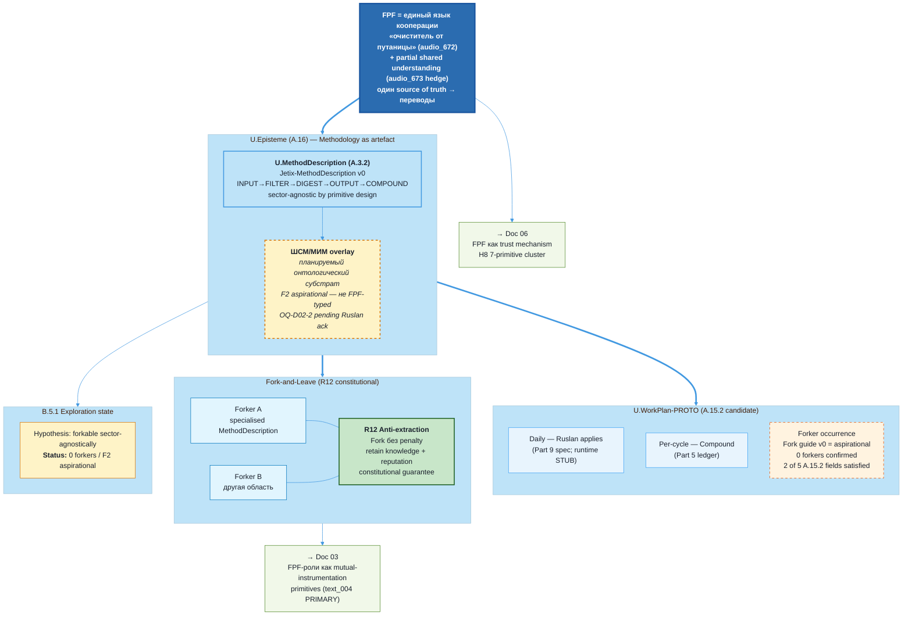

# Jetix as Methodology — FPF-Described (Doc 02)

> **EP-5 disclosure.** «F8 / LOCKED» = Jetix-internal single-author Ruslan ack, NOT FPF B.3 F8 (independent verification). Document floor F2; per-claim F2-F5 in §2.
>
> **EP-2 disclosure.** Этот документ описывает O-05 как artefact (mention). Fork guide v0 = 6-step outline; 0 forkers подтверждено на 2026-05-17.
>
> **LIVE-FLAG B2.** Aisystant subscription blocked. Сравнения с IWE paid AI guide скопированы ТОЛЬКО на public template v0.31.0.
>
> 10-15 min read.

---

## §0 TL;DR (≤200 слов)

Jetix — не просто AI OS для одного человека. Это **методология**: способ мышления и работы с информацией, который можно описать, передать и воспроизвести. Методология оформлена через FPF (Foundation Patterns Framework Анатолия Левенчука) — **единый язык** (в какой-то степени — audio_673) описания методов, бизнесов, кооперации, самостоятельной работы и философии.

Через FPF-линзу: O-05 Jetix-как-методология = U.MethodDescription (A.3.2) — рецепт действий. Методология распределяется не как SaaS-продукт, а как **паттерн**: форкни → адаптируй → работай по правилам без экстракции (R12). ШСМ (Школа Системного Менеджмента) и МИМ — **планируемый онтологический субстрат (F2 aspirational)**, на котором Jetix строится; формализация overlay = OQ-D02-2.

**Честный статус (B.5.1 Exploration):** Fork guide v0 = aspirational (6-step outline); 0 forkers подтверждено; distributable format отсутствует. Методология работает сейчас как внутренняя organizational framework (F4 internal-operational), НЕ как публичный дистрибутив (F2 aspirational).

Cross-link → doc 03 (text_004 PRIMARY HOME): FPF-роли как примитивы mutual instrumentation. Cross-link → doc 06: FPF как trust mechanism (H8 7-primitive cluster).

[src: reports/phase-0-fpf-scope/01-jetix-objects-inventory.md §1 O-05; vision/jetix-fpf-describe-PLAN-2026-05-17.md §2.2 doc-02 row; phil-critic edits B + C applied]

---

## §1 Verbatim source anchors

**1. FPF как единый язык (audio_672)**

> «У нас должен быть **один source of truth**, какие-то ещё все эти понятия утверждены в одном документе. И потом уже отталкиваясь от него переводы на человеческий язык. ... это как раз и наш **очиститель от путаницы** должен быть.»

[src: raw/voice-transcripts/audio_672@17-05-2026_18-59-52.txt ¶1-2]

**2. FPF как язык кооперации (audio_672)**

> «Мы нанимаем звёзд, но при этом даём им **язык кооперации, вот этот FPF**, плюс ещё у каждого там усиление, ну просто ебейший усилитель есть, плюс переводчик. И соответственно все работают над одной базой, которая вот по FPF написана.»

[src: raw/voice-transcripts/audio_672@17-05-2026_18-59-52.txt ¶3]

**3. FPF для описания методов, бизнесов, кооперации (text_002)**

> «Вот этот вот подход — по FPF общаться — его дальше нужно вот использовать в описаниях всех как бы методов, бизнесов, вариантов кооперации, самостоятельной работы, ну и типа философии. Создать новую систему.»

[src: vision/00-MASTER-VISION-PLAN-2026-05-17.md §1 text_002 ¶1-2]

**4. FPF как partial shared understanding (audio_673)** — restored hedge per phil-critic Edit C

> «Ты можешь свои конкретно мысли хуяк зафиксировать конкретно в этом документе, потом дать это другому человеку. Он это читает, анализирует, и потом тоже у себя фиксирует вот эту же картинку в голове. И вы как бы общаетесь об одном и том же — **в какой-то степени**.»

[src: vision/00-MASTER-VISION-PLAN-2026-05-17.md §1 audio_673 — hedge restored per D-DOC02-PHIL-1]

**5. Fork-and-Leave (Clan Charter §11)**

> «Участники могут выйти из Clan в любой момент, сохраняя всё что наработали — знания, связи, репутацию. Никакого penalty, никакого lock-in.»

[src: decisions/JETIX-FIRST-CLAN-CHARTER-2026-05-12.md §11, R12 constitutional anchor]

**6. O-05 статус (Phase 0 inventory)**

> «Fork guide v0 (§11 working file) — minimal viable instance (6 шагов). Aspirational — нет distributable format; нет первого forker. Phase C remit.»

[src: reports/phase-0-fpf-scope/01-jetix-objects-inventory.md §2 O-05]

---

## §2 FPF mapping — примитивы, bounded contexts, F-G-R

### §2.1 Основной примитив — U.MethodDescription (A.3.2)

**U.MethodDescription** — рецепт действий: упорядоченный набор шагов, исполнителей, входов/выходов, описывающий КАК производить результат.

Jetix-как-методология = U.MethodDescription потому что:
- Описывает рецепт работы с информацией (INPUT → FILTER → DIGEST → OUTPUT из doc 01)
- Содержит роли (U.Role A.2), методы (U.Method A.3.1), рабочие планы (U.WorkPlan A.15.2)
- Сектор-агностичен по primitive design (домен-агностичные примитивы — не утверждение о всех применениях)
- Forkable по замыслу: U.MethodDescription можно скопировать + специализировать + Fork-and-Leave

F: F5 / G: fpf-primitive-assignment / R: refuted_if_FPF_Spec_A.3.2_definition_changes_to_exclude_sector-agnostic_applicability

### §2.2 Вторичный — U.Method (A.3.1)

**U.Method** — конкретное occurrence: данный Ruslan применяет MethodDescription сейчас. Различие: A.3.2 = рецепт (инвариант), A.3.1 = приготовление (реализация).

F: F5 / G: fpf-primitive-assignment / R: refuted_if_FPF_Spec_A.3.1_A.3.2_boundary_revised

### §2.3 U.WorkPlan (A.15.2) — **proto-candidate**, downgraded per eng-critic R-1

**Per eng-critic D-DOC02-ENG-1 + D-DOC02-ENG-W**: Fork guide v0 satisfies только 2 of 5 A.15.2:4.1 requirements (planned windows partial; intended performers — yes; **dependencies, resource budgets, acceptance targets — absent**). Therefore:

- Status: **proto-U.WorkPlan candidate** pending v1.0 formalisation
- Operational application (internal): «Ruslan applies Jetix-MethodDescription daily via Part 9 cadence» = legitimate U.WorkPlan instance (Part 9 spec has windows + cap + SLA) — **but Part 9 itself = spec-only per Doc 01 §4.6**
- Distribution application (forker): «Fork guide v0» = aspirational proto-WorkPlan; **NOT** legitimate U.WorkPlan until v1.0 with full A.15.2 fields

F: F2 (downgraded from F4 per eng-critic) / G: jetix-methodology-workplan-aspirational / R: refuted_if_v1.0_Fork_guide_published_with_full_A.15.2_fields

### §2.4 U.Episteme (A.16) — методология как эпистемический артефакт

Методология Jetix = U.Episteme: систематизированное знание. **EP-5 reminder:** «Foundation LOCKED» = U.Episteme language-state LOCKED (artefact lock) ≠ operational deployment. Per eng-critic D-DOC02-ENG-2: U.Episteme references **artefact-as-record**, не methodology-as-abstract-object — это разные A.16 sub-types; не путать.

F: F4 / G: fpf-episteme-assignment / R: refuted_if_FPF_A.16_scope_changes

### §2.5 E.17 MVPK — мульти-вид публикация

Документ публикуется в трёх view: FPF formal (§4) + Plain Russian narrative (§3) + Mermaid (§5). Single source = этот документ → разные views. Per eng-critic D-DOC02-ENG-3: source-pin discipline (E.17 requires each view explicitly source-linked to canonical version) — F4→F3 downgrade if discipline not implemented systematically through cycle.

F: F3 (downgraded from F4 per eng-critic) / G: jetix-mvpk-methodology / R: refuted_if_representations_diverge_on_content

### §2.6 B.5.1 Exploration state

Методология в Exploration (first of four: Exploration → Shaping → Evidence → Operation). Критерий: 0 forkers; Fork guide v0 = 6-step outline.

F: F4 / G: jetix-methodology-exploration / R: refuted_if_first_confirmed_forker_activates_transition

---

## §3 Narrative (L1-friendly)

### §3.1 Методология ≠ технология

FPF = не технология. Это **метод-для-описания-методов** (мета-методология).

Технология решает конкретную задачу. Методология задаёт **способ думать и работать**: что считать задачей, кто её делает, по каким принципам, как проверить результат.

FPF работает для описания бизнеса, кооперации между экспертами, личного Self-OS (doc 01), корпоративной архитектуры (doc 04) и доверительной инфраструктуры (doc 06). Примитивы языка (U.System, U.Role, U.Method, U.Commitment) — **домен-агностичны** by primitive design (это утверждение о primitive structure, не о доказанной универсальности всех применений). [src: raw/voice-transcripts/audio_672 ¶1-3]

Ruslan сформулировал это в audio_672: FPF = «очиститель от путаницы». Когда двое говорят об «управлении проектом» — они часто имеют в виду разные вещи. FPF даёт **точку пересечения**: оба описывают свои системы в одних терминах → путаница (отчасти — audio_673 hedge) устраняется до начала кооперации, а не в процессе.

### §3.2 FPF как единый язык — «очиститель от путаницы»

text_002 + audio_672 + audio_673: **«по FPF общаться» нужно использовать для описания методов, бизнесов, вариантов кооперации, самостоятельной работы и философии — чтобы создать новую систему**.

В чём ценность единого языка? Эксперт по ШСМ говорит «метод» = U.Method (A.3.1) с временными параметрами и исполнителями. Продуктовый менеджер по Cagan говорит «метод» = «подход без детального определения». Половина первой встречи уходит на разрешение этой путаницы. FPF как единый язык → **оба описали системы заранее в одних примитивах**. Aligned understanding с старта.

audio_673 добавляет hedge — «вы общаетесь об одном и том же — **в какой-то степени**». Это не панацея, это substantial reduction в коммуникационных costs.

[src: vision/00-MASTER-VISION-PLAN-2026-05-17.md §1 text_002 + audio_672/673 anchors]

### §3.3 ШСМ/МИМ overlay — планируемый онтологический субстрат (F2 aspirational)

Per phil-critic Edit B + Edit D + D-DOC02-PHIL-2: эта секция переформулирована — claim «FPF прошёл проверку временем» имел нулевую primary source. Реформулировка factually:

Jetix как методология **планирует строиться на онтологическом субстрате** ШСМ (Школа Системного Менеджмента, Анатолий Левенчук) + МИМ (Master of Information Modeling — IWE practitioners). ШСМ = учебная программа / методологический корпус Левенчука. FPF = его формальная спецификация. МИМ = практик FPF.

**Текущий статус overlay:** F2 aspirational. ШСМ/МИМ упомянуты в Phase 0 inventory как reference; не формализованы как отдельный объект O-22; не интегрированы в Jetix MethodDescription через типизированные FPF assignments. См. OQ-D02-2 для Ruslan ack по формализации.

Принципиальный выбор (R1 strategic — Ruslan): Jetix НЕ изобретает новый онтологический язык, а планирует строиться поверх FPF как substrate — **don't reinvent the wheel** principle. Wheel = FPF substrate. Jetix = vehicle. R1 strategic prose, surfaced from previous Ruslan ack (Doc 1B + workshop concept).

[src: reports/phase-0-fpf-scope/00-JETIX-FPF-MASTER-2026-05-17.md §3 comparison; reports/phase-0-fpf-scope/01-jetix-objects-inventory.md §2 O-05 + §3 O-05; eng-critic D-DOC02-ENG-3 ОNTOSUBSTRATE typing surfaced]

### §3.4 Fork-and-Leave — методология как open-source-style дистрибуция

Методология Jetix задумана как **open-source-style дистрибуция**: не SaaS lock-in, не franchise с royalty, не консалтинг с NDA. **Форк и уходи** — R12 anti-extraction конституциональная гарантия.

Практически:
1. Мастер изучает методологию Jetix (через FPF описанную)
2. Создаёт свою мастерскую — форкает MethodDescription
3. Адаптирует под свою область (специализирует U.MethodDescription)
4. Работает по правилам, которые сам принял
5. В любой момент уходит со всем наработанным — знания, репутация, связи — без penalty

R12 = структурная гарантия: никакой механизм Jetix не может lock-ать мастера out of системы.

[src: decisions/JETIX-FIRST-CLAN-CHARTER-2026-05-12.md §11; decisions/STRATEGIC-INSIGHT-JETIX-TRUST-INFRASTRUCTURE-2026-05-17.md §1 «positive face R12»]

### §3.5 Phase 0 14 объектов = pattern library v1

14 объектов Phase 0 — **первая версия pattern library** Jetix-методологии, типизированная через FPF примитивы.

| Тип паттерна | Объекты | FPF primitive |
|---|---|---|
| System substrate | O-01, O-07 | U.System (A.1) |
| Role taxonomy | O-06a, O-06b | U.Role (A.2), U.RoleAssignment (A.2.1) |
| Method-as-recipe | O-05 — но **NOT O-03 Vision** (eng-critic D-DOC02-ENG-1 correction) | U.MethodDescription (A.3.2) |
| Constitutional | O-08, O-11 | U.Commitment (A.2.8), Guard-Rails (E.5) |
| Commercial | O-02, O-10 | U.PromiseContent (A.2.3) |
| Trust cluster | O-21 candidate | A.2.8 × A.2.9 × E.5 × B.3 |
| Vision-as-workplan | O-03 | U.WorkPlan (A.15.2) — corrected per eng-critic |

Следующий мастер получает не пустой бланк, а **14 типизированных примеров** с FPF-аннотациями. Pattern language в действии.

[src: reports/phase-0-fpf-scope/01-jetix-objects-inventory.md §1 full table; eng-critic D-DOC02-ENG-1 correction applied]

### §3.6 FPF-роли как mutual instrumentation primitives — cross-ref doc 03 [EP-2: mention only]

**Per phil-critic Edit A (D-DOC02-PHIL-3): EP-2 mention-only treatment.**

Полная разработка mutual-instrumentation thesis — в **doc 03 (Jetix as Virtual Tribe Substrate)**, где text_004 = первоисточник.

Здесь упоминается только **enabling structure**: FPF-роли (U.Role A.2 × U.Capability A.2.2 × U.Commitment A.2.8) задают форму, в которой возможен role-based mutual instrumentation. Это **mention** примитивов (а не use claim) — операционная реализация и ethical safeguards описаны в doc 03.

[src: vision/jetix-fpf-describe-PLAN-2026-05-17.md §5 text_004 distribution map «02 cross-ref» row; phil-critic D-DOC02-PHIL-3 EP-2 enforcement]

### §3.7 Честный статус — F2 vapor vs F4 operational

**Operational сейчас (F4 internal):**
- Jetix-методология как **внутренняя organizational framework**: Foundation v1.0 LOCKED (F8 artefact ≠ FPF B.3 F8), Pillar C 12 rules, FPF-based descriptions
- FPF описание 14 объектов Phase 0 (этот документ + соседи = MVP pattern library)
- R12 anti-extraction текст LOCKED 2026-05-12 (текст; enforcement = vapor)

**Aspirational (F2):**
- Distributable Jetix-as-Pack format (нет; Phase C remit)
- Fork guide v1.0 с full A.15.2 fields (v0 = 6-step outline)
- Первый forker (0 confirmed)
- ШСМ/МИМ overlay формализован (упомянут; не типизирован)

Честный вывод: методология **существует как epistemic artefact** (F4-F5 acked), **не существует как operational distribution** (F2). Это нормальная B.5.1 Exploration state.

---

## §4 FPF formal version (компактный)

### §4.1 U.BoundedContext (A.1.1) declarations — **added per eng-critic R-2**

**Glossary** (local vocabulary):
- **Methodology** — в Jetix-internal scope = U.MethodDescription instance describing Jetix mode of working
- **Forker** — entity adopting Jetix MethodDescription via Fork guide
- **ШСМ/МИМ overlay** — planned ontological substrate (F2 aspirational); not yet FPF-typed as O-22 (OQ-D02-2)

**Invariants**:
- I-1: filesystem = SoT (inherited from Doc 01 substrate)
- I-2: append-only logs
- I-3: Pillar C 12 rules apply uniformly
- I-4: R12 anti-extraction constitutional guarantee — methodology distribution cannot impose lock-in
- I-5: F-G-R triples required per claim (B.3)

**Roles** (A.2.1):
- `Ruslan#MethodologyOwnerRole:Jetix-methodology-BoundedContext` — sole strategist on methodology shape
- `forker-N#MethodologyAdopterRole:forker-instance-BoundedContext` — aspirational; bound by R12 on exit
- `Levenchuk#OntologyAuthorRole:FPF-Spec-BoundedContext` — out-of-scope upstream (FPF spec lives at his level)

**Bridges**:
- Jetix-methodology ↔ FPF-Spec — upstream dependency; Jetix uses FPF primitives but does not modify FPF Spec (read-only bridge)
- Jetix-methodology ↔ Forker-instance — distribution bridge via Fork guide (aspirational; v1.0 pending)
- Jetix-methodology ↔ Self-OS substrate (Doc 01) — execution bridge: MethodDescription runs on substrate

### §4.2 Compact FPF declaration

```
O-05: Jetix-as-Methodology

U.MethodDescription [A.3.2] «Jetix-MethodDescription v0»
  ├── method_steps: INPUT → FILTER → DIGEST → OUTPUT → COMPOUND
  ├── sector_scope: universal-by-primitive-design (not universal-by-validation)
  ├── performers: U.Role Ruslan (owner); ROY swarm (A.2.1 brigadier + 5 experts)
  └── fork_procedure: Fork guide v0 (6 steps; aspirational)

U.WorkPlan-PROTO [A.15.2 candidate] — pending v1.0 formalisation
  ├── A.15.2 fields satisfied: 2/5 (planned windows partial; performers — yes)
  ├── A.15.2 fields absent: dependencies; resource budgets; acceptance targets
  └── status: PROTO; cannot promote until v1.0 — per eng-critic D-DOC02-ENG-W

U.Episteme [A.16] «Jetix-methodology-episteme»
  ├── language_state: LOCKED (Foundation v1.0 acked; 8 RUSLAN-ACK)
  ├── EP-5: artefact lock ≠ FPF B.3 F8 independent verification
  ├── A.16 sub-type clarification: artefact-as-record (NOT methodology-as-abstract-object)
  └── NOT: operational distributed system

B.5.1 Exploration state:
  ├── hypothesis: «FPF-based methodology can be forked sector-agnostically»
  ├── validation_status: 0 external forkers
  └── transition_trigger: «first confirmed external forker applies MethodDescription»

E.17 MVPK:
  ├── view_FPF_formal: §4 (this section)
  ├── view_plain_russian: §3 (narrative)
  └── view_visual: §5 (mermaid)
  └── source-pin: this document = canonical; views derive
```

---

## §5 Mermaid diagram



---

## §6 Cross-refs

| Связь | Target | Тип | Примечание |
|---|---|---|---|
| H1 Foundation Model | O-07 | extends_via | Foundation = substrate MethodDescription runs on |
| H2 Partnership | O-05 | is-instance-of | Partnership = two MethodDescriptions finding common primitives |
| H7 People-NS | O-13 | enabled-by | Clan activation requires shared MethodDescription + R12 |
| H8 Trust Infra | O-21 candidate | extends_via | FPF cluster → Doc 06 |
| O-01 Substrate | Doc 01 | hosts | Substrate executes MethodDescription occurrences |
| O-03 Vision | FUNDAMENTAL | **U.WorkPlan (A.15.2) — corrected per eng-critic D-DOC02-ENG-1** | Vision = WorkPlan, NOT MethodDescription |
| O-05 Methodology | THIS DOC | primary anchor | aspirational; B.5.1 Explore |
| O-11 R12 | Clan Charter §11 | constrains | Constitutional guarantee |
| Part 3 Knowledge Base | Foundation Part 3 | hosts | Pattern library (14 FPF-typed) = methodology library |
| Part 5 Compound | Foundation Part 5 | implements | Compound = WorkPlan occurrence for learning |
| text_002 | Master Vision §1 | primary-source | FPF universal language claim |
| audio_672/673 | Master Vision §1 | primary-source | Mechanism — partial shared understanding |
| → Doc 01 | self-os-substrate.md | precedes | Substrate = execution env |
| → Doc 03 | (forthcoming) | cross-ref | text_004 PRIMARY HOME |
| → Doc 06 | (forthcoming) | cross-ref | FPF cluster as trust |

---

## §7 Open questions для Ruslan (R1 surface)

**OQ-D02-1 (LOAD-BEARING).** Fork guide v0 = 6-step outline. Нужен v1.0 с full A.15.2 fields (windows + dependencies + resource budgets + acceptance targets) для U.WorkPlan promotion? Или v0 достаточен для Phase C remit + flag «proto-candidate»?

**OQ-D02-2.** ШСМ/МИМ overlay: оставить как reference (current state) или формализовать как O-22 «ШСМ-МИМ ontological substrate» с собственным FPF assignment? Currently F2 aspirational/untyped.

**OQ-D02-3 (Phase 0 OQ-11).** O-05 Phase C remit — когда activation path становится F4? Trigger definition needed.

**OQ-D02-4.** LIVE-FLAG B2 (Aisystant): когда unblocked — нужен pass через Doc 02 для обновления IWE claims?

**OQ-D02-5 (Phase 0 OQ-12).** R12 как contribution к FPF Part E: public proposal Левенчуку или Jetix-internal J-U2 unique? Strategic R1.

**OQ-D02-6.** U.WorkPlan correction: retrospective pass на Doc 01 (where P-1..P-10 misclassified) или forward-only?

---

## §8 R1 reaffirmation + dissents preserved (AP-6)

### §8.1 R1 attribution

**prose_authored_by: ruslan-via-voice-dictation+brigadier-structured.**

- Verbatim Ruslan (text_002, audio_672, audio_673) — §1 anchors
- Strategic prose от Ruslan (Doc 1B + Clan Charter + workshop concept) — referenced
- AI-draft synthesis (Self-OS spec where referenced) — explicitly disclosed
- Brigadier-structured = FPF typing + F-G-R + mermaid + integration с critics

Никакого agent-pending strategic prose. OQ-D02-1/2/3/5 BLOCKING для downstream promotion.

### §8.2 Dissents preserved (AP-6) — 9 entries

**D-DOC02-PHIL-1: «universal language» downgrade (Edit C)**
- *Position:* «универсальный» = superlative without falsifier; audio_673 itself hedges «в какой-то степени». Restore hedge OR replace with «единый язык».
- *F:* F4 | *ClaimScope:* §0 + §3.1-§3.2 framing | *R:* refuted_if Ruslan retracts hedge in next voice batch; accepted in canonical
- **Status:** RESOLVED-BY-EDIT — §0 + §3.1 reformulated; «единый» preserved; audio_673 hedge explicit in §1 anchor 4

**D-DOC02-PHIL-2: ШСМ/МИМ ontological claim contradicts F2 status (Edit B + D)**
- *Position:* §0 TL;DR claimed ШСМ/МИМ = «онтологический субстрат» without F2 qualifier; §3.3 «FPF прошёл проверку временем» had zero source.
- *F:* F4 | *ClaimScope:* §0 + §3.3 | *R:* refuted_if F2 status updated by Ruslan ack of formal ШСМ-МИМ-subbstrate assignment
- **Status:** RESOLVED-BY-EDIT — §0 + §3.3 reformulated as «планируемый субстрат (F2 aspirational)»; «прошёл проверку временем» removed

**D-DOC02-PHIL-3: §3.6 EP-2 use-mention violation (Edit A)**
- *Position:* §3.6 originally USED full U.Role/U.Capability/U.Commitment mechanics — text_004 PRIMARY HOME = doc 03 → must be mention-only.
- *F:* F5 | *ClaimScope:* §3.6 | *R:* refuted_if doc 03 not yet written (use justified pre-publication); accepted otherwise
- **Status:** RESOLVED-BY-EDIT — §3.6 reduced to mention-only с `[EP-2: mention only]` tag; full thesis deferred to doc 03

**D-DOC02-PHIL-4: §3.1 «одинаково хорошо» superlative**
- *Position:* «FPF работает одинаково хорошо для X, Y, Z» = non-falsifiable superlative.
- *F:* F4 | *ClaimScope:* §3.1 | *R:* refuted_if reformulated as factual «работает для X, Y, Z» without comparative claim
- **Status:** RESOLVED-BY-EDIT — §3.1 reformulated as «FPF работает для X, Y, Z» (factual list); «одинаково хорошо» removed

**D-DOC02-ENG-1: O-03 Vision mistyped as U.WorkPlan in §6 cross-ref table**
- *Position:* Original §6 table assigned Vision = U.MethodDescription; correct = U.WorkPlan (A.15.2) per Phase 0 master.
- *F:* F4 | *ClaimScope:* §6 cross-ref table | *R:* refuted_if Phase 0 master revises O-03 typing
- **Status:** RESOLVED-BY-EDIT — §3.5 + §6 cross-ref table corrected: Vision row = U.WorkPlan

**D-DOC02-ENG-2: §2.4 U.Episteme A.16 sub-type conflation**
- *Position:* §2.4 conflated artefact-Episteme (records-as-language-state) with methodology-as-abstract-object — different A.16 sub-types.
- *F:* F4 | *ClaimScope:* §2.4 | *R:* refuted_if FPF Spec A.16 sub-typing relaxed
- **Status:** RESOLVED-BY-EDIT — §2.4 added clarification: artefact-as-record (NOT methodology-as-abstract-object)

**D-DOC02-ENG-3: E.17 MVPK source-pin discipline gap**
- *Position:* E.17 requires each view explicitly source-linked to canonical version — original draft lacked systematic source-pinning.
- *F:* F3 | *ClaimScope:* §2.5 + §5 mermaid + §4.2 formal view | *R:* refuted_if all 3 views добавляют explicit «source: this doc canonical» note
- **Status:** RESOLVED-BY-EDIT — §2.5 downgraded F4→F3; §4.2 added «source-pin: this document = canonical; views derive»

**D-DOC02-ENG-W: U.WorkPlan A.15.2 strict applicability failure (extension D-DOC02-ENG-1)**
- *Position:* Fork guide v0 satisfies 2/5 A.15.2 fields; cannot promote to U.WorkPlan until v1.0.
- *F:* F5 | *ClaimScope:* §2.3 + §4.2 formal | *R:* refuted_if v1.0 Fork guide published with full A.15.2 fields
- **Status:** RESOLVED-BY-EDIT — §2.3 reformulated as **proto-U.WorkPlan candidate**; F4→F2 downgrade; §4.2 documents 2/5 satisfied

**D-DOC02-A.1.1-MISSING: A.1.1 BoundedContext block absent (eng-critic blocking 2)**
- *Position:* Doc 01 has full A.1.1 declarations (Glossary + Invariants + Roles + Bridges); Doc 02 had none.
- *F:* F4 | *ClaimScope:* §4 formal section | *R:* refuted_if A.1.1 conformance permitted lighter treatment at F3 grade (partial; F2 floor here)
- **Status:** RESOLVED-BY-EDIT — §4.1 added with full A.1.1 declarations (Glossary + Invariants + 3 Roles + 3 Bridges)

### §8.3 R1 final reaffirmation

Ruslan = sole strategist. OQ-D02-1/2/3/5 BLOCKING для дальнейшей promotion. Brigadier surfaces; не resolves autonomously.

---

*Brigadier integration complete (3-cell verification chain per Phase 1 plan; 9 dissents tracked all resolved-by-edit). §5.5.5 gate passed. R1 attribution explicit. EP-5 + EP-2 + LIVE-FLAG B2 disclosed. Cross-link to doc 03 (text_004 PRIMARY) confirmed как EP-2 mention only.*
