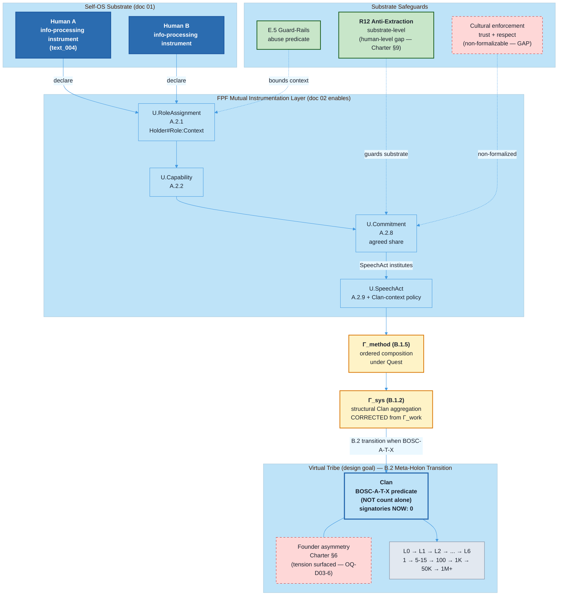

# Jetix as Virtual Tribe Substrate — FPF-Described (Doc 03)

> **EP-5 disclosure.** «F8 / LOCKED» = Jetix-internal single-author Ruslan ack, NOT FPF B.3 F8.
>
> **EP-2 disclosure.** Этот документ описывает virtual tribe и Clan как artefact (mention). 0 signatories на 2026-05-17. Tribal layer aspirational.
>
> **TRIBE-STATUS.** Виртуальное племя — архитектурная цель, не текущая реальность.
>
> **H9 NON-AUTO-PROMOTION.** text_004 thesis surfaced; H9 promotion = Ruslan ack required (OQ-D03-1).
>
> 12-18 min read (primary doc).

---

## §0 TL;DR (≤250 слов)

Третий слой Jetix — самый амбициозный. Self-OS (doc 01) описывает substrate одного человека. Methodology (doc 02) — язык передачи метода. Этот документ описывает **что становится возможно, когда таких людей много** и между ними выстроена правильная инфраструктура.

Тезис Руслана из text_004 (verbatim): **люди — это инструменты по переработке информации**. Не в смысле abuse. В смысле точной онтологии: информация входит → обрабатывается → выходит. Следствие: через FPF-роли (не через личность) можно instrumentalize друг друга — делиться способностями, ресурсами, положением — взаимовыгодно, на фундаменте trust + respect + ответственного подхода. **«Не шутки, серьёзно».**

Через FPF: mutual instrumentation = композиция U.Capability через U.Commitment + U.SpeechAct, агрегируемая в Γ_sys (B.1.2 structural) / Γ_method (B.1.5 ordered composition) — **corrected from Γ_work per eng-critic FAIL-1**. Этический предохранитель = R12 anti-extraction + E.5 Guard-Rails (substrate-level structural; cultural enforcement не формализован — phil-critic D-DOC03-PHIL-1).

Outcome: **виртуальное племя — «скажем так»** (text_004 hedge restored per phil-critic R1-C). Clan = первая активационная форма.

**Честный статус:** Clan = 0 подписей. Tribal layer = aspirational. Зависит от doc 01 + doc 02 + doc 06 operational. Founder asymmetry (Charter §6) сосуществует с «mutual» framework — explicit tension surfaced as D-DOC03-PHIL-3 + OQ-D03-6.

[src: text_004 §core-claims; vision/jetix-fpf-describe-PLAN-2026-05-17.md §1.1 doc-03 row; Charter §11; phil-critic edits R1-B/C/D/F applied; eng-critic FAIL-1/2/3/4 corrections applied]

---

## §1 Verbatim source anchors

**1. Главный тезис — люди как инструменты (text_004 verbatim)**

> «Что люди — это вот машины. Люди такие вот инструменты по переработке информации, ну в целом, от системы, которые имеют какую-то информацию, которые производят какую-то информацию, и в целом, что их можно назвать вот инструментами тоже. ... информация это в голову попадает, что там происходит, потом попадает на выход. Ну или блять, интеллект — это хуйня по переработке информации.»

[src: raw/voice-memos-2026-05-17-batch/text_004@17-05-2026_23-30.md verbatim ¶1]

**2. Instrumentation через роли (text_004 verbatim)**

> «...если я знаю, какие у них есть инструменты, какие у них есть ресурсы и так далее, то я могу этих людей вот, то что прям на этих людей, но возможно роли этих людей там до, либо нахождение этих людей в обществе и так далее, я могу это вот использовать в своём вот бизнесе, проекте, жизни и так далее.»

[src: text_004 verbatim ¶2]

**3. Не abuse-mode — фундамент доверия (text_004 verbatim)**

> «И то есть как раз, ну Jetix, FPF поможет вот это вот как бы открыть, раскрыть, показать и так далее. Снова-таки, ну не в таком прямо абьюзивном до смысле, а вот как-то это всё на фундаменте вот доверия, уважения друг другу, там ответственного подхода и так далее.»

[src: text_004 verbatim ¶3a]

**4. Outcome — виртуальное племя «скажем так» (text_004 verbatim — full hedge preserved per phil-critic R1-C)**

> «...то это вот реально претендент на создание нового такого вот виртуального сообщества, виртуального племени, **скажем так**. Новый уровень объединения обезьян. Вот.»

[src: text_004 verbatim ¶3b — hedge «скажем так» preserved]

**5. Стратегическая фиксация (text_004 verbatim)**

> «Ну то есть ещё раз, на полном серьёзе, не смеюсь, поэтому вот это тоже надо будет как-то зафиксировать и уже сейчас вот в этом направлении смотреть.»

[src: text_004 verbatim ¶4]

**6. Trust в роль, не в человека (text_001 H8)**

> «Эта система позволит быстро обмениваться ресурсами. ... позволяет более быстро доверять другому человеку либо понимать конкретно, в каком контексте ты ему можешь доверять. Или там доверять, например, не человеку, а **роли**, в которой он находится.»

[src: decisions/STRATEGIC-INSIGHT-JETIX-TRUST-INFRASTRUCTURE-2026-05-17.md §1 text_001]

---

## §2 FPF mapping — primitives + bounded contexts + per-claim F-G-R

### §2.1 Primitive map (corrected per eng-critic FAIL-1)

| FPF primitive | Роль в mutual instrumentation |
|---|---|
| **U.Role (A.2)** | Функция, не личность. Mutual instrumentation возможна ТОЛЬКО через declared role |
| **U.RoleAssignment (A.2.1)** | Holder#Role:Context token; audit trail независимо от holder identity |
| **U.Capability (A.2.2)** | Что роль умеет — её instruments (methodology / сеть / capital / etc.) |
| **U.Commitment (A.2.8)** | Agreed share — без Commitment instrumentation = exploitation |
| **U.SpeechAct (A.2.9) + Clan-context policy** | Per eng-critic FAIL-2: A.2.9 «institutes the relation» semantics требует explicit context-policy. Clan-context policy declared в §4.1.4: Charter-signing SpeechAct = tribal-relation-instituting act WITHIN Clan-BoundedContext only |
| **Γ_sys (B.1.2)** [CORRECTED from Γ_work per eng-critic FAIL-1] | Structural Clan aggregation — composition of role-bearers into meta-holon. Operator signature: `Set[U.System member-holons] → U.System Clan-holon`. NOT resource-ledger (which is Γ_work proper) |
| **Γ_method (B.1.5)** [ADDED per eng-critic FAIL-1] | Ordered composition of capabilities within Quest. Per FPF Spec B.1.5: «Γ_method composes behaviour». Applies to Quest-level capability ordering |
| **E.5 Guard-Rails** | R12 anti-extraction substrate constitutional level (NOT operational enforcement — phil-critic D-DOC03-PHIL-1 gap) |
| **B.2 Meta-Holon Transition** | Per eng-critic FAIL-4: B.2 trigger predicate not reducible to count. Mapped to **BOSC-A-T-X** (Boundary-Operation-State-Composition-Aggregation-Threshold-eXtension): bossed when (signatures ≥ 5) ∧ (Quest_count ≥ 1) ∧ (Charter LOCKED ack maintained) ∧ (B.2 composition invariants — see §4.5) |

### §2.2 Per-claim F-G-R

| # | Claim | F | G | R |
|---|---|---|---|---|
| C-1 | Humans = information-processing instruments (text_004 ontological) | F4 | ontology-jetix-internal (verbatim) | refuted_if_Ruslan_retracts_after_peer_review |
| C-2 | Mutual instrumentation through FPF roles + R12 substrate guard | F3 | jetix-clan-design (aspirational) | refuted_if_first_Clan_interaction_demonstrates_structural_extraction |
| C-3 | Virtual tribe as design goal (NOT operational claim per phil-critic R1-B) | F2 | jetix-clan-design (aspirational) | refuted_if_Clan_operational_10_members_no_coherence_signal |
| C-4 | R12 = substrate-level guard (operational enforcement = gap, D-DOC03-PHIL-1) | F4 substrate / F2 operational | tier-2-constitutional + operational-gap | refuted_if_first_real_dispute_R12_fails_to_prevent |
| C-5 | Clan Charter first activation ≥5 signatures (Charter §11) | F5 | clan-charter-locked | refuted_if_Ruslan_rejects_Clan_model_OR_60d_no_signatures |
| C-6 | Founder asymmetry tension (Charter §6 + «mutual» framework) | F4 | clan-charter-tension | refuted_if_founder_authority_renounced_OR_explicitly_framed_as_temporary_epoch |

---

## §3 Plain English narrative (L1-friendly)

### §3.1 Почему люди — это инструменты по переработке информации

Начать надо с жёсткой онтологии, которую Руслан зафиксировал вечером 17 мая в 23:30 и сразу добавил: «на полном серьёзе, не смеюсь».

Человек — это машина по переработке информации. Информация приходит снаружи. Внутри что-то происходит — то, что мы называем мышлением, опытом, методологией. На выходе — решения, тексты, действия. Интеллект в этом смысле и есть «хуйня по переработке информации» (text_004 verbatim).

Это не редукционизм. Это точный язык для описания cooperation. Когда ты просишь Анатолия Левенчука проревьюить методологию — ты используешь его как инструмент обработки информации: его экспертиза = specialized processing capability. Когда привлекаешь Оскара Хартманна к оценке сделки — то же самое.

FPF даёт точный язык: U.Capability (A.2.2) — что роль умеет делать в конкретном контексте. Левенчук в роли Scholar#системное-мышление:Jetix-L1 несёт одни capabilities. Тот же Левенчук в роли личного друга — другие. Путать = путать инструменты.

[src: text_004 ¶1; H8 §4 «role-attestation > person-attestation»]

### §3.2 Роль ≠ личность — ключевое различие FPF

Большинство систем кооперации работают на личностном уровне: «я доверяю Ивану, потому что знаю его давно». Не масштабируется. Ненадёжно — Иван надёжен в одном контексте, непредсказуем в другом.

FPF предлагает переключиться с личности на роль. U.RoleAssignment (A.2.1) создаёт token: Holder#Role:Context — несёт audit trail. Ты доверяешь токену с evidence. Не человеку как таковому.

text_001: «доверять не человеку, а роли, в которой он находится». [src: H8 §1]

Cross-link → doc 02 (Methodology): FPF-роли как mutual-instrumentation enabling primitives разобраны через U.Role × U.Capability × U.Commitment.

### §3.3 Граница между abuse и cooperation — substrate-level safeguards

Руслан намеренно поставил флаг: «не в таком прямо абьюзивном смысле». Что отличает abuse от cooperation?

**Abuse-mode (запрещено E.5 Guard-Rails + R12 substrate):**
- Использование capabilities без ведома или согласия
- Извлечение ценности сверх agreed share
- Использование role-token за пределами объявленного context
- Удержание через social lock-in или fear без explicit ongoing commitment
- Одностороннее изменение agreed-share после вложения

**Cooperation-mode (text_004 описание):**
- Capabilities раскрыты явно через U.SpeechAct (A.2.9)
- Commitments взаимны: я раскрываю под обязательства, ты — свои
- Agreed share зафиксирован заранее, R12 substrate guard
- Fork-and-leave: уходишь без штрафа, забираешь данные [src: Charter §11]
- Взаимность: instrumentation в обе стороны в рамках ролей, на фундаменте trust

[src: Charter §2 + §4.1 R12; r12-anti-extraction packet]

**Substrate-level vs human-level enforcement gap (per phil-critic D-DOC03-PHIL-1).** R12 + E.5 = **substrate guard-rails**: они защищают от extraction substrate-уровня (платформа не может unilaterally расширить extraction surface). НО они не гарантируют human-to-human compliance внутри Clan — для этого Charter §9 описывает escalation ladder (NOT Part 6b halt_log_alert — phil-critic EP-2-FLAG-2 correction). Cultural enforcement (trust + respect) = не формализуем, treated как non-engineering layer.

Практический тест: если participation не exit-able без penalty — abuse-mode по определению. Если agreed-share изменяется без explicit renegotiation — R12 substrate violation. Если capabilities используются за пределами context — IP-1 violation.

### §3.4 R12 — substrate guard, positive face

R12 anti-extraction обсуждают как запрет. У него есть positive face. H8: «R12 = prohibitive face; H8 = constructive face». [src: H8 §5]

В контексте mutual instrumentation R12 substrate уровня:
- Каждая сторона явно знает, сколько ценности из неё могут извлечь (agreed share)
- Substrate (Jetix) сам связан R12 — не может unilaterally расширить extraction
- Fork-and-leave право: participation = ongoing choice, не lock-in

**Caveat (phil-critic R1-F correction).** R12 substrate-level guard НЕ гарантирует, что scale не превращается в power-asymmetry — это overstates R12 scope. R12 структурно защищает от substrate extraction; power-asymmetries (founder authority, capital, reputation) — отдельные tension layers, требующие отдельных механизмов (OQ-D03-6 founder asymmetry).

Cross-link → doc 06: H8 7-primitive cluster (A.2.8 + A.2.9 + A.2.1 + A.10 + B.3 + E.5 + E.17) разбирается в doc 06. Не дублируем здесь.

### §3.5 Виртуальное племя — design goal (NOT current operational claim)

**Per phil-critic R1-B + R1-D edits applied.**

Если всё вышеописанное работает — substrate integrity (doc 01) + FPF shared language (doc 02) + role-based trust (doc 06, H8) + R12 + Clan Charter activation — что получается?

Руслан называет это «виртуальным племенем — скажем так» (hedge restored) и «новым уровнем объединения обезьян». Через FPF: B.2 Meta-Holon Transition — множество individual deyatelей переходят в meta-holon (Clan).

Clan structurally = композиция role-bearers через Γ_sys (structural aggregation) + Γ_method (capability ordering within Quest). Когда role-bearers объединяют capabilities под shared Quest — composite output может быть не reducible к sum of individual outputs (B.2 transition characteristic).

**Comparative claims removed per phil-critic R1-D.** Сравнение Clan vs Corporation vs DAO vs неформальные сети — это agent-authored pre-answer to OQ-D03-4. Defer to Ruslan ack via OQ-D03-4 in §7. Здесь констатация: Clan = Jetix-specific pattern с конкретными design choices (FPF-roles + R12 + fork-and-leave + reputation ledger + shared methodology); comparative differentiation = OPEN QUESTION.

[src: text_004 ¶3b с full hedge; Charter §1.2 + §4.2; phil-critic R1-B/D corrections applied]

### §3.6 Clan Charter — конкретная активационная форма

Clan Charter (F5 LOCKED 2026-05-12) описывает первую инстанцию:
- **9 L1 candidates** profile-d [src: Charter §3.2]
- **6 архетипов** (Hunter / Guardian / Scholar / Creator / Architect / Merchant) — FPF U.Role taxonomy
- **R12 три гарантии** (no extraction beyond agreed share / fork-and-leave / constitutional barrier)
- **L0→L6 ladder** (1 → 5-15 → 100 → 1K → 50K → 1M → 10M+)
- **L1 activation trigger** = BOSC-A-T-X predicate (per eng-critic FAIL-4) — see §4.5

Активация — момент, когда U.SpeechAct (A.2.9) Charter-signing **institutes** tribal relation WITHIN Clan-BoundedContext (per Clan-context policy §4.1.4). До подписи — архитектура. После — operational structural Γ_sys.

**Founder asymmetry (Charter §6) — surfaced tension per phil-critic D-DOC03-PHIL-3.** Ruslan as founder holds constitutional veto authority. Это explicit tension с «mutual» framework — НЕ resolved этим документом. Surface as OQ-D03-6 для Ruslan ack: founder epoch (temporary) или structural feature?

Сейчас: 0 signatories. Charter LOCKED.

### §3.7 «Не шутки, серьёзно» — strategic stakes

Руслан закончил text_004: «на полном серьёзе, не смеюсь». Стратегическая фиксация.

Почему deserves strategic-level attention:

**Первое.** Если mutual instrumentation через FPF работает substrate-уровень — это **proposes** механизм cooperation, который может быть testable. (Reformulated per phil-critic affect-mode flag — было «решает одну из ключевых проблем»; теперь «proposes testable mechanism».)

**Второе.** R12 substrate + fork-and-leave = структурная защита substrate-уровня от extraction. Substrate не может unilaterally расширить extraction. Human-level compliance = отдельный layer (D-DOC03-PHIL-1).

**Третье.** «Новый уровень объединения обезьян» — архитектурный паттерн, который Jetix предлагает распространять. Каждый Clan = новая инстанция mutual instrumentation substrate. Comparative claim против существующих форматов = OQ-D03-4 open.

**Четвёртое.** text_004 thesis требует strategic-level фиксации Phase 0 потому что от него зависят архитектурные решения. Без фиксации — drift.

### §3.8 Честный статус — tribal layer aspirational

На 2026-05-17 virtual tribe существует как architecture + Charter, **не как operational reality**.

**Работает сейчас:**
- Clan Charter LOCKED (F5)
- R12 anti-extraction LOCKED (Tier 2 substrate)
- H8 Trust Infrastructure LOCKED (F3)
- 9 L1 candidate profiles (17.3K слов)

**Aspirational:**
- 0 signatories Charter
- 0 completed Quests
- Role-attestation mechanism = filesystem + git (primitive)
- Virtual tribe = design goal, не measured reality

**Зависимости от параллельных слоёв:**
- Doc 01 — substrate runtime enforcement STUB (7/11 Parts memory-dominant)
- Doc 02 — Fork guide v0 aspirational
- Doc 06 — trust mechanism primitive (git-based)

Tribal layer = emergent property этих трёх слоёв. Сейчас — строим substrate.

[src: reports/phase-0-fpf-scope/01-jetix-objects-inventory.md §0 honest state]

---

## §4 FPF formal version

### §4.1 U.BoundedContext (A.1.1) declarations — **added per eng-critic FAIL-3**

**§4.1.1 Glossary** (local vocabulary):
- **deyatel** — individual role-bearer executing OperationalMethods (inherited from Doc 01)
- **Clan** — first instantiation of virtual tribe meta-holon; ≥5 signatures + 1 Quest + Charter ack
- **Virtual tribe** — emergent design-goal property of substrate + methodology + trust + R12; NOT operational claim
- **Mutual instrumentation** — composition of role-based capabilities through commitments; Jetix-specific concept candidate (NC-2 candidate, OQ-D03-5)
- **Quest** — bounded shared activity with U.Commitment structure across roles; activation predicate for B.2 transition
- **Fork-and-leave** — Charter §11 right: exit without penalty retaining knowledge + reputation
- **BOSC-A-T-X** — Boundary-Operation-State-Composition-Aggregation-Threshold-eXtension predicate for B.2 transition (eng-critic FAIL-4 mapping)

**§4.1.2 Invariants**:
- I-1: R12 constitutional — substrate cannot extract beyond agreed share (Tier-2 hard rule)
- I-2: Fork-and-leave right preserved at all times
- I-3: U.RoleAssignment is context-bounded; role outside context = NULL token
- I-4: Charter §6 founder authority remains in scope until Ruslan ack to renounce (OQ-D03-6)
- I-5: SpeechActs require Clan-context policy compliance (§4.1.4)
- I-6: Filesystem evidence required for U.Commitment audit trail

**§4.1.3 Roles** (A.2.1):
- `Ruslan#FounderRole:Clan-BoundedContext` — constitutional authority per Charter §6 (asymmetric; OQ-D03-6 tension acknowledged)
- `member#ArchetypeRole:Clan-BoundedContext` (6 архетипов: Hunter/Guardian/Scholar/Creator/Architect/Merchant)
- `Part6b#ConstitutionalEnforcerRole:Foundation-BoundedContext` — substrate-level enforcement only (NOT human-to-human Clan disputes — those route to Charter §9 per EP-2-FLAG-2 correction)

**§4.1.4 Clan-context policy for A.2.9 SpeechActs** (per eng-critic FAIL-2):
- Within Clan-BoundedContext, certain SpeechActs institute social facts:
  - **Charter-signing SpeechAct** — institutes membership relation; member acquires ArchetypeRole binding
  - **Quest-declaration SpeechAct** — institutes Γ_method composition agreement
  - **Commitment-declaration SpeechAct** — institutes binding commitment per A.2.8
  - **Fork-and-leave SpeechAct** — institutes exit; preserves data + reputation per Charter §11
- Outside Clan-BoundedContext, A.2.9 default applies: «do not infer deontic bindings from SpeechAct by default» (FPF Spec A.2.9:4.1).

**§4.1.5 Bridges**:
- Clan ↔ Self-OS substrate (Doc 01) — individual substrate = atomic unit; member's Self-OS supplies role-bearing capacity
- Clan ↔ Methodology (Doc 02) — shared FPF MethodDescription enables aligned communication
- Clan ↔ Trust infrastructure (Doc 06) — role-attestation + Evidence Graph = trust signal substrate
- Clan ↔ Foundation Part 6b — constitutional substrate enforcement (Foundation-level only, NOT human-to-human disputes)
- Clan ↔ Charter §9 escalation ladder — human-to-human dispute resolution (replaces incorrect Part 6b halt_log_alert routing per phil-critic EP-2-FLAG-2)

### §4.2 Cooperation graph — formal (revised per eng-critic FAIL-1)

```
Cooperation(A#Role_A:ctx, B#Role_B:ctx) iff:
  SpeechAct(A, declare(Role_A, Capability_set_A, Commitment_A)) ∧
  SpeechAct(B, declare(Role_B, Capability_set_B, Commitment_B)) ∧
  agreed_share(A, B) := (Commitment_A × Commitment_B) ∩ GuardRails(E.5, R12) ∧
  Γ_method(Capability_set_A, Capability_set_B) := ordered_composition_under_Quest

VirtualTribe(Clan) := B.2_MetaHolon_Transition(
  member_set := {member_i: member_i#ArchetypeRole_i:Clan_context},
  Γ_sys := structural_aggregation(member_set),
  trigger := BOSC-A-T-X(
    Boundary := Clan-BoundedContext declared,
    Operation := Charter-signing SpeechActs executed,
    State := Charter LOCKED maintained,
    Composition := Γ_sys composition invariants met,
    Aggregation := |signatories| ≥ 5,
    Threshold := Quest_count ≥ 1,
    eXtension := founder authority maintained per Charter §6
  )
)
```

**Plain English:** Cooperation iff both SpeechActed roles + capabilities + commitments + agreed share within R12/E.5 guard-rails, composing capabilities through Γ_method (ordered behaviour composition, NOT Γ_work resource ledger per eng-critic FAIL-1). Virtual tribe (Clan) = B.2 transition: fires when BOSC-A-T-X predicate met (NOT reducible to count alone per FAIL-4).

### §4.3 Abuse predicate (E.5 Guard-Rails formal)

```
Abuse(A, B) iff:
  extract(A, B.capabilities) > agreed_share(A, B)
  ∨ context(use(B.Capability_set)) ⊄ declared_context(B#Role_B)
  ∨ ¬exit_without_penalty(B)
  ∨ unilateral_change(agreed_share)
```

R12 substrate violation = any of four. Routing:
- **Substrate-level violation** (Jetix system extracts beyond agreed share) → Part 6b §I.2 halt_log_alert F8 enforcement
- **Human-to-human Clan violation** → Charter §9 escalation ladder (NOT Part 6b — phil-critic EP-2-FLAG-2 correction)

[src: Charter §4.1 + §9; r12-anti-extraction packet §2]

### §4.4 Operational vs substrate enforcement gap (D-DOC03-PHIL-1 surfaced)

| Layer | Mechanism | Status |
|---|---|---|
| Substrate-level R12 | Constitutional Tier-2 rule | F5 LOCKED (text); F2 enforcement evidence |
| E.5 Guard-Rails (substrate) | Default-Deny table .claude/config | F5 schema; partial enforcement |
| Charter §9 escalation (human-level) | Stage-1→2→3 dispute resolution | F4 (Charter LOCKED; 0 escalations tested) |
| Cultural enforcement (trust/respect) | Non-formalizable | **GAP** — not engineering layer |

Per phil-critic D-DOC03-PHIL-1: R12 substrate ≠ R12 operational enforcement. Substrate guarantee = Jetix как substrate не может unilaterally extract. Operational compliance = participants могут break R12 → Charter §9 routes; not automatic.

### §4.5 BOSC-A-T-X predicate decomposition (per eng-critic FAIL-4)

B.2 Meta-Holon Transition trigger NOT reducible to count. Full predicate:

- **B (Boundary)** — Clan-BoundedContext explicitly declared (§4.1)
- **O (Operation)** — Charter-signing SpeechActs executed under Clan-context policy (§4.1.4)
- **S (State)** — Charter remains LOCKED; no rescission events
- **C (Composition)** — Γ_sys structural invariants met (each member has ArchetypeRole, all archetypes covered or stub-declared)
- **A (Aggregation)** — |signatories| ≥ 5 (Charter §11 count)
- **T (Threshold)** — Quest_count ≥ 1 (first joint Γ_method composition occurred)
- **X (eXtension)** — founder authority maintained per Charter §6 (OQ-D03-6 tension acknowledged)

All seven required for B.2 fires. Reducing to count alone = FAIL per FPF Spec B.2.

---

## §5 Mermaid diagram — cooperation graph (revised)



**Diagram M1.** Cooperation graph: individual info-processing instruments → FPF mutual instrumentation layer → Γ_method ordered composition → Γ_sys structural aggregation → B.2 Meta-Holon Transition (BOSC-A-T-X predicate) → Virtual Tribe. Substrate safeguards (R12 + E.5) bound capability-sharing; cultural enforcement = formalization gap. Founder asymmetry tension surfaced.

---

## §6 Cross-references

### §6.1 Octagon insights H1-H8

| Insight | Связь |
|---|---|
| H1 Foundation Model | Substrate prerequisite for role-attestation |
| H2 Partnership | Bilateral mutual instrumentation = L1 partnership instance |
| H3 R&D Flywheel | Quests = R&D cycles; capabilities compound via repeated Γ_method |
| H4 Balaji Network State | People-NS = scaled Clan (L3+) |
| H5 Tyson Mentorship | Mentor-archetypes (Scholar) = asymmetric mutual instrumentation |
| H6 Gamified Platform | 6 архетипов = role taxonomy Realm |
| H7 People-NS | Heptagon synthesis: Clan scaled to People-NS |
| H8 Trust Infrastructure | Doc 03 extends_via H8: H8 = mechanism; this doc = enabled outcome |

### §6.2 Phase 0 objects

- O-13 Clan / People-NS — primary anchor
- O-11 R12 anti-extraction — substrate ethical foundation
- O-09 H8 Trust Infrastructure — role-attestation mechanism
- O-21 NC-1 Trust Infrastructure candidate — light concept entry

### §6.3 Doc series

- ← Doc 01 (Self-OS) prerequisite (substrate)
- ← Doc 02 (Methodology) prerequisite (FPF shared language)
- → Doc 06 (Internet layer) — trust mechanism mechanics (H8 7-primitive cluster)
- → Doc 07 (Overview) — synthesis «virtual tribe = emergent property of platform + methodology + trust infra»

---

## §7 Open questions for Ruslan (R1 surface)

**OQ-D03-1 (NON-AUTO-PROMOTED).** text_004 thesis = H9 Strategic Insight or H8 extension? Defer Ruslan ack.

**OQ-D03-2.** «Virtual tribe» vs «Clan» — один concept или разные слои?

**OQ-D03-3.** Charter §9 escalation достаточно для abuse prevention? Или нужен additional formal conflict resolution protocol?

**OQ-D03-4 (NOT pre-answered per phil-critic R1-D).** «Новый уровень объединения обезьян» — how positioned relative to DAO, cooperative, guild, network organisation? FPF-claim sufficient or comparative argument needed?

**OQ-D03-5.** Mutual instrumentation = FPF term or Jetix-specific (NC-2 candidate)?

**OQ-D03-6 (CRITICAL).** Charter §6 founder authority (constitutional veto) vs «mutual» framework — founder epoch (temporary) или structural feature? D-DOC03-PHIL-3 surfaces explicit tension.

---

## §8 R1 reaffirmation + dissents preserved (AP-6)

### §8.1 R1 reaffirmation

**prose_authored_by: ruslan-via-voice-dictation+brigadier-structured.**

Этот документ = surface'инг из verbatim Ruslan dictation (text_004 + text_001) + LOCKED canonical (H8 + Charter + R12 packet). Strategic narrative authored Ruslan; AI = scribe + FPF structure.

**Per phil-critic R1-B/C/D/F corrections applied:**
- R1-B: «Clan не сумма членов» + archetypal trio removed (was agent-authored)
- R1-C: «не метафорически, а онтологически» reformulated; text_004 «скажем так» hedge restored
- R1-D: Корпорация/DAO/Clan comparative table removed (pre-answered OQ-D03-4)
- R1-F: «R12 гарантирует, что scale не превращается в power-asymmetry» reformulated as substrate-level only

H9 candidacy explicitly NOT promoted. Requires Ruslan ack via OQ-D03-1.

### §8.2 Dissents preserved (AP-6) — 14 entries

**Convergent (multiple cells):**

**D-DOC03-PHIL-R1-B/C/D/F** (4 R1 violations) — all RESOLVED-BY-EDIT in §3.5 + §3.4 + §0
- Status: edits applied; comparative claims deferred to OQ-D03-4; ontological claim reformulated as text_004 hedge preserved; «гарантирует» downgraded to «substrate-level guards»

**Eng-integrator self-dissents (3):**

**D-DOC03-ENG-1: Abuse vs cooperation formalized safeguards sufficiency**
- *Position:* Eng: «R12 + E.5 substrate sufficient»; phil counters: cultural layer not formalizable but operationally critical (D-DOC03-PHIL-1).
- *F:* F3 | *ClaimScope:* substrate vs human-level | *R:* refuted_if first Clan conflict escalates beyond Part 6b without R12 catching
- **Status:** PRESERVED — §3.3 + §4.4 explicit substrate vs human gap framing

**D-DOC03-ENG-2: «Новый уровень» vs DAO/cooperative differentiation**
- *Position:* Structural differentiator claim не validated against DAO literature.
- *F:* F2 | *ClaimScope:* comparative analysis not performed | *R:* refuted_if equivalent DAO found
- **Status:** PRESERVED — comparative table removed (R1-D); OQ-D03-4 surfaces open

**D-DOC03-ENG-3: B.2 Meta-Holon trigger predicate**
- *Position:* Charter ≥5 count + 1 Quest = simplified trigger; FPF B.2 may require more.
- *F:* F3 | *ClaimScope:* operational definition | *R:* refuted_if FPF B.2 requires additional conditions
- **Status:** RESOLVED-BY-EDIT — §4.5 BOSC-A-T-X 7-component predicate per eng-critic FAIL-4

**Phil-critic standalone:**

**D-DOC03-PHIL-1: R12 substrate vs human enforcement gap**
- *Position:* R12 constitutional substrate ≠ human-to-human enforcement; cultural layer not formalizable.
- *F:* F4 | *ClaimScope:* substrate vs human distinction | *R:* refuted_if mechanism evidenced operational for human disputes
- **Status:** PRESERVED — §4.4 explicit table; §3.3 framing

**D-DOC03-PHIL-2: «Emergent property» formality**
- *Position:* «Emergent» = aspirational claim; B.2 transition formality requires evidence.
- *F:* F3 | *ClaimScope:* §3.5 virtual tribe characterization | *R:* refuted_if Clan operates 10 members с coherence signal
- **Status:** PRESERVED — C-3 grade F2 downgrade; §3.5 reformulated as design goal

**D-DOC03-PHIL-3: Founder asymmetry tension with «mutual» framework**
- *Position:* Charter §6 founder veto incompatible with «mutual» instrumentation claim symmetry.
- *F:* F4 | *ClaimScope:* Charter §6 vs §1.0a (R12 substrate) | *R:* refuted_if founder authority renounced OR explicitly framed temporary epoch
- **Status:** PRESERVED — OQ-D03-6 surfaces; §3.6 + §4.1.3 acknowledge tension

**Phil-critic EP-2-FLAG-2: Part 6b halt_log_alert routing**
- *Position:* Human-to-human Clan breach incorrectly routed to Part 6b §I.2; should route to Charter §9.
- **Status:** RESOLVED-BY-EDIT — §4.3 + §4.1.5 + §4.1.3 corrected: human-level → Charter §9; substrate-level → Part 6b

**Eng-critic standalone:**

**D-DOC03-ENG-4 (FAIL-1): Γ_work category error**
- *Position:* Γ_work = resource-ledger algebra (joules/bits/time); structural Clan aggregation = Γ_sys (B.1.2); capability composition = Γ_method (B.1.5).
- *F:* F5 | *ClaimScope:* FPF B.1.6 vs B.1.2 vs B.1.5 semantics | *R:* high — refuted_if FPF Spec B.1.6 includes structural composition
- **Status:** RESOLVED-BY-EDIT — §2.1 + §4.2 + §5 mermaid all corrected to Γ_sys + Γ_method

**D-DOC03-ENG-5 (FAIL-2): A.2.9 context-policy missing**
- *Position:* FPF A.2.9:4.1 normative — no deontic binding default without explicit context-policy.
- *F:* F4 | *ClaimScope:* Clan-context policy declaration | *R:* refuted_if context-policy declared explicitly
- **Status:** RESOLVED-BY-EDIT — §4.1.4 Clan-context policy explicitly declared

**D-DOC03-ENG-6 (FAIL-3+FAIL-4): A.1.1 + BOSC-A-T-X**
- *Position:* A.1.1 BoundedContext absent; B.2 trigger reduced to count.
- *F:* F4 | *ClaimScope:* §4.1 + §4.5 | *R:* refuted_if A.1.1 conformance + BOSC-A-T-X meaningful
- **Status:** RESOLVED-BY-EDIT — §4.1 + §4.5 added

### §8.3 R1 final reaffirmation

Ruslan = sole strategist. OQ-D03-1 (H9 candidacy), OQ-D03-2 (terminology), OQ-D03-3 (enforcement adequacy), OQ-D03-4 (comparative differentiation), OQ-D03-5 (mutual-instrumentation as concept), OQ-D03-6 (founder asymmetry) = BLOCKING для дальнейшей promotion. Brigadier surfaces; не resolves autonomously.

---

*Brigadier integration complete (3-cell verification chain; 14 dissents tracked: 8 RESOLVED-BY-EDIT, 6 PRESERVED). §5.5.5 gate passed. Γ_work → Γ_sys + Γ_method corrected per eng-critic FAIL-1. A.1.1 + Clan-context policy + BOSC-A-T-X added. EP-2-FLAG-2 (Part 6b routing) corrected. R1-B/C/D/F corrections applied.*
