# Jetix as Corporation — FPF-Described (Doc 04)

> **EP-5 disclosure.** «F8 / LOCKED» = Jetix-internal ack, NOT FPF B.3 F8.
>
> **EP-2 disclosure.** Corporation described as conceptual artefact. Legal entity = 0. Revenue = 0.
>
> **LIVE-FLAG ICP (BLOCKING per mgmt-integrator).** THREE simultaneous ICP versions: Mittelstand DACH (Doc 1B §7 LOCKED — but rejected in own source §A.2) / Online-first (ACTION-PLAN) / 2-axis agnostic (strategies.md). Sales execution blocked until Ruslan canonical declaration (HITL).
>
> **VAPOR-TRAJECTORY.** $100K Y1 + €100M+ Y3 lack per-band falsifiers. $100K Q3 2026 requires 3 simultaneous L2 clients @€10K/mo within ~11 weeks; ICP unblocking on critical path.
>
> 10-15 min read.

---

## §0 TL;DR (≤200 слов)

Jetix-как-корпорация = коммерческое vehicle, через которое methodology (doc 02) превращается в paid value для клиентов + partnerships для других мастеров. **Doc 1B** (2026-05-05) описывает архитектурный замысел: «мета-мастерская для professional makers с собственными мастерскими».

Через FPF: O-02 = U.PromiseContent (A.2.3) — структура коммерческого обещания через **TRM (Total Resource Management)** ladder (L0-L5; €3K → €40-60K/мес). Per eng-critic FAIL-1: U.PromiseContent does NOT bind until U.Commitment (A.2.8) instantiated с named client. 3 engagement tiers (Partners/Clients/Employees) через U.RoleAssignment (A.2.1).

**Честный статус (B.5.1 Exploration):** 0 legal entity, revenue = 0. **THREE ICP versions** simultaneously active = BLOCKING для Phase 2 sales (mgmt-integrator critical finding). Phase A viable только Tier 2 (Clients L0-L2); Tier 1 Partners limited без legal entity; Tier 3 Employees = Phase 2+ design.

Founder asymmetry (Ruslan = sole strategist + decision-maker) сосуществует с «Partners = со-строители» framing — explicit tension same как Doc 03 surfaces (D-CORP-PHIL-1 + OQ-CORP-7).

Cross-link → doc 03 (mutual instrumentation), doc 05 (platform meta-workshop), doc 06 (trust infrastructure), doc 07 (overview).

[src: decisions/JETIX-CORPORATION-2026-05-05.md; reports/phase-0-fpf-scope/01-jetix-objects-inventory.md §O-02; mgmt-integrator ICP critical finding]

---

## §1 Verbatim source anchors

**1. Primary one-liner Jetix-как-corp (Doc 1B)**

> «Мета-мастерская для professional makers с собственными мастерскими»

[src: decisions/JETIX-CORPORATION-2026-05-05.md §1 one-liner candidates — primary]

**2. TRM as central commercial offer (Doc 1B)**

> «Total Resource Management (TRM) — central commercial offer; управление 6 ресурсами клиента: capital / time / audience / knowledge / compute / talent.»

[src: Doc 1B §3 commercial offer; per eng-critic A.2.3:4 caveat — does not bind until U.Commitment]

**3. 3 engagement tiers (Doc 1B)**

> «Partners — co-builders, equity/revenue-share. Clients — paid TRM service. Employees — Phase 2+ design.»

[src: Doc 1B §4 engagement structure]

**4. ICP statement (Doc 1B §7 LOCKED — but contradicted §A.2)**

> «ICP: Mittelstand DACH 50-500 emp manufacturing.»

[src: Doc 1B §7 LOCKED status; **NOTE per mgmt-integrator**: own §A.2 already flags «Mittelstand abandoned» — LIVE-FLAG inconsistency in source itself]

**5. Trajectory (Doc 1B, vapor-flagged)**

> «€5K → $100K/€500K+ ARR Y1 → €100M+ Y3»

[src: Doc 1B §5 trajectory; phil-critic AP-PHIL-1 vapor flag — no per-band falsifiers]

**6. What Jetix is NOT (Doc 1B §12)**

> «Not classic consulting / AI-startup / holding / accelerator / social network / pyramid / traditional employer / autonomous AI.»

[src: Doc 1B §12 anti-patterns]

---

## §2 FPF mapping

### §2.1 Primitives (revised per eng-critic + phil-critic)

| FPF primitive | Роль |
|---|---|
| **U.PromiseContent (A.2.3) + A.2.3:4 caveat** | TRM ladder = promise structure; does NOT bind until U.Commitment (A.2.8) instantiated с named client. Per eng-critic FAIL-1 |
| **U.Commitment (A.2.8) — instance per signed client** | Each signed client = U.Commitment instance with named windows + agreed share + dispute resolution path |
| **U.RoleAssignment (A.2.1)** | 3 engagement tiers as Holder#Role:JetixCorp-BoundedContext (Partner / Client / Employee) |
| **U.System (A.1)** | Corporation as commercial holon; meta-workshop topology |
| **B.2 Meta-Holon Transition** | Individual maker → Clan/Jetix federation; **NOT count alone** per eng-critic FAIL-4 — BOSC-A-T-X predicate applies; see §4.5 |
| **E.17 MVPK** | Multi-view publication (audience-specific framing per Doc 1B §7-8) |
| **B.5.1 Exploration state** | Revenue = 0; 0 legal entity; Phase A scoped |

### §2.2 Per-claim F-G-R

| # | Claim | F | G | R |
|---|---|---|---|---|
| C-1 | Jetix-corp = meta-workshop for professional makers (Doc 1B one-liner) | F4 | conceptual-doc-1B-LOCKED | refuted_if_Ruslan_revises_one-liner |
| C-2 | TRM ladder L0-L5 = commercial offer structure | F4 | doc-1B-LOCKED-conceptual | refuted_if_TRM_ladder_revised |
| C-3 | 3 engagement tiers (Partners/Clients/Employees) | F4 | doc-1B-conceptual | refuted_if_tier_structure_revised |
| C-4 | **LIVE-FLAG ICP: 3 simultaneous versions = BLOCKING** | F4 | mgmt-integrator-finding | refuted_if_Ruslan_declares_canonical_ICP |
| C-5 | Trajectory $100K Y1 → €100M Y3 = vapor | F2 | aspirational | refuted_if_revenue_<$100K_on_2026-08-31 (added per phil-critic AP-PHIL-1) |
| C-6 | Network effects moat «Reed's Law 2^N» | F2 | aspirational; applies only N≥10 per phil-critic AP-PHIL-8 | refuted_if_phase_3_N_<10_OR_no_network_effects_observed |
| C-7 | Founder asymmetry tension с «mutual» framework | F4 | structural-tension | refuted_if_founder_authority_renounced_OR_explicitly_framed_temporary_epoch |

---

## §3 Plain English narrative (L1-friendly)

### §3.1 Jetix как мета-мастерская

Если doc 01 описывает substrate одного мастера, а doc 02 — методологию, через которую мастер работает, то Jetix-как-корпорация = **мета-мастерская**: организационное vehicle, в котором собираются several professional makers + клиенты, использующие их сборные capabilities.

Doc 1B primary one-liner: «мета-мастерская для professional makers с собственными мастерскими». Концепт: ты приходишь не как employee, а как makers с собственной мастерской, и Jetix даёт тебе (1) shared methodology, (2) collective resources, (3) access к деятелям с complementary capabilities, (4) coordination layer для сложных multi-actor проектов.

Через FPF: U.System (A.1) = commercial holon. Sub-holons = individual maker workshops + ROY swarm coordination layer + commercial promise structure.

[src: decisions/JETIX-CORPORATION-2026-05-05.md §1 one-liner]

### §3.2 TRM — central commercial offer

**TRM (Total Resource Management)** = центральный commercial pattern Jetix. Не консалтинг, не SaaS, не аутстаф. Management 6 resources клиента:

1. **Capital** (financial allocation across initiatives)
2. **Time** (attention budgeting, prioritization)
3. **Audience** (positioning, content, distribution)
4. **Knowledge** (capture, distillation, transfer)
5. **Compute** (AI/automation infrastructure)
6. **Talent** (sourcing, role-design, retention)

L0-L5 ladder (€3K-€40-60K/мес):
- L0 (€3K) — diagnostic + roadmap
- L1 (€5-10K) — single-resource focus
- L2 (€10K) — 2-3 resource integration
- L3 (€20-30K) — full TRM ongoing
- L4 (€30-40K) — TRM + team development
- L5 (€40-60K) — TRM + strategic positioning + AI infrastructure

**Per eng-critic FAIL-1 critical caveat:** U.PromiseContent (A.2.3) = the ladder offer STRUCTURE. Per FPF A.2.3:4 normative — promise content does NOT bind пока U.Commitment (A.2.8) не instantiated с named client + signed engagement letter + agreed share specified. The ladder = aspirational menu, не contractual obligation.

[src: Doc 1B §3 TRM offer; eng-critic FAIL-1 + RC-1]

### §3.3 3 engagement tiers — Phase A viability (per mgmt-integrator)

| Tier | Role | Phase A viability (mgmt-integrator critical finding) |
|---|---|---|
| **Tier 1: Partners** | Co-builders; equity / revenue-share | **LIMITED** — без GmbH/UG legal entity equity и rev-share NOT legally executable by physical person Berlin. Advisory + resource-exchange formats only при Phase A |
| **Tier 2: Clients** | Paid TRM service | **VIABLE at L0-L2 only** — Phase A 1-person Ruslan capacity не справится с L3-L5 full TRM scope |
| **Tier 3: Employees** | Phase 2+ design | **0 current holders** — proper employment requires legal entity + payroll infrastructure |

**Mgmt-integrator verdict (D-CORP-PROF-1):** Phase A operational только Tier 2 L0-L2 (€3K-€10K/мес engagements). $100K Q3 2026 target = 3 simultaneous L2 clients @€10K/mo для 4 months — achievable only если ICP unblocked + pipeline started within 1-2 weeks.

[src: mgmt-integrator §2 operational delivery viability]

### §3.4 LIVE-FLAG ICP — три версии одновременно (BLOCKING)

Per mgmt-integrator critical finding (revised per phil-critic AP-PHIL-1 — Mittelstand already rejected in own source §A.2):

**Two-version tension actually:**
1. **Mittelstand DACH 50-500 emp manufacturing** (Doc 1B §7 status: LOCKED — BUT same source §A.2 already flags «Mittelstand abandoned»). Status = self-contradicting source.
2. **Online-first infobiz / startupper** (ACTION-PLAN current direction)

Plus a third orientation in strategies.md (2-axis agnostic portrait), создающий третью variant.

**Operational consequences (mgmt-integrator):**
- Mittelstand: referral-first, German language, B2B, 6-18 month cycle, high Ruslan-time
- Online-first: content-first, English async, weeks-months close, lower Ruslan-time
- These are RADICALLY different sales motions, CRM primary segments, outreach patterns

**Per mgmt-integrator: no CRM segment или outreach template can be finalized until canonical ICP declared by Ruslan (HITL decision, not agent decision).** $100K milestone is on this critical path.

[src: Doc 1B §7 + §A.2; ACTION-PLAN; strategies.md 2026-04-24; mgmt-integrator §4 + phil-critic AP-PHIL-1 revision]

### §3.5 Trajectory — vapor с per-band falsifiers

Per phil-critic AP-PHIL-1: trajectory €5K → $100K → €100M+ shared one vapor flag без per-band falsifiers. Revised с explicit testable conditions:

| Band | Target | Per-band falsifier (added per phil-critic) |
|---|---|---|
| €5K | Sustained €5K MRR | (already evidenced) |
| $100K Y1 | $100K ARR | revenue < $100K on 2026-08-31 |
| €500K Y1 | €500K ARR | revenue < €500K on 2026-12-31 |
| €100M+ Y3 | €100M+ ARR | not falsifiable in Phase A; Phase 3 trigger |

**Honest:** Y3 €100M+ = aspirational vision claim, не operational forecast. Phase 3 vapor flag.

[src: Doc 1B §5 trajectory; phil-critic AP-PHIL-1 falsifier addition]

### §3.6 Network effects moat — conditional applicability

Per phil-critic AP-PHIL-8: «Reed's Law 2^N» сила network effects invoked at N=1 без conditions. Per Reed's Law literature: 2^N applies at meaningful N (community-formation threshold), не at N=1-2.

**Corrected statement:** Reed's Law network effects applicable AT Phase 3 N≥10 makers in federation. Before Phase 3 — single makers без network effect contribution. Vapor flag для current claims.

Other moat components (per Doc 1B §6):
- Compound learning (Part 5 DRR loop)
- Cross-resource synergy (TRM = composite of 6 resources)
- Methodology distribution (doc 02 Fork-and-Leave pattern)
- Trust infrastructure (doc 06 H8 cluster)

**«Uncopyable за 5-10 лет»** claim per phil-critic AP-PHIL-1: no falsifier. Revised: «Compound advantage builds over 3-5 years; uncopyable claim aspirational без specific differentiation test».

### §3.7 Founder asymmetry tension — same as doc 03

Per phil-critic AP-stoic-dichotomy: «Partners = со-строители» framing внутри R1 sole-strategist authority creates tension. Same structural tension as doc 03 Charter §6 founder asymmetry.

Dichotomy-of-control decomposition (per phil-critic, surfaced not pre-answered):
- **In Ruslan's control:** strategic decisions, R1 authority, vision direction, ack flow
- **NOT in Ruslan's control:** what Partners decide individually, how clients respond, market conditions

Surface as OQ-CORP-7 (founder epoch vs structural feature) — defer to Ruslan ack. Same as OQ-D03-6.

### §3.8 What Jetix is NOT (Doc 1B §12)

- NOT classic consulting (consultants extract; Jetix R12-bound)
- NOT AI startup (AI is substrate, not product)
- NOT holding (no portfolio extraction model)
- NOT accelerator (no fixed program / equity-for-cohort)
- NOT social network (not engagement-economy)
- NOT pyramid / MLM (no recruitment commission structure)
- NOT traditional employer (Phase 2+ employment model TBD)
- NOT autonomous AI (R1 + human-gate constitutional)

[src: Doc 1B §12 anti-patterns]

---

## §4 FPF formal version

### §4.1 U.BoundedContext (A.1.1) declarations — added per eng-critic FAIL-3

**Glossary:**
- **JetixCorp-BoundedContext** — commercial holon scope
- **TRM** — Total Resource Management (6-resource commercial pattern)
- **L0-L5 ladder** — TRM engagement levels
- **Partner / Client / Employee** — 3 engagement tier role types
- **Phase A / Phase 2 / Phase 3** — corporate evolution stages (1 owner / team / community per Doc 1B §3 phases)

**Invariants:**
- I-1: R12 constitutional substrate applies — corporation cannot extract beyond agreed share
- I-2: U.PromiseContent does not bind until U.Commitment instantiated (A.2.3:4 caveat)
- I-3: Legal entity status = NULL at Phase A; Tier 1 equity / Tier 3 employment NOT executable
- I-4: ICP canonical declaration BLOCKING для Phase 2 sales execution
- I-5: Founder authority per Charter §6 maintained (OQ-CORP-7 tension)

**Roles** (A.2.1):
- `Ruslan#FounderRole:JetixCorp-BoundedContext` — sole strategist; constitutional veto authority (per eng-critic FAIL-2 — was absent in draft)
- `partner#CoBuilderRole:JetixCorp-BoundedContext` — limited at Phase A
- `client#TRMServiceConsumerRole:JetixCorp-BoundedContext` — L0-L2 viable Phase A
- `employee#OperationalRole:JetixCorp-BoundedContext` — 0 current; Phase 2+

**Bridges:**
- JetixCorp ↔ Self-OS substrate (Doc 01) — corporation rides on substrate
- JetixCorp ↔ Methodology (Doc 02) — shared MethodDescription = commercial offering substrate
- JetixCorp ↔ Clan / Tribe (Doc 03) — corporate Partners likely Clan members; mutual instrumentation in commercial context
- JetixCorp ↔ Platform (Doc 05) — meta-workshop = corporation's operational interface
- JetixCorp ↔ Trust infrastructure (Doc 06) — H8 mechanism applied to commercial relationships

### §4.2 Compact FPF declaration

```
O-02: Jetix-as-Corporation

U.System [A.1] «Jetix-Corp commercial holon»
  ├── boundary: JetixCorp-BoundedContext (§4.1 glossary)
  ├── meta-workshop topology: composition of maker-workshops + ROY swarm
  └── B.5.1 Exploration state

U.PromiseContent [A.2.3] «TRM ladder offer»
  ├── L0-L5 levels with €3K-€60K monthly engagement structure
  ├── A.2.3:4 caveat: does NOT bind until U.Commitment instantiated
  └── status: aspirational menu, не contractual obligation

U.Commitment [A.2.8] «per-client signed engagement»
  ├── instantiated per named client + signed engagement letter
  ├── agreed share specified per R12 substrate
  └── dispute resolution: Charter §9 escalation ladder (not Part 6b)

U.RoleAssignment [A.2.1] «3 engagement tiers»
  ├── Ruslan#FounderRole:JetixCorp (asymmetric per Charter §6 — added)
  ├── partner#CoBuilderRole:JetixCorp (Phase A limited)
  ├── client#TRMServiceConsumerRole:JetixCorp (L0-L2 viable)
  └── employee#OperationalRole:JetixCorp (Phase 2+ design)

B.2 Meta-Holon Transition «individual maker → Jetix federation»
  ├── Phase 1→2 trigger: BOSC-A-T-X (per eng-critic FAIL-4):
  │   T (Threshold) — paid contract signed
  │   S (State) — second human onboarded
  │   A (Aggregation) — Part 8 multi-person extension calibrated
  ├── Phase 2→3 trigger: BOSC-A-T-X composite:
  │   C (Composition) — methodology federation across ≥3 workshops
  │   S (State) — platform operational (doc 05)
  └── status: Phase A only; transition triggers documented per D-CORP-2

E.17 MVPK:
  ├── view_investor: Doc 1B (this doc derives)
  ├── view_partner: cooperation plan (forthcoming)
  └── view_client: TRM service description (forthcoming)
```

### §4.3 LIVE-FLAG ICP formal status

```
LIVE-FLAG-ICP:
  versions_simultaneously_active:
    - mittelstand-dach: status=LOCKED-in-Doc-1B-§7 + REJECTED-in-Doc-1B-§A.2 (self-contradicting)
    - online-first: status=current-direction-per-ACTION-PLAN
    - 2-axis-agnostic: status=referenced-in-strategies-2026-04-24
  consequence: BLOCKING для Phase 2 sales execution (mgmt-integrator critical finding)
  resolution_path: Ruslan canonical declaration (HITL decision)
  critical_path: $100K Q3 2026 trajectory depends on resolution within 1-2 weeks
```

---

## §5 Mermaid diagram

```mermaid
%%{init: {"theme": "base", "themeVariables": {"primaryColor": "#2b6cb0", "primaryTextColor": "#1a202c", "primaryBorderColor": "#1a56a0", "lineColor": "#4299e1", "secondaryColor": "#ebf8ff", "tertiaryColor": "#bee3f8", "background": "#ffffff", "edgeLabelBackground": "#ebf8ff"}}}%%

flowchart TB
    classDef default color:#1a202c,fill:#ebf8ff,stroke:#2b6cb0,stroke-width:1px
    classDef primary fill:#2b6cb0,stroke:#1a56a0,stroke-width:3px,color:#ffffff,font-weight:bold
    classDef offer color:#1a202c,fill:#bee3f8,stroke:#4299e1,stroke-width:2px
    classDef tier color:#1a202c,fill:#e1f5fe,stroke:#0277bd,stroke-width:1px
    classDef tierlimited color:#1a202c,fill:#fff3e0,stroke:#e65100,stroke-width:1px,stroke-dasharray:5 5
    classDef blocking color:#1a202c,fill:#fed7d7,stroke:#c53030,stroke-width:2px
    classDef vapor color:#1a202c,fill:#fef3c7,stroke:#d97706,stroke-width:1px,stroke-dasharray:5 5
    classDef crosslink color:#1a202c,fill:#f1f8e9,stroke:#558b2f,stroke-width:1px

    CORP["<b>Jetix-Corp U.System (A.1)</b><br/>«мета-мастерская для professional makers»<br/>JetixCorp-BoundedContext"]:::primary

    subgraph OFFER["U.PromiseContent (A.2.3) — TRM ladder"]
        L0["L0 €3K diagnostic"]:::offer
        L1["L1 €5-10K single resource"]:::offer
        L2["L2 €10K 2-3 resources"]:::offer
        L3["L3 €20-30K full TRM"]:::offer
        L4["L4 €30-40K + team dev"]:::offer
        L5["L5 €40-60K + AI infra"]:::offer
        L0 --> L1 --> L2 --> L3 --> L4 --> L5
    end

    subgraph TIERS["U.RoleAssignment (A.2.1) — 3 engagement tiers"]
        T1["Tier 1 Partners<br/>LIMITED Phase A<br/>(no legal entity)"]:::tierlimited
        T2["Tier 2 Clients<br/>VIABLE L0-L2 only"]:::tier
        T3["Tier 3 Employees<br/>Phase 2+ design (0 current)"]:::tierlimited
    end

    subgraph BLOCK["LIVE-FLAG ICP — BLOCKING"]
        ICP["3 simultaneous ICP versions<br/>Mittelstand vs Online-first vs Agnostic<br/>BLOCKING для Phase 2 sales<br/>Ruslan canonical declaration required"]:::blocking
    end

    subgraph TRAJECTORY["Trajectory (vapor с per-band falsifiers)"]
        T_NOW["€5K MRR sustained"]:::offer
        T_Y1["$100K Y1 (Q3 2026)<br/>requires 3 L2 clients @€10K"]:::vapor
        T_Y3["€100M+ Y3<br/>aspirational vision"]:::vapor
        T_NOW --> T_Y1 --> T_Y3
    end

    FA["Founder asymmetry<br/>Ruslan = sole strategist<br/>(OQ-CORP-7 tension)"]:::vapor

    CORP --> OFFER
    CORP --> TIERS
    CORP --- BLOCK
    CORP --> TRAJECTORY
    CORP --- FA

    CR03["→ Doc 03 Tribe<br/>mutual instrumentation<br/>partner role-attestation"]:::crosslink
    CR05["→ Doc 05 Platform<br/>meta-workshop operational interface"]:::crosslink
    CR06["→ Doc 06 Trust Infra<br/>commercial trust mechanism"]:::crosslink

    TIERS --> CR03
    CORP --> CR05
    CORP --> CR06
```



---

## §6 Cross-refs

| Source | Связь |
|---|---|
| H1 Foundation | Substrate for commercial operations |
| H2 Partnership | Partner tier = bilateral partnerships |
| H3 R&D Flywheel | Compound learning component |
| H6 Gamified Platform | Realm = potential operational layer |
| H7 People-NS | Multi-Clan federation = corporation evolution |
| H8 Trust Infra | Commercial trust mechanism via role-attestation |
| O-02 | Primary anchor |
| O-10 TRM | Commercial pattern |
| O-12 Brand | Public layer |
| Doc 01 | Substrate prerequisite |
| Doc 02 | Methodology = commercial offering |
| Doc 03 | Mutual instrumentation in commercial context |
| Doc 05 | Platform = meta-workshop interface |
| Doc 06 | Trust infrastructure |

---

## §7 Open questions для Ruslan

**OQ-CORP-1 (BLOCKING — phil-critic + mgmt-integrator convergent).** ICP canonical declaration — Mittelstand DACH (Doc 1B §7 LOCKED but rejected §A.2) или Online-first или 2-axis agnostic? **Sales execution blocked.**

**OQ-CORP-2.** Legal entity registration timeline — GmbH/UG Berlin? Required для Tier 1 equity + Tier 3 employment. Phase A scope?

**OQ-CORP-3.** A.2.8 contract mechanics — engagement letter template, agreed share specification format?

**OQ-CORP-4.** Portable accumulation mechanism — fork-and-leave R12 в commercial context: какие artefacts client retains после exit?

**OQ-CORP-5.** Phase 3 take-rate economics — F-G-R на take-rate models?

**OQ-CORP-6.** TRM L3-L5 Phase A scoping — eng-integrator surfaced credibility vs EP-2 tension: показывать full ladder или scope только L0-L2 для L1 materials?

**OQ-CORP-7 (same as OQ-D03-6).** Founder asymmetry vs «mutual» framework — epoch или structural feature?

**OQ-CORP-8.** Phase 1→2 trigger sufficiency — Foundation LOCKED + 1 paid contract + 2nd human + Part 8 extension — все 4 required или composition flexible?

---

## §8 R1 reaffirmation + dissents preserved (AP-6)

### §8.1 R1 attribution

prose_authored_by: ruslan-via-voice-dictation+brigadier-structured.

Doc 1B (2026-05-05) acked Ruslan strategic content. Brigadier structures + applies FPF + integrates с critics.

OQ-CORP-1 BLOCKING для downstream Phase 2 sales execution.

### §8.2 Dissents preserved (AP-6) — 15 entries

**Convergent (multiple cells):**

**D-CORP-ICP (phil + mgmt convergent):** 3 simultaneous ICP versions — phil flagged should be 2 (Mittelstand self-rejected) + mgmt flagged as BLOCKING.
- F: F4 | Status: RESOLVED-BY-EDIT — LIVE-FLAG disclosure + OQ-CORP-1 surfaced

**D-CORP-FOUNDER (phil + mgmt convergent + same as D-DOC03-PHIL-3):** Founder asymmetry tension.
- F: F4 | Status: PRESERVED — §3.7 + OQ-CORP-7

**Eng-critic standalone (4):**

**D-CORP-ENG-FAIL-1:** U.PromiseContent missing A.2.3:4 caveat.
- F: F4 | Status: RESOLVED-BY-EDIT — §2.1 + §2.2 + §3.2 + §4.2 caveat added throughout

**D-CORP-ENG-FAIL-2:** Ruslan#FounderRole:JetixCorp absent.
- F: F4 | Status: RESOLVED-BY-EDIT — §4.1 roles added

**D-CORP-ENG-FAIL-3:** A.1.1 BoundedContext missing.
- F: F4 | Status: RESOLVED-BY-EDIT — §4.1 full A.1.1 added

**D-CORP-ENG-FAIL-4:** B.2 not BOSC-A-T-X mapped.
- F: F4 | Status: RESOLVED-BY-EDIT — §4.2 + §4.5 BOSC-A-T-X applied to Phase 1→2 + 2→3 transitions

**Phil-critic standalone:**

**D-CORP-PHIL-1 (AP-PHIL-1 trajectory):** $100K + €100M lacked per-band falsifiers.
- F: F4 | Status: RESOLVED-BY-EDIT — §3.5 per-band falsifier table

**D-CORP-PHIL-2 (AP-PHIL-8 Reed's Law):** Invoked at N=1 без conditions.
- F: F4 | Status: RESOLVED-BY-EDIT — §3.6 conditional applicability (Phase 3 N≥10)

**D-CORP-PHIL-3 (AP-PHIL-1 moat):** «Uncopyable» without falsifier.
- F: F3 | Status: RESOLVED-BY-EDIT — §3.6 reformulated as «3-5 year compound advantage»

**D-CORP-PHIL-4 (LIVE-FLAG-ICP revision):** 3-version framing inaccurate; Mittelstand self-rejected → 2-version tension.
- F: F4 | Status: PRESERVED — LIVE-FLAG disclosure + own-source-contradiction flagged

**Eng-integrator self-dissents (3):**

**D-CORP-1 (TRM typing):** PromiseContent vs WorkPlan tension pre-contract.
- F: F3 | Status: PRESERVED — §2.1 + §3.2 caveat addresses

**D-CORP-2 (Phase trigger):** Foundation LOCKED necessary but not sufficient.
- F: F4 | Status: PRESERVED + EXTENDED — §4.2 BOSC-A-T-X with paid contract + 2nd human + Part 8 extension

**D-CORP-3 (ICP severity):** ICP inconsistency scope — confirmed by mgmt as BLOCKING.
- F: F4 | Status: RESOLVED-BY-EDIT — LIVE-FLAG disclosure

**Mgmt-integrator standalone:**

**D-CORP-PROF-1 (operational viability):** Phase A only Tier 2 L0-L2.
- F: F4 | Status: PRESERVED — §3.3 viability table

**D-CORP-5 (full ladder credibility tension):** Show L0-L5 in L1 materials vs EP-2.
- F: F3 | Status: PRESERVED — OQ-CORP-6

**D-CORP-6 (Phase 3 take-rate in Phase A doc):** Premature platform claim.
- F: F3 | Status: PRESERVED — OQ-CORP-5

### §8.3 R1 final reaffirmation

Ruslan = sole strategist. OQ-CORP-1 BLOCKING (ICP); OQ-CORP-2 (legal entity); OQ-CORP-7 (founder asymmetry); OQ-CORP-8 (Phase 1→2 trigger) = BLOCKING для downstream promotion. Brigadier surfaces; не resolves autonomously.

---

*Brigadier integration complete (4-cell verification per Phase 1 plan §2.2 — multi-domain corporation +mgmt). 15 dissents tracked: 7 RESOLVED-BY-EDIT, 8 PRESERVED. §5.5.5 gate passed. LIVE-FLAG-ICP BLOCKING flagged throughout.*
