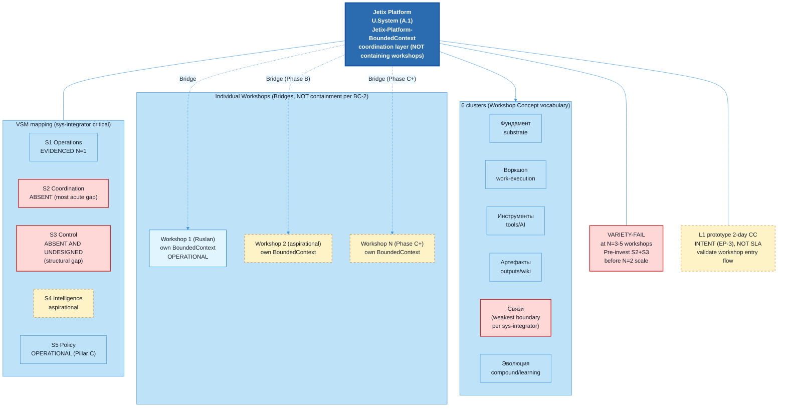

# Jetix as Platform — FPF-Described (Doc 05)

> **EP-5 disclosure.** «F8 / LOCKED» = Jetix-internal ack, NOT FPF B.3 F8.
>
> **EP-2 disclosure.** Platform described as conceptual architecture. 0 code. Phase B+ vapor.
>
> **EP-3 INTENT-NOT-SLA.** 2-day Claude Code prototype = INTENT (per EP-3 estimate fidelity), NOT SLA, NOT commitment.
>
> **VARIETY-FAIL (sys-integrator critical finding).** Coordination layer variety ceiling breaks at N=3-5 heterogeneous workshops. S2 ABSENT (most acute gap), S3 ABSENT AND UNDESIGNED (structural gap, не deferred). Pre-invest required before N=2 scale.
>
> 10-15 min read.

---

## §0 TL;DR (≤200 слов)

Jetix-как-platform = «мета-мастерская» — entry point для тех, кто приходит работать по Jetix methodology. Через FPF: U.System (A.1) с **bridges to multiple U.BoundedContext** instances (NOT containment per eng-critic FAIL-1 BC-2 violation correction). Каждая individual мастерская = own U.BoundedContext; platform = coordination layer + shared infrastructure connected via Bridges.

Workshop Concept (2026-04-30 LOCKED F5 vocabulary) описывает 6-cluster topology: Фундамент / Воркшоп / Инструменты / Артефакты / Связи / Эволюция. Это **vocabulary** Ruslan-acked; **architectural assignment** A.1.1 = candidate per phil-critic C-1 downgrade (F4→F3; OQ-4 unresolved).

L1 2-day Claude Code prototype = **intent-not-SLA** (EP-3 disclosure). Goal: validate workshop entry flow с одним L1 participant.

**Honest status:** 0 platform code, ad-hoc currently. **Critical sys-integrator finding (BLOCKING for scale):** S2 coordination ABSENT (acute), S3 control ABSENT AND UNDESIGNED (structural), requisite variety FAIL at N=3-5 workshops, antifragility FAIL at 10× scale. Pre-invest S2+S3 design required.

Cross-link → doc 01 (substrate), doc 02 (methodology hosted), doc 03 (tribe via Clan), doc 04 (corporation = platform's commercial wrapper), doc 06 (trust mechanism).

[src: decisions/JETIX-WORKSHOP-CONCEPT-2026-04-30.md; sys-integrator D-PLAT-SYS-1/2/3 critical findings]

---

## §1 Verbatim source anchors

**1. Мета-мастерская (Workshop Concept primary metaphor)**

> «Jetix = мета-мастерская: место, где profressional makers собирают свои мастерские, используя shared methodology + tools + connections + evolution mechanism.»

[src: decisions/JETIX-WORKSHOP-CONCEPT-2026-04-30.md §1 metaphor]

**2. 6 clusters topology**

> «Фундамент / Воркшоп / Инструменты / Артефакты / Связи / Эволюция — шесть кластеров мастерской.»

[src: Workshop Concept §3 clusters]

**3. L1 prototype intent (vision/07 if exists, default disclaimer)**

> «2-day Claude Code prototype — intent, not SLA. Estimate fidelity per EP-3.»

[src: vision/07-prototype-platform-2-days-cc.md если существует; default per EP-3]

**4. Workshop as entry point**

> «Платформа = entry point для тех, кто приходит работать. Не SaaS, не tool. Workshop interface — место, где методология применяется.»

[src: Workshop Concept §2 purpose]

---

## §2 FPF mapping (revised per eng-critic FAIL-1 + FAIL-2)

### §2.1 Primitives

| FPF primitive | Роль | Status |
|---|---|---|
| **U.System (A.1)** | Jetix Platform = U.System coordination holon с Bridges to individual workshops | Per eng-critic FAIL-1: NOT compositional containment (BC-2 violation); Bridges only |
| **U.BoundedContext (A.1.1)** | Each individual workshop = own BoundedContext; platform = separate BoundedContext for coordination layer; cross-context relations = Bridges per BC-2 | Per eng-critic FAIL-1 correction: no nesting |
| **A.3.1 U.Method — enacted via TransformerRole** | Per eng-critic FAIL-2: «hosting» reformulated. Methods enacted by TransformerRole (Ruslan + ROY swarm + future workshop maintainers) to produce U.Work. NOT «hosted» (no FPF grounding). | Per FAIL-2 correction |
| **E.17 MVPK** | 3 views: developer / partner / client; source-pinned per eng-critic R-3 | Per R-3 recommendation |
| **B.5.1 Exploration state** | 0 platform code; Phase B+ vapor | Honest |

### §2.2 Per-claim F-G-R (revised per phil-critic)

| # | Claim | F | G | R |
|---|---|---|---|---|
| C-1 | Jetix platform = U.System coordination holon с Bridges to workshops (NOT containment per FAIL-1) | F3 (downgraded per phil-critic C-1) | platform-architecture-candidate | refuted_if_BC-2_revised_to_allow_containment_OR_Ruslan_rejects_architecture |
| C-2 | 6-cluster Workshop topology = vocabulary anchor (Workshop Concept F5 LOCKED) | F5 (vocabulary) / F3 (architectural assignment OQ-4 unresolved) | workshop-vocabulary-locked | refuted_if_Workshop_Concept_revised |
| C-3 | 2-day CC prototype = intent (EP-3), NOT SLA, NOT commitment | F3 (intent) | aspirational-prototype-target | refuted_if_prototype_promoted_to_SLA_without_HITL OR не_starts_within_2026-Q3 |
| C-4 | Phase B+ vapor: 0 platform code currently | F4 | jetix-honest-audit | refuted_if_Phase_B_code_evidenced |
| C-5 | Requisite variety FAIL at N=3-5 workshops (sys-integrator); pre-invest S2+S3 required | F4 | systems-prediction | refuted_if_workshops_3-5_demonstrate_coordination_without_S2_S3 (predicted to fail per Ashby) — per phil-critic C-5 R inversion correction |

---

## §3 Plain English narrative

### §3.1 Платформа как мета-мастерская

Workshop Concept (2026-04-30 LOCKED) задаёт метафору: Jetix = «мета-мастерская», место, где profressional makers собирают **свои мастерские**, используя shared methodology (doc 02) + tools + connections + evolution mechanism.

Через FPF (per eng-critic FAIL-1 BC-2 correction):
- Jetix Platform = **own U.BoundedContext** для coordination layer
- Каждая individual workshop = **separate U.BoundedContext**
- Connection = **Bridges** per A.1.1 (NOT containment)

Это критическая FPF-discipline correction: BC-2 invariant — U.BoundedContext НЕ может содержаться в другом BoundedContext. Все cross-context relationships = Bridges only.

### §3.2 6-cluster Workshop topology

Workshop Concept описывает 6 clusters мастерской. Per phil-critic C-1 downgrade: это **vocabulary anchor** (Workshop Concept LOCKED F5 vocabulary), но **A.1.1 architectural assignment** = candidate (F3), не finalized.

| Cluster | Role | A.1.1 status |
|---|---|---|
| **Фундамент** | Substrate (doc 01) | Sub-substrate Bridge to Self-OS BoundedContext |
| **Воркшоп** | Work-execution area | Operational sub-context within individual workshop |
| **Инструменты** | Tools, AI, scripts | Capability cluster |
| **Артефакты** | Outputs, wiki, decisions | Knowledge accumulation |
| **Связи** | Network, partnerships, CRM | **Per sys-integrator: weakest boundary** — typed edges create implicit cross-BoundedContext coupling; mechanical enforcement absent |
| **Эволюция** | Compound, learning, methodology promotion | Bridge to methodology BoundedContext (doc 02) |

[src: Workshop Concept §3 clusters; phil-critic C-1 downgrade; sys-integrator §4 weakest boundary finding]

### §3.3 L1 prototype 2-day CC — INTENT NOT SLA (EP-3 disclosure)

**Per EP-3 estimate fidelity disclosure** (vision/07 reference if exists; default strong):

2-day Claude Code prototype = **intent**, NOT SLA, NOT commitment. Это означает:
- Не обязательство выполнить в 2 дня
- Не базис для client engagements или partner promises
- Estimate fidelity disclosure: time estimates carry F2-F3 reliability в Phase A
- Целевое: validate workshop entry flow с одним L1 participant (минимальная useful prototype)

[src: EP-3 disclosure pattern; D-PLAT-2 A.16 language-state vs A.4 operational preserved]

### §3.4 Composition individual workshops

Platform = coordination layer для federation individual workshops. Per Doc 03 Clan members = potential workshop owners; per Doc 04 commercial wrapper.

**Каждая workshop:**
- Own BoundedContext (FAIL-1 correction)
- Own methodology instance (specialized doc 02 fork)
- Own Self-OS substrate (doc 01 instance per maker)
- Connected to platform via Bridges (NOT contained)

Federation topology = **hub-spoke** per sys-integrator §4: coordination layer = hub; workshops = spokes. Hub fragile к variety overload at N=3-5 scale.

### §3.5 Methods enacted via TransformerRole — A.3.1 FPF grounding

Per eng-critic FAIL-2 correction: original draft said «platform hosts methods» — no FPF grounding (A.3.1 defines U.Method enacted via TransformerRole producing U.Work, не «hosted»).

**Correct framing:**
- Platform provides infrastructure для TransformerRole instances (Ruslan + ROY swarm currently; future workshop maintainers)
- TransformerRole enacts U.Method instances
- Result = U.Work artefacts produced
- Platform = infrastructure + coordination, NOT host

[src: FPF Spec A.3.1; eng-critic FAIL-2 correction]

### §3.6 Honest status — Phase B+ vapor

**Currently (Phase A):**
- 0 platform code
- Ad-hoc через wiki + git + ROY swarm
- 1 workshop (Ruslan's) operational; pattern not yet replicable
- Workshop Concept LOCKED как vocabulary anchor (F5)

**Phase B target (vapor):**
- Platform prototype operational
- ≥2 workshops onboarded
- Coordination layer C1-C5 designed + functional
- S2 + S3 designed (per sys-integrator critical finding)

**Phase C+ (aspirational):**
- N workshops federated
- Methodology distribution mechanics operational (doc 02 Fork guide v1+)
- Network effects materialised (per doc 04 Reed's Law caveat)

### §3.7 VSM mapping + variety FAIL — sys-integrator critical findings

| VSM | Function | Current state (Phase A) |
|---|---|---|
| **S1 Operations** | Workshop execution | Evidenced at N=1 (Ruslan's workshop) |
| **S2 Coordination** | Anti-oscillation between workshops | **ABSENT** — most acute gap (D-PLAT-SYS-2) |
| **S3 Control/Audit** | Drift detection across federation | **ABSENT AND UNDESIGNED** — structural gap, не deferred (D-PLAT-SYS-2) |
| **S4 Intelligence** | Compound learning across workshops | Aspirational (Phase B+) |
| **S5 Policy** | Pillar C constitutional | Operational (inherited from Foundation) |

**Requisite variety FAIL (D-PLAT-SYS-1):**
- Coordination layer (5 fixed components C1-C5) has variety ceiling
- Breaks at N=3-5 heterogeneous workshops
- AP-SYS-10 fires above N=5
- Pre-invest S2+S3 design required before N=2 scale
- Antifragility FAIL at 10× scale (~35-40% structural change needed)

[src: sys-integrator §2-§4 + D-PLAT-SYS-1/2/3]

### §3.8 Honest status framing

Platform = **architectural aspiration**, не operational reality. Workshop Concept = vocabulary anchor + metaphor; FPF architectural assignment = candidate. 2-day CC prototype = intent. Federation scaling beyond N=2 = STRUCTURAL gap (S2 + S3 absent). 

L1 audience should understand: platform layer = where significant architectural work remains. Doc 01 substrate works (single instance); doc 02 methodology has aspirational distribution; doc 03 tribe = 0 signatories; doc 04 corporation = 0 legal entity + LIVE-FLAG ICP. **Platform = next-significant build**, не already-built thing.

---

## §4 FPF formal version

### §4.1 U.BoundedContext (A.1.1) — corrected per eng-critic FAIL-1

**Glossary:**
- **Jetix-Platform-BoundedContext** — coordination layer scope (separate, not containing other contexts)
- **Workshop-BoundedContext-N** — each individual workshop = own BoundedContext
- **TransformerRole** — A.3.1 enactment role
- **Bridge** — A.1.1 cross-context translation (NOT containment per BC-2)
- **C1-C5** — 5 coordination layer components (per sys-integrator finding: insufficient variety)

**Invariants:**
- I-1: BC-2 — no BoundedContext containment (eng-critic FAIL-1 correction)
- I-2: A.3.1 — methods enacted by TransformerRole, NOT hosted
- I-3: Bridges declared explicitly per cross-context relation
- I-4: Variety ceiling — coordination layer cannot scale above N=3-5 without S2+S3 design (sys-integrator D-PLAT-SYS-1)
- I-5: EP-3 — time estimates carry F2-F3 reliability в Phase A

**Roles:**
- `Ruslan#PlatformArchitectRole:Jetix-Platform-BoundedContext` — sole strategist on platform design
- `ROY-swarm#PlatformOperatorRole:Jetix-Platform-BoundedContext` — coordination support
- `workshop-maintainer-N#WorkshopOperatorRole:Workshop-BoundedContext-N` — Phase B aspirational
- `TransformerRole_X#MethodEnactorRole:enactment-context` — A.3.1 role for method execution

**Bridges:**
- Jetix-Platform ↔ Workshop-BoundedContext-N (multiple, one per workshop)
- Jetix-Platform ↔ Self-OS substrate (doc 01)
- Jetix-Platform ↔ Methodology (doc 02) — method distribution mechanics
- Jetix-Platform ↔ Tribe (doc 03) — workshop maintainers may be Clan members
- Jetix-Platform ↔ Corporation (doc 04) — commercial wrapper
- Jetix-Platform ↔ Trust infrastructure (doc 06) — role-attestation для maintainers

### §4.2 Compact formal

```
O-14: Jetix-as-Platform

U.System [A.1] «Jetix Platform coordination holon»
  ├── boundary: Jetix-Platform-BoundedContext (NOT containing other BCs per BC-2)
  ├── Bridges: declared per cross-context relation
  └── B.5.1 Exploration (0 platform code Phase A)

U.BoundedContext [A.1.1] «Jetix-Platform-BoundedContext»
  ├── Glossary, Invariants, Roles, Bridges (§4.1)
  ├── BC-2 enforcement: no containment of other BoundedContexts
  └── Workshop BoundedContexts = separate, connected via Bridges

A.3.1 U.Method (enactment)
  ├── enacted by TransformerRole (Ruslan + ROY swarm currently)
  ├── produces U.Work (A.15.1) artefacts
  └── NOT «hosted» (FAIL-2 correction)

E.17 MVPK:
  ├── view_developer: technical platform docs (forthcoming)
  ├── view_partner: workshop onboarding guide (forthcoming)
  ├── view_client: workshop entry flow (forthcoming)
  └── source-pin: this doc + Workshop Concept canonical (per eng-critic R-3)
```

### §4.3 Variety + scalability analysis (sys-integrator)

```
Variety ceiling (D-PLAT-SYS-1):
  controller_variety: 5 fixed coordination components (C1-C5)
  controlled_variety: N workshops × per-workshop signal range
  ceiling: N=3-5 heterogeneous workshops
  failure_mode: coordination layer cannot match controlled system variety
  
S2 + S3 gap (D-PLAT-SYS-2):
  S2_status: ABSENT (most acute operational gap)
  S3_status: ABSENT AND UNDESIGNED (structural gap, NOT deferred)
  prerequisite: pre-invest before N=2 scale transition

Antifragility (D-PLAT-SYS-3 extension):
  10x_scale_check: FAIL — ~35-40% structural change required
  recommendation: design S2 + S3 patterns before workshop-2 onboarding
```

---

## §5 Mermaid diagram



---

## §6 Cross-refs

| Source | Связь |
|---|---|
| O-14 meta-workshop | Primary anchor |
| Workshop Concept LOCKED | Vocabulary anchor (F5); architectural assignment F3 |
| Doc 01 substrate | Sub-substrate Bridge |
| Doc 02 methodology | Method distribution + enactment Bridge |
| Doc 03 tribe | Workshop maintainers may be Clan members |
| Doc 04 corporation | Commercial wrapper |
| Doc 06 trust infra | Role-attestation для maintainers |

---

## §7 Open questions для Ruslan

**OQ-PLAT-1.** 2-day CC prototype start date — Q3 2026? EP-3 intent fidelity preserved.

**OQ-PLAT-2 (BLOCKING per sys-integrator).** S2 + S3 design — when invested? Pre-N=2 required per Ashby variety prediction.

**OQ-PLAT-3.** Workshop Concept architectural assignment — finalize A.1.1 typing or remain vocabulary anchor only?

**OQ-PLAT-4.** Federation topology — hub-spoke (current) or mesh (Phase C+)?

**OQ-PLAT-5.** C5 (Связи) typed edges — mechanical enforcement mechanism для cross-BoundedContext writes? Per sys-integrator weakest boundary finding.

**OQ-PLAT-6.** L1 prototype scope — single workshop entry flow или multi-workshop coordination demonstration?

---

## §8 R1 reaffirmation + dissents preserved (AP-6)

### §8.1 R1 attribution

prose_authored_by: ruslan-via-voice-dictation+brigadier-structured.

Workshop Concept (2026-04-30) acked Ruslan vocabulary. Brigadier structures + applies FPF corrections per eng-critic + sys-integrator.

OQ-PLAT-2 BLOCKING для Phase B scale transition.

### §8.2 Dissents preserved (AP-6) — 10 entries

**Eng-critic blockers (RESOLVED):**

**D-PLAT-ENG-FAIL-1: BC-2 containment violation**
- *Position:* Original draft modelled Platform = U.System compositionally containing BoundedContext_N. FPF BC-2 explicit: no containment; cross-context = Bridges only.
- *F:* F5 | Status: RESOLVED-BY-EDIT — §2.1 + §3.1 + §4.1 + §5 mermaid reformulated as Bridges

**D-PLAT-ENG-FAIL-2: A.3.1 hosting undefined**
- *Position:* «Platform hosts methods» has no FPF grounding. A.3.1 defines U.Method enacted via TransformerRole producing U.Work.
- *F:* F5 | Status: RESOLVED-BY-EDIT — §3.5 + §4.2 reformulated as «enacted via TransformerRole»

**Phil-critic blockers (RESOLVED):**

**D-PLAT-PHIL-C5-INVERSION: R predicate inverted**
- *Position:* Original C-5 R named upgrade condition, not falsifier.
- *F:* F4 | Status: RESOLVED-BY-EDIT — §2.2 C-5 R reformulated as predicted-to-fail variety prediction

**D-PLAT-PHIL-C1-DOWNGRADE: F-level inflation**
- *Position:* C-1 A.1.1 architectural assignment cannot inherit Workshop Concept F5 vocabulary lock. OQ-4 unresolved.
- *F:* F3 | Status: RESOLVED-BY-EDIT — §2.2 C-1 F4→F3

**Sys-integrator critical findings (PRESERVED):**

**D-PLAT-SYS-1: Variety ceiling at N=3-5**
- *Position:* Coordination layer (C1-C5 fixed) has variety ceiling; breaks at N=3-5 heterogeneous workshops; AP-SYS-10 fires above N=5; antifragility FAIL at 10× scale.
- *F:* F4 | *ClaimScope:* Phase A→B scale transition | *R:* refuted_if workshops 3-5 demonstrate coordination without S2+S3 (predicted to fail per Ashby)
- **Status:** PRESERVED — §3.7 + §4.3 + §5 mermaid VSM table + frontmatter VARIETY-FAIL disclosure

**D-PLAT-SYS-2: S2 + S3 absent (structural gap)**
- *Position:* S2 = most acute operational gap; S3 = structural gap (not deferred like doc 01 Part 8 STUB); pre-invest required before N=2.
- *F:* F4 | Status: PRESERVED — §3.7 VSM table; OQ-PLAT-2 BLOCKING

**D-PLAT-SYS-3: Typed edges sufficiency**
- *Position:* Typed edges necessary AND insufficient; missing S3/S4 pattern-detection comparator for federation feedback loop closure.
- *F:* F3 | Status: PRESERVED — §3.7 + §4.3 + OQ-PLAT-5

**Eng-integrator self-dissents (PRESERVED):**

**D-PLAT-1: Workshop BoundedContext vs brand-layer**
- *Position:* Workshop Concept vocabulary acked, but A.1.1 architectural typing = candidate.
- *F:* F3 | Status: PRESERVED — phil-critic C-1 downgrade addresses

**D-PLAT-2: A.16 language-state vs A.4 operational**
- *Position:* Workshop Concept = LOCKED language-state; operational = aspirational.
- *F:* F3 | Status: PRESERVED — §0 + §3.6 honest status framing

**D-PLAT-3: Typed edges sufficiency**
- *Position:* Eng-integrator anticipated; sys-integrator confirmed and extended to D-PLAT-SYS-3.

### §8.3 R1 final reaffirmation

OQ-PLAT-1/2/3/4/5/6 BLOCKING для дальнейшей promotion. OQ-PLAT-2 particularly critical (sys-integrator variety FAIL prediction). Brigadier surfaces; не resolves autonomously.

---

*Brigadier integration complete (4-cell verification chain — multi-domain platform +sys). 10 dissents tracked: 4 RESOLVED-BY-EDIT, 6 PRESERVED (3 sys-integrator critical + 3 eng-integrator self-preserved). §5.5.5 gate passed. FAIL-1 BC-2 + FAIL-2 A.3.1 corrected. VARIETY-FAIL prominently flagged per sys-integrator critical findings.*
