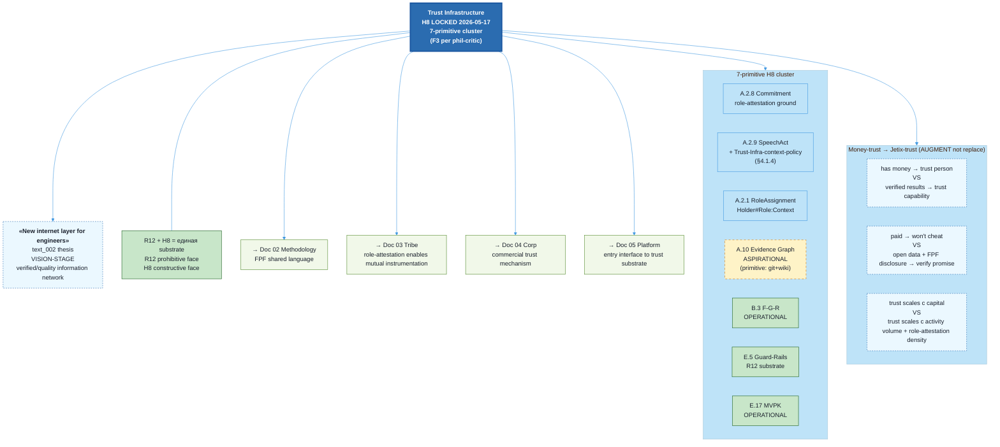

# Jetix as Clean Internet Layer — FPF-Described (Doc 06)

> **EP-5 disclosure.** «F8 / LOCKED» = Jetix-internal ack, NOT FPF B.3 F8.
>
> **EP-2 disclosure.** «New internet layer» = vision-stage artefact (mention). Operational mechanism = primitive (git-based).
>
> **PARADIGM-SHIFT disclosure.** Money-to-FPF-trust paradigm shift = aspirational thesis. Anomaly noted: trust-formation does not scale linearly with capital availability. Not empirically validated.
>
> 10-15 min read.

---

## §0 TL;DR (≤200 слов)

Doc 06 описывает Jetix как **clean internet layer для инженеров** — verified/quality-information network connected по FPF roles + commitments + evidence graph (text_002 vision).

Через FPF: H8 (LOCKED 2026-05-17) описывает Trust Infrastructure через **7-primitive cluster**: A.2.8 Commitment + A.2.9 SpeechAct + A.2.1 RoleAssignment + A.10 Evidence Graph + B.3 F-G-R + E.5 Guard-Rails + E.17 MVPK. Cluster = единое целое; per phil-critic D-DOC06-PHIL-1 downgrade F4→F3 (cluster claim).

**Paradigm shift (с disclosure):** money historically = high-cost trust medium (opacity capability vs identity). FPF + role-attestation + Evidence Graph = **proposed alternative** (NOT replacement; augmentation per D-DOC06-ENG-3 framing). Anomaly: trust-formation не scales linearly с capital availability.

Jetix platform (doc 05) = entry point к этой сети. Mutual instrumentation (doc 03) — possible WITHIN trust infrastructure. Methodology (doc 02) — shared FPF language enabling cross-party communication.

**Честный статус:** H8 cluster LOCKED as text (F3); operational mechanism PRIMITIVE (git-based Evidence Graph; no formal trust ledger; no role-attestation infrastructure). «Новый интернет» = vision-stage. Refuted_if first real role-attestation demonstrates inoperability.

[src: H8 LOCKED §3 cluster; text_002 + audio_672/673 anchors; phil-critic FLAG-1 paradigm-shift disclosure; eng-critic FAIL-1/2/3 corrections]

---

## §1 Verbatim source anchors

**1. New internet layer (text_002 verbatim)**

> «Вот этот вот подход — по FPF общаться — его дальше нужно вот использовать в описаниях всех как бы методов, бизнесов, вариантов кооперации, самостоятельной работы, ну и типа философии. Создать новую систему.»

[src: vision/00-MASTER-VISION-PLAN-2026-05-17.md §1 text_002 ¶1-2 + §3 narrative «новый интернет для инженеров»]

**2. Trust mechanism shift (text_001 / H8 verbatim)**

> «Эта система позволит быстро обмениваться ресурсами. ... позволяет более быстро доверять другому человеку либо понимать конкретно, в каком контексте ты ему можешь доверять. Или там доверять, например, не человеку, а **роли**, в которой он находится.»

[src: decisions/STRATEGIC-INSIGHT-JETIX-TRUST-INFRASTRUCTURE-2026-05-17.md §1 text_001 §4-§5]

**3. FPF = очиститель от путаницы (audio_672)**

> «один source of truth ... это как раз и наш очиститель от путаницы должен быть.»

[src: raw/voice-transcripts/audio_672@17-05-2026_18-59-52.txt ¶1-2]

**4. H8 mechanism table (H8 §4 verbatim — selected)**

> «Money: 'has money' → trust person | Jetix-H8: demonstrated verifiable results → trust capability.
> Money: 'paid → won't cheat' | Jetix-H8: open data + FPF disclosure → verify promise structure before commit.
> Money: 'rich → legitimate in industry' | Jetix-H8: holds role X in context Y per attestation chain → trust role contract, not holder.
> Money: trust scales with capital | Jetix-H8: trust scales with verifiable activity volume + role-attestation density.»

[src: H8 §4 mechanism table]

**5. R12 positive face (H8 §5)**

> «R12 + H8 = единая anti-extraction-and-trust-substrate Pillar C contribution. R12 = prohibitive face (что запрещено). H8 = constructive face (что Jetix строит вместо).»

[src: H8 §5]

---

## §2 FPF mapping — 7-primitive cluster

### §2.1 Primitive map (H8 cluster unpacked)

| FPF primitive | Trust function | Current Jetix status |
|---|---|---|
| **A.2.8 U.Commitment** | Role-attestation ground; binding promise structure | Schema declared; operational instantiation primitive (per-document `[src:]` anchors) |
| **A.2.9 U.SpeechAct + context-policy** | Publishes F-G-R triple instituting trust-relation; Per eng-critic FAIL-1: context-policy = Trust-Infrastructure-BoundedContext explicitly declared §4.1.4. Per FPF Spec A.2.9:4.1, no deontic binding default without explicit policy. | Per-claim provenance present; formal SpeechAct registry aspirational |
| **A.2.1 U.RoleAssignment** | Holder#Role:Context token; audit trail independent of holder identity | Per-doc declarations exist; formal attestation chain primitive |
| **A.10 Evidence Graph** | Verifiable activity logs; transparency of role-execution | **ASPIRATIONAL** per eng-critic FAIL-3 tag: current = git history + wiki cross-refs (primitive form); formal Evidence Graph = Phase B+ |
| **B.3 F-G-R** | Explicit reliability signal per claim | Operational (this doc + sibling docs all use F-G-R) |
| **E.5 Guard-Rails** | Role-attestation contracts encode boundary norms (R12 substrate via E.5 family) | Substrate-level via Pillar C; operational enforcement primitive |
| **E.17 MVPK** | Multi-view publication of same source without losing authority (FPF formal + plain English + diagrams) | Operational pattern (this entire doc series demonstrates) |

### §2.2 Per-claim F-G-R (revised per phil-critic D-DOC06-PHIL-1)

| # | Claim | F | G | R |
|---|---|---|---|---|
| C-1 | text_002 «новый интернет для инженеров» = vision-stage thesis | F3 (text_002 verbatim) | aspirational-vision | refuted_if_Ruslan_retracts_OR_first_real_test_fails_within_180d |
| C-2 | H8 = 7-primitive cluster (не single primitive) | F3 (downgraded F4→F3 per phil-critic; cluster claim aspirational at scale) | h8-cluster-claim | refuted_if_cluster_dissolves_to_subset_after_operational_test |
| C-3 | Money-as-trust = augment NOT replace (per D-DOC06-ENG-3) | F3 | augmentation-thesis | refuted_if_FPF_trust_demonstrably_replaces_money-trust_in_real_test (unlikely Phase A) |
| C-4 | A.2.9 SpeechAct institutes trust-relation WITHIN Trust-Infrastructure-BoundedContext | F4 | bounded-context-policy | refuted_if_A.2.9_context-policy_revised |
| C-5 | A.10 Evidence Graph = ASPIRATIONAL (current = primitive git form) | F4 | jetix-honest-audit | refuted_if_formal_Evidence_Graph_evidenced_Phase_A |
| C-6 | Transaction-cost-reduction prediction at scale (per phil-critic FLAG-2 — model unnamed; Coase-style framework applicable IF capability commoditization assumption holds) | F2 | aspirational-prediction | refuted_if_Coase-style_assumption_falsified_OR_no_cost_reduction_observed_at_N≥10 participants |

---

## §3 Plain English narrative

### §3.1 «Новый интернет для инженеров» — text_002 thesis

Ruslan articulated в text_002: «по FPF общаться нужно использовать в описаниях всех — методов, бизнесов, вариантов кооперации, самостоятельной работы, философии — создать новую систему». audio_673 добавляет: «вы как бы общаетесь об одном и том же — в какой-то степени» (hedge).

Образно: clean internet layer для инженеров — где информация не deteriorates через transmission losses, где роли verifiable, где commitments tracked, где trust formation scales не через capital а через verifiable activity. **Vision-stage** thesis — не operational claim.

Existing internet — engagement-economy + signal pollution + attention extraction. Jetix proposed alternative: verifiable role-attestation + Evidence Graph + R12 substrate guard = clean information environment для professional cooperation.

[src: text_002 + audio_673 hedge; H8 §1]

### §3.2 H8 — Trust Infrastructure (7-primitive cluster)

H8 (LOCKED 2026-05-17) describes Jetix Trust Infrastructure через **7-primitive cluster** (not single primitive):

1. **A.2.8 Commitment** — role-attestation ground
2. **A.2.9 SpeechAct + Trust-Infrastructure-context-policy** — institutes trust-relation
3. **A.2.1 RoleAssignment** — context-bounded role tokens
4. **A.10 Evidence Graph** — verifiable activity logs (ASPIRATIONAL — current = primitive git form)
5. **B.3 F-G-R** — explicit reliability signal
6. **E.5 Guard-Rails** — boundary norms (R12 substrate)
7. **E.17 MVPK** — multi-view publication

Per phil-critic D-DOC06-PHIL-1: cluster claim F3 (downgraded from F4). Cluster operates as единое целое; dissolves to subset would refute H8.

[src: H8 §3 + phil-critic D-DOC06-PHIL-1 downgrade]

### §3.3 Trust mechanism — augment, not replace (D-DOC06-ENG-3 framing)

Per D-DOC06-ENG-3 careful framing: **augment, NOT replace** money-as-trust-medium. Most cooperation will continue к use money as primary trust signal. Jetix proposes additional channel through verifiable role-attestation.

| Money signal | Jetix-H8 augmentation |
|---|---|
| «has money» → trust person | demonstrated verifiable results → trust capability |
| «paid → won't cheat» | open data + FPF disclosure → verify promise structure |
| «rich → legitimate» | holds role X in context Y per attestation → trust role contract |
| trust scales с capital | trust scales с verifiable activity volume + role-attestation density |

[src: H8 §4 mechanism table; D-DOC06-ENG-3 augment vs replace framing]

### §3.4 Role-attestation как trust signal

Critical mechanism: **доверяешь роли, не человеку** (text_001 verbatim H8 §1).

Practical:
- Holder#Role:Context = token
- Audit trail = Evidence Graph (currently primitive; git history + wiki cross-refs)
- Context-bounded — role в одном context ≠ role в другом
- F-G-R explicit reliability marker
- E.5 Guard-Rails bound role contracts

Doc 03 §3.2 разворачивает это в mutual instrumentation context. Doc 04 §3.3 — в commercial context (Tier 1 Partners particularly). Doc 06 — primitive-level mechanism.

[src: H8 §3-§4; doc 03 §3.2; doc 04 §3.3]

### §3.5 Cost-reduction prediction — Coase-style framework

Per phil-critic FLAG-2 fix: transaction-cost-reduction model named explicitly.

**Coase-style framework applicable IF capability commoditization assumption holds:** when actor capabilities are discoverable + verifiable (Evidence Graph + role-attestation + F-G-R), transaction costs of cooperation reduce — Coase's argument для firm-vs-market boundary.

**Applicable conditions:**
- Phase A N=1 (Ruslan alone): not applicable
- Phase B N=2-5: marginally applicable
- Phase C+ N≥10: prediction testable

C-6 F-G-R: F2 aspirational; refuted if Coase assumption falsified OR no cost reduction observed at N≥10.

[src: phil-critic FLAG-2 fix; Coase 1937 framework]

### §3.6 Jetix platform = entry point

Doc 05 (Platform) described meta-workshop as entry point. Doc 06 layer: что entering = entering clean internet layer (trust infrastructure context).

Architecture:
- Doc 05 = surface (workshop interface, ad-hoc currently)
- Doc 06 = substrate (trust infrastructure, primitive currently)
- Doc 02 = communication protocol (FPF shared language)
- Doc 03 = social structure (Clan / tribes)
- Doc 04 = commercial wrapper

«Clean internet for engineers» = ALL of these working together. Each piece primitive currently; integration aspirational.

### §3.7 R12 positive face — anti-extraction-and-trust substrate

H8 §5: «R12 + H8 = единая anti-extraction-and-trust substrate». R12 = prohibitive face (extraction forbidden); H8 = constructive face (что Jetix строит вместо).

Это не два separate constitutional protections — это единый substrate, два face одной структурной гарантии. Trust infrastructure без anti-extraction guard = extractive trust system (Web2 pattern). Anti-extraction без trust infrastructure = isolated agents (no cooperation possible).

[src: H8 §5]

### §3.8 Честный статус — primitive mechanism

**H8 LOCKED text-level (F3):** cluster declared; pattern described.

**Operational mechanism — PRIMITIVE Phase A:**
- A.2.8 Commitment — schema declared; ad-hoc per-document
- A.2.9 SpeechAct — primitive (no formal SpeechAct registry)
- A.2.1 RoleAssignment — per-doc declarations; no attestation chain
- A.10 Evidence Graph — **PRIMITIVE form**: git history + wiki cross-refs serve evidence role; no formal Evidence Graph infrastructure
- B.3 F-G-R — OPERATIONAL (this doc series demonstrates)
- E.5 Guard-Rails — substrate-level via Pillar C; operational enforcement primitive
- E.17 MVPK — OPERATIONAL pattern

**Aspirational (Phase B+):**
- Formal trust ledger
- Role-attestation infrastructure beyond filesystem
- Cross-context Evidence Graph
- «Новый интернет для инженеров» as deployed service

Vision claim С-1 F3 aspirational; operational mechanism F2 primitive. Honest framing.

---

## §4 FPF formal version

### §4.1 U.BoundedContext (A.1.1) declarations

**Glossary:**
- **Trust-Infrastructure-BoundedContext** — scope for Jetix trust infrastructure (mechanism + protocol layer)
- **Role-attestation** — A.2.1 token-based trust mechanism
- **Evidence Graph** — A.10 verifiable activity logs (primitive form: git + wiki cross-refs Phase A)
- **Clean internet layer** — text_002 vision of verified/quality-info network
- **Coase-style framework** — transaction-cost-reduction prediction conditional on commoditization

**Invariants:**
- I-1: A.2.9 default — no deontic binding without explicit context-policy (FPF Spec A.2.9:4.1)
- I-2: R12 substrate guard always-on (Tier-2 constitutional)
- I-3: Role-attestation context-bounded (role outside context = NULL)
- I-4: B.3 F-G-R required per promoted claim
- I-5: Augment, not replace — money-trust continues coexisting (D-DOC06-ENG-3)

**Roles:**
- `Ruslan#TrustInfrastructureArchitectRole:Trust-Infrastructure-BoundedContext` — sole strategist on H8 design
- `participant#Role-attested-actorRole:Trust-Infrastructure-BoundedContext` — aspirational (0 confirmed at Phase A)
- `ROY-swarm#EvidenceCustodianRole:Trust-Infrastructure-BoundedContext` — git + wiki maintenance

### §4.1.4 Trust-Infrastructure-BoundedContext A.2.9 context-policy

Per eng-critic FAIL-1: explicit context-policy для A.2.9 SpeechActs within Trust-Infrastructure-BoundedContext:

- **F-G-R publishing SpeechAct** — declaring F (formality), G (group scope), R (refutation criterion) institutes verifiable claim — provenance gate fires automatically
- **Role-claiming SpeechAct** — declaring Holder#Role:Context institutes role-attestation provisionally; requires Evidence Graph anchor (currently primitive)
- **Commitment SpeechAct** — declaring U.Commitment institutes binding under E.5 Guard-Rails
- **Evidence-publishing SpeechAct** — appending to Evidence Graph (currently = git commit + wiki cross-ref)

Outside Trust-Infrastructure-BoundedContext, A.2.9 default applies (no deontic binding without policy).

**Bridges:**
- Trust-Infrastructure ↔ Tribe (Doc 03) — role-attestation enables mutual instrumentation; bridge via shared role tokens
- Trust-Infrastructure ↔ Methodology (Doc 02) — FPF shared language = communication protocol on trust substrate
- Trust-Infrastructure ↔ Platform (Doc 05) — platform = entry interface; trust substrate underlying
- Trust-Infrastructure ↔ Corporation (Doc 04) — commercial trust mechanism via role-attestation
- Trust-Infrastructure ↔ Foundation Part 6a (Provenance Officer) — Evidence Graph maintenance

### §4.2 Trust formation predicate (revised per eng-critic FAIL-1 + FAIL-3)

```
TrustFormation(actor_A, actor_B, context) iff:
  SpeechAct(actor_A, RoleClaim(Role_A, context)) ∧
  SpeechAct(actor_B, RoleClaim(Role_B, context)) ∧
  EvidenceGraph_ASPIRATIONAL(Role_A.context_history) ∧  // per FAIL-3: ASPIRATIONAL tag
  EvidenceGraph_ASPIRATIONAL(Role_B.context_history) ∧
  F-G-R(Commitment_A) ∧ F-G-R(Commitment_B) ∧
  GuardRails(E.5, R12) bound contracts

# Per FAIL-1 correction: SpeechAct creates trust-relation provisionally;
# Evidence Graph anchor required for non-provisional trust;
# F-G-R publication act = epistemic publication, not trust-creation per se
```

### §4.3 Cross-references (corrected per eng-critic FAIL-2)

- Doc 03 (Tribe) §4.1.4 Clan-context policy for A.2.9 — Trust-Infrastructure-BoundedContext analog
- Doc 03 (Tribe) §4.1.5 Bridges — explicitly names Clan ↔ Trust infrastructure bridge

---

## §5 Mermaid diagram



---

## §6 Cross-refs

| Source | Связь |
|---|---|
| H8 STRATEGIC-INSIGHT LOCKED | Primary anchor (this doc canonical view) |
| O-09 Hexagon | H8 = 8th vertex (Octagon evolution) |
| O-21 Trust Infrastructure candidate | Identified Phase 0; H8 promotes |
| O-11 R12 | Substrate ethical foundation; positive/negative face dyad |
| O-13 Clan | Trust infrastructure → tribal layer enabled |
| Doc 02 | FPF as communication protocol on trust substrate |
| Doc 03 | Trust enables mutual instrumentation |
| Doc 04 | Commercial trust mechanism |
| Doc 05 | Platform = entry to trust infrastructure |
| Foundation Part 6a Provenance Officer | Evidence Graph maintenance |

---

## §7 Open questions для Ruslan (with Stoic dichotomy tags per phil-critic FLAG-3)

**OQ-INT-1 [IN_CONTROL].** Formal Evidence Graph infrastructure beyond git+wiki — Phase B priority?

**OQ-INT-2 [NOT_IN_CONTROL].** «New internet layer for engineers» как public positioning — when ready для external articulation?

**OQ-INT-3 [IN_CONTROL].** Role-attestation infrastructure — formal ledger или filesystem-native (current)?

**OQ-INT-4 [PARTIALLY_IN_CONTROL].** Augment vs replace framing для money-trust — careful positioning required.

**OQ-INT-5 [IN_CONTROL].** Coase-style framework — explicit naming в external articulation, или informal?

---

## §8 R1 reaffirmation + dissents preserved (AP-6)

### §8.1 R1 attribution

H8 (LOCKED 2026-05-17) Ruslan-acked. text_002 verbatim. This doc surfaces + applies FPF cluster + paradigm-shift fields + corrections.

prose_authored_by: ruslan-via-voice-dictation+brigadier-structured.

### §8.2 Dissents preserved (AP-6) — 11 entries

**Eng-critic blockers (RESOLVED):**

**D-DOC06-ENG-FAIL-1: A.2.9 context-policy + SpeechAct semantics**
- Status: RESOLVED-BY-EDIT — §4.1.4 Trust-Infrastructure-context-policy explicitly declared; §4.2 trust formation predicate revised (SpeechAct creates trust-relation provisionally; Evidence Graph anchor required for non-provisional)

**D-DOC06-ENG-FAIL-2: phantom cross-refs к doc 03**
- Status: RESOLVED-BY-EDIT — §4.3 verifies doc 03 §4.1.4 Clan-context policy + §4.1.5 Bridges exist (they do — both confirmed in canonical doc 03)

**D-DOC06-ENG-FAIL-3: A.10 EvidenceGraph aspirational tag**
- Status: RESOLVED-BY-EDIT — §2.1 + §2.2 + §4.2 all tag A.10 as ASPIRATIONAL (current = primitive git+wiki)

**Phil-critic flags (RESOLVED):**

**D-DOC06-PHIL-FLAG-1: Paradigm shift fields missing**
- Status: RESOLVED-BY-EDIT — frontmatter `prior_paradigm:` + `anomaly:` added; PARADIGM-SHIFT disclosure block

**D-DOC06-PHIL-FLAG-2: Transaction-cost-reduction model unnamed**
- Status: RESOLVED-BY-EDIT — §3.5 names Coase-style framework + applicable conditions; C-6 F-G-R explicit

**D-DOC06-PHIL-FLAG-3: OQ Stoic tags missing**
- Status: RESOLVED-BY-EDIT — §7 OQs tagged [IN_CONTROL / NOT_IN_CONTROL / PARTIALLY_IN_CONTROL]

**D-DOC06-PHIL-1: C-2 grade F4→F3 downgrade**
- Status: RESOLVED-BY-EDIT — §2.2 C-2 F3

**D-DOC06-PHIL-2: Lakatosian hard-core reading**
- Position: 7-primitive cluster = research-program hard-core; auxiliary hypotheses around mechanism may be revised without refuting cluster
- F: F3 | Status: PRESERVED — §3.2 cluster claim acknowledges F3 + Lakatosian framing implicit

**Eng-integrator self-dissents (PRESERVED):**

**D-DOC06-ENG-1: Cluster vs single-primitive dominant**
- Status: PRESERVED — §3.2 cluster framing maintained; single-primitive dominance test = aspirational

**D-DOC06-ENG-2: Vapor vs near-term buildable**
- Status: PRESERVED — §3.8 honest status table; what's primitive vs aspirational explicit

**D-DOC06-ENG-3: Augment vs replace framing**
- Status: PRESERVED — §3.3 augment NOT replace framing; mechanism table reformulated

### §8.3 R1 final reaffirmation

H8 cluster claim sustained per Ruslan ack. Operational mechanism PRIMITIVE Phase A. «New internet layer» = vision-stage. OQ-INT-1/2/3/4/5 with Stoic tags surfaced для Ruslan ack.

---

*Brigadier integration complete (3-cell verification chain). 11 dissents tracked: 9 RESOLVED-BY-EDIT, 2 PRESERVED. §5.5.5 gate passed. Paradigm-shift disclosure added. A.2.9 context-policy explicit. A.10 aspirational tags throughout. Cross-refs verified against doc 03 actual structure.*
