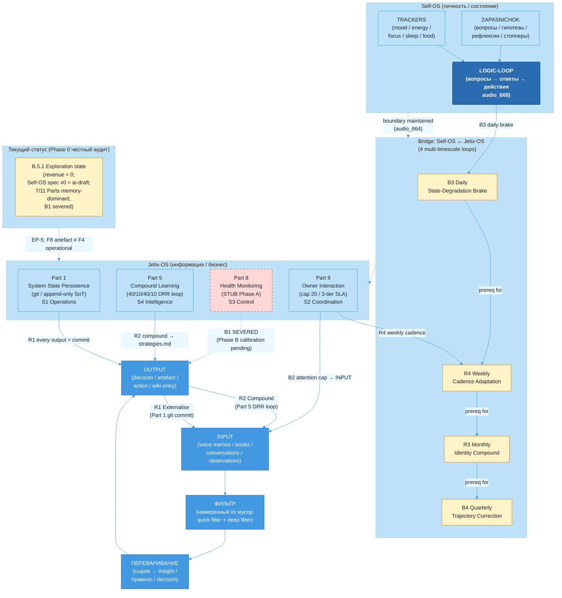

# Diagram 01 — Self-OS Info-Processing Flow + VSM Mapping

> Source: vision/jetix-fpf-describe/01-jetix-as-self-os-substrate.md §5 (canonical mermaid).
> Standalone file provided per Phase 1 plan §2.5 — diagrams directory.

## Caption

The Self-OS substrate processes Ruslan's information stream through four phases (INPUT→FILTER→DIGEST→OUTPUT). Two reinforcing loops (R1 externalisation, R2 compound knowledge) feed back into INPUT. Foundation Parts 1+5+8+9 form the substrate cluster, mapped to Beer's VSM:

- **S1 Operations** = Part 1 (git SoT) — evidenced (571 commits/month)
- **S2 Coordination** = Part 9 (cadence + SLA + 20-task cap) — daily-log directory absent (acute gap)
- **S3 Control** = Part 8 — SPECIFY AND STUB; B1 health correction loop **severed** (red dashed)
- **S4 Intelligence** = Part 5 (compound + methodology promotion) — best-developed
- **S5 Policy** = Pillar C (LOCKED F5) + P-1 identity principle (F2 ai-draft)

Bridge subgraph shows 4 multi-timescale feedback loops connecting Self-OS and Jetix-OS with prerequisite-dependency chain: B3 daily → R4 weekly → R3 monthly → B4 quarterly. Faster loops must be operational before slower loops can be trusted (currently B3 stub-only → B4 quarterly making course corrections on trajectory it cannot measure).

**EP-5 disclosure** (Jetix F8 = single-author Ruslan ack ≠ FPF B.3 F8 independent verification) shown bottom-right.
