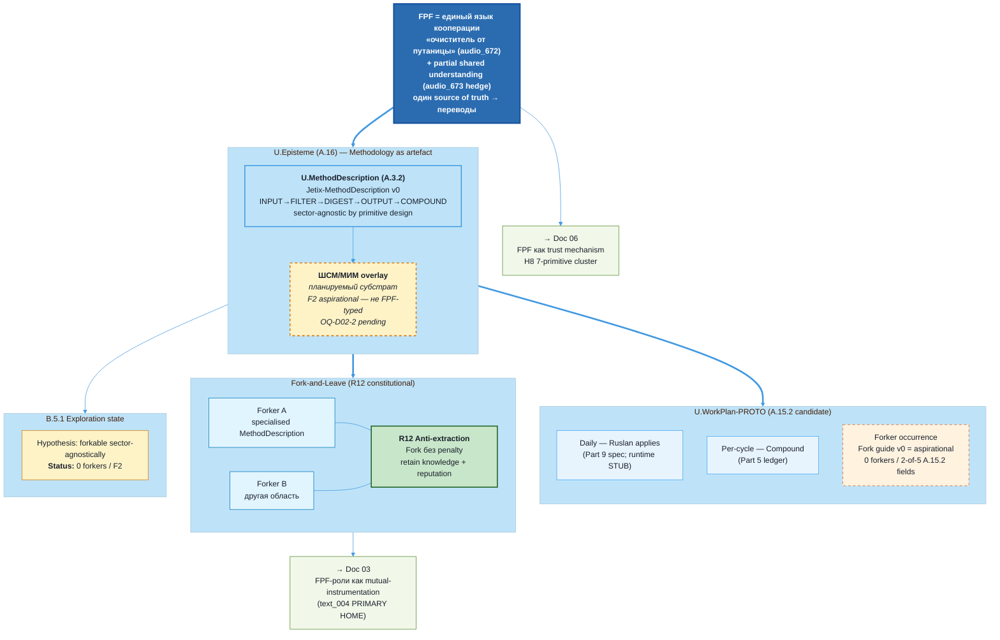

# Diagram 02 — Methodology Distribution Layer

> Source: vision/jetix-fpf-describe/02-jetix-as-methodology.md §5 (canonical).

## Caption

FPF = единый язык кооперации (с audio_673 hedge «в какой-то степени»). Methodology = U.MethodDescription (A.3.2) with planned ШСМ/МИМ overlay (F2 aspirational; не типизирован, OQ-D02-2). U.WorkPlan = PROTO-candidate (satisfies 2 of 5 A.15.2 fields per eng-critic D-DOC02-ENG-W). Distribution via Fork-and-Leave (R12 constitutional). B.5.1 Exploration: 0 forkers confirmed as of 2026-05-17. Cross-links: doc 03 (mutual instrumentation), doc 06 (trust infra).
