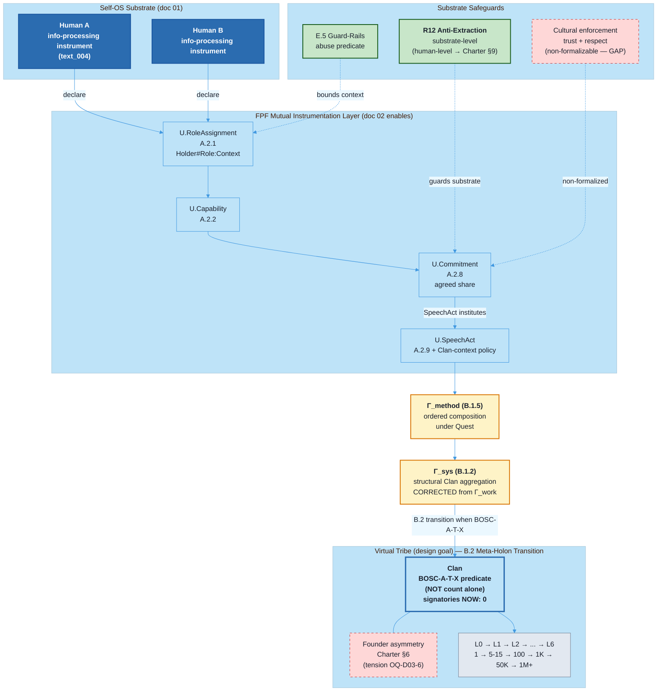

# Diagram 03 — Tribe Substrate Cooperation Graph

> Source: vision/jetix-fpf-describe/03-jetix-as-virtual-tribe-substrate.md §5 (canonical).

## Caption

Cooperation graph (text_004 PRIMARY HOME). Individual info-processing instruments → FPF mutual instrumentation primitives (U.RoleAssignment + U.Capability + U.Commitment + U.SpeechAct with Clan-context policy) → ordered composition Γ_method (B.1.5) + structural aggregation Γ_sys (B.1.2) [CORRECTED from Γ_work per eng-critic FAIL-1] → B.2 Meta-Holon Transition with BOSC-A-T-X 7-component predicate → Virtual Tribe (Clan, 0 signatories aspirational). Substrate safeguards (R12 + E.5) bound capability-sharing at constitutional level; cultural enforcement (trust + respect) = non-formalizable gap explicitly surfaced. Founder asymmetry tension (Charter §6 vs «mutual» framework) acknowledged via OQ-D03-6.
