# Diagram 04 — Corporation Structure

> Source: vision/jetix-fpf-describe/04-jetix-as-corporation.md §5 (canonical).

```mermaid
%%{init: {"theme": "base", "themeVariables": {"primaryColor": "#2b6cb0", "primaryTextColor": "#1a202c", "primaryBorderColor": "#1a56a0", "lineColor": "#4299e1", "secondaryColor": "#ebf8ff", "tertiaryColor": "#bee3f8", "background": "#ffffff", "edgeLabelBackground": "#ebf8ff"}}}%%

flowchart TB
    classDef default color:#1a202c,fill:#ebf8ff,stroke:#2b6cb0,stroke-width:1px
    classDef primary fill:#2b6cb0,stroke:#1a56a0,stroke-width:3px,color:#ffffff,font-weight:bold
    classDef offer color:#1a202c,fill:#bee3f8,stroke:#4299e1,stroke-width:2px
    classDef tier color:#1a202c,fill:#e1f5fe,stroke:#0277bd,stroke-width:1px
    classDef tierlimited color:#1a202c,fill:#fff3e0,stroke:#e65100,stroke-width:1px,stroke-dasharray:5 5
    classDef blocking color:#1a202c,fill:#fed7d7,stroke:#c53030,stroke-width:2px
    classDef vapor color:#1a202c,fill:#fef3c7,stroke:#d97706,stroke-width:1px,stroke-dasharray:5 5
    classDef crosslink color:#1a202c,fill:#f1f8e9,stroke:#558b2f,stroke-width:1px

    CORP["<b>Jetix-Corp U.System (A.1)</b><br/>«мета-мастерская для professional makers»<br/>JetixCorp-BoundedContext"]:::primary

    subgraph OFFER["U.PromiseContent (A.2.3) — TRM ladder"]
        L0["L0 €3K diagnostic"]:::offer
        L1["L1 €5-10K single resource"]:::offer
        L2["L2 €10K 2-3 resources"]:::offer
        L3["L3 €20-30K full TRM"]:::offer
        L4["L4 €30-40K + team dev"]:::offer
        L5["L5 €40-60K + AI infra"]:::offer
        L0 --> L1 --> L2 --> L3 --> L4 --> L5
    end

    subgraph TIERS["U.RoleAssignment (A.2.1) — 3 engagement tiers"]
        T1["Tier 1 Partners<br/>LIMITED Phase A<br/>(no legal entity)"]:::tierlimited
        T2["Tier 2 Clients<br/>VIABLE L0-L2 only"]:::tier
        T3["Tier 3 Employees<br/>Phase 2+ design (0 current)"]:::tierlimited
    end

    subgraph BLOCK["LIVE-FLAG ICP — BLOCKING"]
        ICP["3 simultaneous ICP versions<br/>Mittelstand (self-rejected) vs Online-first vs Agnostic<br/>BLOCKING для Phase 2 sales<br/>Ruslan canonical declaration required"]:::blocking
    end

    subgraph TRAJECTORY["Trajectory (vapor с per-band falsifiers)"]
        T_NOW["€5K MRR sustained"]:::offer
        T_Y1["$100K Y1 (Q3 2026)<br/>requires 3 L2 clients @€10K"]:::vapor
        T_Y3["€100M+ Y3<br/>aspirational vision"]:::vapor
        T_NOW --> T_Y1 --> T_Y3
    end

    FA["Founder asymmetry<br/>Ruslan = sole strategist<br/>(OQ-CORP-7 tension)"]:::vapor

    CORP --> OFFER
    CORP --> TIERS
    CORP --- BLOCK
    CORP --> TRAJECTORY
    CORP --- FA

    CR03["→ Doc 03 Tribe<br/>mutual instrumentation<br/>partner role-attestation"]:::crosslink
    CR05["→ Doc 05 Platform<br/>meta-workshop operational interface"]:::crosslink
    CR06["→ Doc 06 Trust Infra<br/>commercial trust mechanism"]:::crosslink

    TIERS --> CR03
    CORP --> CR05
    CORP --> CR06
```

## Caption

Jetix-Corp = U.System «мета-мастерская» (Doc 1B one-liner). TRM ladder L0-L5 = U.PromiseContent (A.2.3) with critical caveat: does NOT bind until U.Commitment (A.2.8) instantiated с named client. 3 engagement tiers with Phase A viability: Partners LIMITED (no legal entity для equity/rev-share), Clients VIABLE L0-L2 only (1-person Ruslan capacity), Employees Phase 2+ (0 current). LIVE-FLAG ICP BLOCKING per mgmt-integrator critical finding: 3 simultaneous ICP versions (Mittelstand self-rejected in own source / Online-first / Agnostic) — Ruslan canonical declaration required (HITL). Trajectory $100K Y1 + €100M+ Y3 = vapor с per-band falsifiers (revenue<$100K on 2026-08-31). Founder asymmetry tension surfaced (OQ-CORP-7).
