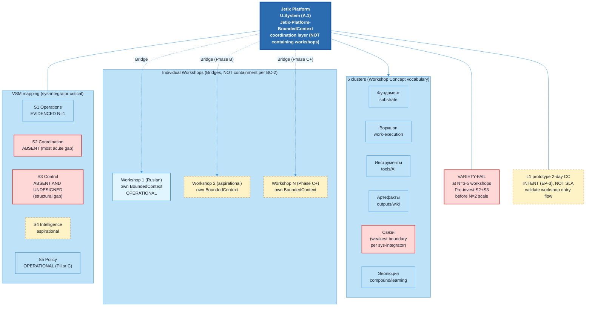

# Diagram 05 — Platform Structure

> Source: vision/jetix-fpf-describe/05-jetix-as-platform.md §5 (canonical).

## Caption

Jetix Platform = U.System coordination holon — JETIX-PLATFORM-BoundedContext. Per eng-critic FAIL-1 BC-2 correction: platform does NOT contain workshop BoundedContexts; connection = Bridges only. 6 clusters from Workshop Concept = vocabulary anchor (F5); architectural assignment F3 candidate (phil-critic C-1 downgrade, OQ-4 unresolved). Cluster 5 (Связи) = weakest boundary per sys-integrator. VSM mapping (sys-integrator critical): S2 ABSENT (most acute), S3 ABSENT AND UNDESIGNED (structural gap not deferred like doc 01 STUB). VARIETY-FAIL at N=3-5 heterogeneous workshops per Ashby — pre-invest S2+S3 design required before N=2 scale. L1 2-day CC prototype = INTENT per EP-3, NOT SLA, NOT commitment.
