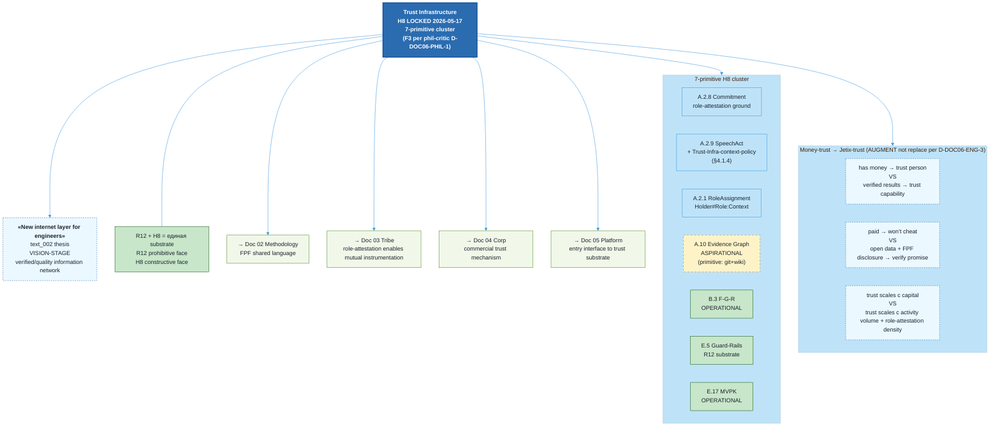

# Diagram 06 — Clean Internet Layer Architecture

> Source: vision/jetix-fpf-describe/06-jetix-as-clean-internet-layer.md §5 (canonical).

## Caption

Trust Infrastructure (H8 LOCKED 2026-05-17) = 7-primitive cluster: A.2.8 Commitment + A.2.9 SpeechAct (with Trust-Infrastructure-BoundedContext context-policy per eng-critic FAIL-1) + A.2.1 RoleAssignment + A.10 Evidence Graph (ASPIRATIONAL — current primitive form = git + wiki) + B.3 F-G-R (OPERATIONAL) + E.5 Guard-Rails (R12 substrate, OPERATIONAL) + E.17 MVPK (OPERATIONAL). Money-to-Jetix-trust shift = AUGMENT, NOT replace (D-DOC06-ENG-3 framing). «New internet layer for engineers» = vision-stage text_002 thesis. R12 + H8 = единая anti-extraction-and-trust substrate (positive/negative face dyad).
