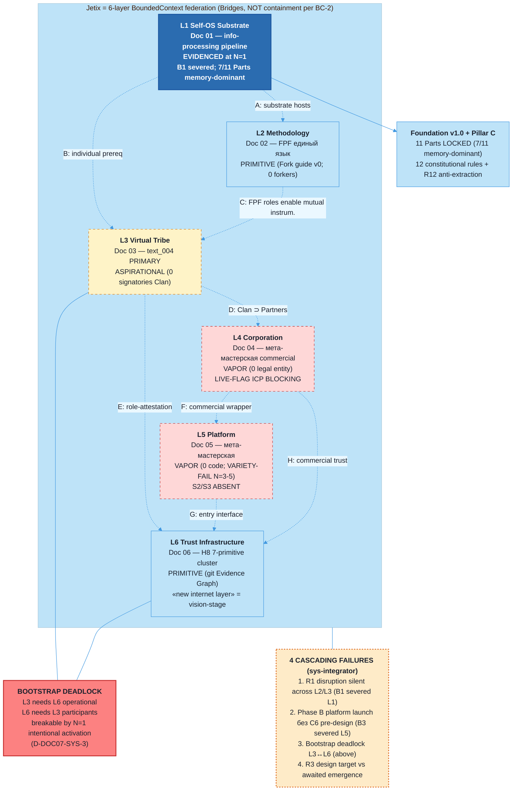

# Diagram 07 — End-to-End Jetix System (CENTERPIECE)

> Source: vision/jetix-fpf-describe/07-jetix-end-to-end-overview.md (synthesis canonical).

## Caption

CENTERPIECE diagram: Jetix as composite system through 6-layer BoundedContext federation (per FPF A.1.1 BC-2 invariant — Bridges only, no containment).

**Layer status** (bottom-up):
- **L1 Self-OS Substrate** — EVIDENCED at N=1 (Ruslan); 7/11 Foundation Parts memory-dominant; B1 health correction loop severed (Part 8 Phase A STUB)
- **L2 Methodology** — PRIMITIVE (Fork guide v0 = 6-step outline; 0 forkers; Aisystant subscription LIVE-FLAG B2 blocks IWE comparisons)
- **L3 Virtual Tribe** (text_004 PRIMARY HOME) — ASPIRATIONAL (Charter LOCKED F5; 0 signatories; mutual instrumentation framework with R12 substrate guard)
- **L4 Corporation** — VAPOR (0 legal entity; LIVE-FLAG ICP BLOCKING — 3 simultaneous versions per mgmt-integrator)
- **L5 Platform** — VAPOR (0 code; VARIETY-FAIL at N=3-5 workshops per sys-integrator; S2 ABSENT acute, S3 ABSENT AND UNDESIGNED structural gap; 2-day CC prototype = INTENT not SLA)
- **L6 Trust Infrastructure** — PRIMITIVE (H8 7-primitive cluster LOCKED text F3; operational mechanism = git-based Evidence Graph; «new internet layer for engineers» = vision-stage)

**8 typed Bridges** A-H connect layers per A.1.1 Bridge semantics.

**4 cascading failures** (sys-integrator critical): R1 disruption silent, Phase B platform launch без C6 pre-design, L3↔L6 bootstrap deadlock (breakable by N=1 intentional activation), R3 awaited-emergence vs design-target.

**Synthesis verdict:** Description-level VIABLE; operational-level FRAGILE. Phase 0 honest status: только L1 evidenced; reinforcing-dominant configuration с balancing loops severed/absent.

[src: doc 01-06 frontmatter + §0 honest status; sys-integrator D-DOC07-SYS-1/2/3/4; phil-critic RC-1 OQ-1 reattribution]
