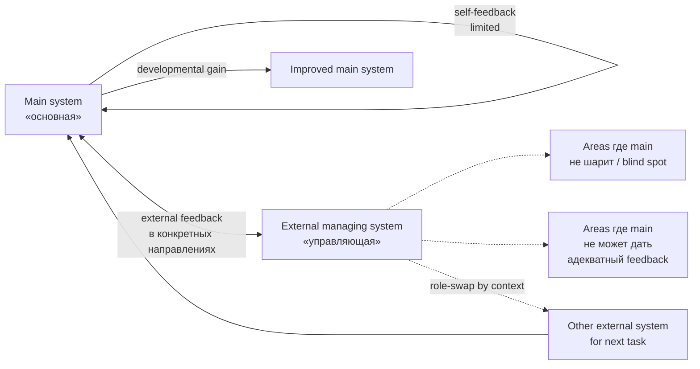

# External-system-required-for-self-management — cybernetic principle

> **Canonical anchor (Ruslan voice verbatim, audio_721 batch-10-supplement 2026-05-22 12:11):**
>
> «⭐⭐⭐ еще важное, что я вижу, как бы система не может сама себя со стороны изнутри... важно описать что система не может сама себя сам сама собой же адекватно управлять то есть ей должен у этой системы должна быть другая управляющая система которая вот видит возможно больше ну или чуть в другом направлении»
>
> **Clarification (audio_721 claim 6):** «не и не особенно прям эта система должна быть больше во всех смыслах… Но эта система, которая управляющая, в какой-то конкретный момент она должна знать и управлять этой системой в тех местах и в тех направлениях, где основная система не сильно шарит, или где она не может дать себе адекватную обратную связь»
>
> Tier A standalone — cybernetic principle articulation (Ashby Requisite Variety + Beer VSM System 4-5 + Meadows feedback-from-outside direct corroboration).

---

## §1 Что это

**Принцип:** никакая система не может adequate'но управлять собой исключительно изнутри. Любая система seeking effective+stable development нуждается в **external managing system**, которая в конкретные моменты / по конкретным направлениям знает больше или видит иначе чем основная система.

**Ключевая asymmetry:**
- External system **не больше overall** — не «учитель всезнающий»
- External system **больше / иначе в конкретных направлениях** где основная система слепа или не может дать себе адекватный feedback

**Operationalisation (audio_721 claim 8-12):**
- Partners / учителя / тренеры = external systems
- Role-swap dynamic: external system #1 ведёт по психологии → main system прокачивается → external system #2 ведёт по продажам → continue
- Sequential expert-rotation = Ruslan's personal-life example (psychologist → sales-teacher)
- Jetix governance pattern (audio_721 claim 12): «в управлении Jetix должна быть похожая ситуация. И как раз это решает вопрос того, что система не может адекватно вокруг себя все видеть»

---

## §2 Почему важно

**Defining feature vs naive «autonomy» framing:**
- Common business narrative: «autonomous self-managed system» = ideal
- Cybernetics literature (Ashby 1956, Beer 1972, Meadows 2008) — direct contradiction: closed self-managed systems hit **requisite-variety ceiling** (Ashby) или **System-4 blind spot** (Beer)
- Ruslan voice independently re-derives 50+ year-old cybernetic insight

**Theoretical lineage (cybernetic literature direct corroboration):**

| Source | Что говорит | Direct mapping |
|---|---|---|
| **W. Ross Ashby «Introduction to Cybernetics» (1956)** — Law of Requisite Variety | «только variety can absorb variety»: controller must have ≥ variety of system being controlled to manage all states | Main system limited variety; external system supplies variety for blind-spot states |
| **Stafford Beer «Brain of the Firm» (1972) — Viable System Model** | System 4 = intelligence/scanning environment; System 5 = policy/identity. S4+S5 = external-perspective layer для viability | External managing system = S4+S5 functional layer для main system |
| **Donella Meadows «Thinking in Systems» (2008)** | Feedback-from-outside-the-system pattern; privileged outsider perspective on blind leverage points | External system sees леverage points main system can't see from inside |
| **Sutton + Barto «Reinforcement Learning» (2018)** | Actor-critic architecture: external critic improves actor's policy | External system = critic; main system = actor |
| **Karpathy teacher-student distillation** | Larger teacher model distills knowledge into smaller student model | Direct AI/ML analogue |
| **Vygotsky «Zone of Proximal Development»** | Learning happens with more-capable other; not in isolation | Pair-learning > solo learning |
| **Polanyi «Personal Knowledge»** | Tacit knowledge requires master-apprentice transmission | External transmission necessary, not optional |

**Connection к larger Jetix narrative:**
- L13 Method V2 §J + §H (exocortex era) — meta-method needs external operand to be effective
- Foundation Part 4 hub-and-spoke + role-taxonomy — partnerships as dynamic role-swap = structural analog
- L14 Strategic Plan Phase 4-6 — partner-vetting cohort onboarding operationalises external-system pattern
- [[jetix-as-exokortex]] — exocortex = institutionalised external managing system (substrate-level)
- [[student-teacher-pair-dynamic]] — relational operationalisation
- ⭐ **HYPOTHESIS H-batch-10-supp-08:** «system effectiveness ∝ external-feedback-system diversity × meta-method depth»

---

## §3 Use cases

### §3.1 Jetix governance design
Workshop / hackathon teams operate в pairs: project-team (main) + advisor-team (external) с rotating composition by task-context. Per audio_721 claim 8 — «партнеры тоже вот следят за системой со стороны».

### §3.2 Self-coaching protocol (personal development)
Ruslan's personal example (audio_721 claim 10-11): psychologist managed psychological development → speedup; sales-teacher managed sales development → speedup. Sequential expert-rotation = explicit operational protocol.

### §3.3 R12 anti-extraction governance (Jetix-specific)
External managing system **must NOT capture** main system value beyond agreed share (R12 LOCK). Voluntary opt-in clause: «партнёры более прошарены / более ответственны» = competence-based selection, not coercion. Fork-and-leave preserved. ⚠️ Pitch-material soften discipline applied per §6.

### §3.4 Org design pattern (Jetix-OS application)
Brigadier (Part 4 §H IP-1) = external managing system для individual ROY expert agents. Each ROY expert (engineering / investor / mgmt / philosophy / systems) = external system relative к other domains. Hub-and-spoke topology = formal implementation of external-management cybernetic principle.

### §3.5 AI/electricity analogue (L16 substrate)
AI = «more knowledgeable external system» available cheaply. AI commoditisation = many external systems становятся available cheap → cybernetic principle becomes mass-applicable, не reserved для wealthy. Adjacency L16 AI Market PLAN.

---

## §4 Cross-cite substrate

| Source | Что говорит |
|---|---|
| `raw/voice-transcripts/audio_721@22-05-2026_12-11-58.txt` | Verbatim voice anchor (claim 5-12) |
| `raw/voice-memos-2026-05-22-batch/audio_721@22-05-2026_12-11-58.md` | 5-cell analysis Cell 1 NEW idea + Cell 3 Corroboration (10 sources) |
| `reports/voice-pipeline-2026-05-22-batch-10/05-candidates-3-buckets.md` | O-128 ⭐⭐⭐ PRIMARY supplement entry + DR-40 trigger |
| `decisions/strategic/METHOD-LIFE-DEVELOPMENT-V2-2026-05-21.md` | L13 §J + §H — §APPEND target (P1-supp-01) |
| `wiki/concepts/method-systems-thinking.md` | §3 Cross-precedent corroboration (Meadows / Beer / Ashby / Wiener / Senge — 10 thinkers K-6 deep) |
| `wiki/concepts/jetix-as-exokortex.md` | Exocortex = institutionalised external managing system; §APPEND target Phase 6 (O-128 reinforcement) |
| `swarm/wiki/foundations/part-4-role-taxonomy-coordination-protocol/architecture.md` | Hub-and-spoke topology = formal implementation |
| `research/method-systems-thinking-deep-2026-05-19/` | K-6 deep research Ashby/Beer/Meadows substrate |

---

## §5 Variations / interpretations

| Phrasing | Audience | Context |
|---|---|---|
| «Система не может сама себя адекватно управлять; нужна другая управляющая система» | RU primary (Ruslan voice) | Default |
| «External-system-required cybernetic principle» | EN engineering | Methodology / AI safety community |
| «Ashby requisite variety applied к self-management» | EN academic | Cybernetics community |
| «Pair-coaching pattern (учитель-ученик)» | RU non-technical | Mass audience / ZPD framing |
| «External feedback layer requirement» | EN softened | Pitch material (soften per §6) |
| «Systems benefit from external feedback layers» | EN public-facing softer | Per HR-2-supp soften discipline |

**Default canonical:** Ruslan voice verbatim + Ashby/Beer/Meadows cross-cite. Soften phrasings only для public-facing.

---

## §6 Constitutional posture

- ✅ **R1 surface** — voice anchor verbatim (audio_721); brigadier scribe header + cybernetics literature cross-cite only; NO strategic prose authored
- ✅ **R6 provenance** — каждый claim с [src: audio_721 claim N] + Ashby/Beer/Meadows citation
- ✅ **R12 anti-extraction** — external managing system MUST NOT extract value beyond agreed share; voluntary opt-in clause (competence-based selection per claim 8); fork-and-leave preserved; см. §3.3 governance explicit
- ✅ **IP-1 STRICT** — Foundation abstract cybernetic principle; instantiation (Jetix partner / brigadier / psychologist / sales-teacher) = RUSLAN-LAYER / U.Episteme role-binding
- ✅ **EP-5 F-grade** — F4 derivative claim (voice substrate + 7-source cybernetic literature corroboration)
- ✅ **AP-6 dissent preservation** — universal-claim form «не может» preserved verbatim в §1 substrate; soften discipline applied только в §5 variations + §3.3 governance explicit
- ⚠️ **HR-1-supp flag** — «партнёры берут управление основной системой» extraction-risk: substrate verbatim; pitch reframe «partners with relevant expertise are invited to lead in their domain»; voluntary opt-in clause mandatory для public-facing
- ⚠️ **HR-2-supp flag** — universal-claim «система не может сама себя адекватно управлять» soften: substrate verbatim; pitch reframe «systems benefit from external feedback layers»
- ✅ **Append-only** — этот файл создан NEW; [[jetix-as-exokortex]] receives §APPEND-O-128 reinforcement per Phase 6
- ✅ **O-83 NOT revived** — audio_721 claim 15 «читерство по управлению» = THIRD batch-10 instance cheat-code metaphor (intellect/management/Jetix-positioning); context-DISTINCT from O-83 (Jetix-positioning DROPPED); preserved verbatim в substrate only

---

## §7 Promotion history

- **2026-05-22 batch-10-supplement:** Surfaced as O-128 ⭐⭐⭐ (Tier B supplement primary entry) via audio_721 voice anchor; substrate density ~700w; Ashby/Beer/Meadows direct corroboration noted
- **2026-05-22 batch-10 closure:** **Ruslan R1 ack via voice «макать всё в Википедию + Тир А ебаш»** → Tier A standalone promotion (this wiki created)
- **Predecessor pool entry:** `reports/voice-pipeline-2026-05-22-batch-10/05-candidates-3-buckets.md` A.2-supp row O-128
- **§APPEND target:** [[jetix-as-exokortex]] receives extension (O-128 reinforcement — exocortex = institutionalised external managing system) per Phase 6 wiki-promotions-batch-10
- **Research pool trigger:** DR-40 ⭐ «External-system-required cybernetic principle benchmarks» (Ashby/Beer/Meadows/Sutton-Barto/Karpathy/Polanyi/Vygotsky) — Ruslan-ack required для launch

---

## §8 Related wikis

- [[jetix-as-exokortex]] — exocortex = institutionalised external managing system; receives §APPEND-O-128 Phase 6
- [[method-method-one-liner]] — meta-method abstract; этот = operational requirement (external operand)
- [[meta-method-8-component-composition]] — 8 components meta-method; этот = required external operand для composition efficacy (sibling Tier A batch-10)
- [[student-teacher-pair-dynamic]] — relational operationalisation (sibling Tier A batch-10)
- [[unified-framework-jetix-stack]] — этот = layer 3 of 5-layer unified stack (sibling Tier A batch-10)
- [[method-systems-thinking]] — broader Ashby/Beer/Meadows substrate parent
- [[korporaciya-startup-concept]] — Jetix governance application
- [[fpf-as-info-transfer-vocabulary]] — FPF = communication protocol для external feedback transmission

---

*Tier A standalone wiki created 2026-05-22 per Ruslan R1 ack. Cybernetic principle articulated by Ruslan voice + direct Ashby/Beer/Meadows corroboration. R12 paired-frame conformant via voluntary opt-in clause. Substrate compile only — no R1 strategic prose authored.*
