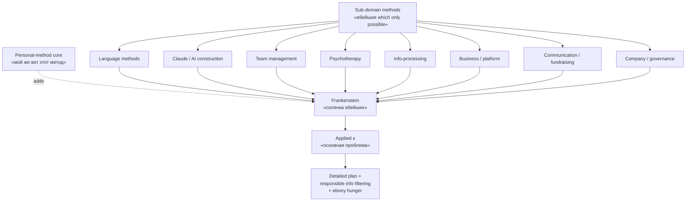

# Frankenstein / солянка method-collection — pitch-friendly metaphor

> **Canonical anchor (Ruslan voice verbatim, audio_719 batch-10 2026-05-22 10:19):**
>
> «методы использования языка, и методы, блядь, построения Клода, и методы, вот, управления командой, методы, блядь, что там, психотерапии, еще что-то, еще что-то, вот это методы, блядь, эффективной обработки информации… Потом мой же вот этот метод, который, как бы, честно с ним с собой, еще что-то, его же тоже туда добавил. Просто собрал такую ебаную солянку из методов, просто вообще ебейших, которые только можно. И пошел как раз решать вот основную проблему»
>
> «всё это вместе соединилось и как бы ну получился такой вот франкенштейн просто все которые только можно методы в куче»
>
> Tier A standalone — explicit naming metaphor для personal meta-method composition; sibling pitch-frame to [[meta-method-8-component-composition]].

---

## §1 Что это

**Frankenstein / солянка** = pitch-friendly Russian-language metaphor для articulation того, что Ruslan'у личный meta-method = **not single discovered method**, а **composed assembly** из множества sub-domain methods + personal-method core, прокинутых через 8+ component composition principles ([[meta-method-8-component-composition]]).

**Two equivalent labels из audio_719:**
- «**Солянка**» — RU comfort food / mixed-stew metaphor (Russian primary, audio_719 claim 8)
- «**Франкенштейн**» — composite-creature metaphor (audio_719 claim 10)

Both = explicit acknowledgement that meta-method ≠ pure invention; meta-method = **conscious composition** existing methods через explicit selection criteria.

**Sub-domain methods explicitly listed (audio_719 claim 7, 5):**

| # | Sub-domain | Source / origin |
|---|---|---|
| 1 | **Методы использования языка** | Linguistic / communication methods |
| 2 | **Методы построения Claude** | AI agent construction / prompt engineering |
| 3 | **Методы управления командой** | Team management / org design |
| 4 | **Методы психотерапии** | Therapy / self-development / psychology |
| 5 | **Методы эффективной обработки информации** | Info-processing / GTD adjacent |
| 6 | Бизнес / platform | Business / product strategy |
| 7 | Communication / fundraising | Sales / outreach / investor-comm |
| 8 | Company-management | Operations / governance |
| 9 | **Personal-method core** (audio_719 claim 8) | Honesty с собой + responsibility + filter + priority focus |

---

## §2 Почему важно

**Defining feature vs abstract «meta-method» word:**
- «Meta-method» = technical / academic-sounding
- «Солянка / Frankenstein» = vivid, conversational, transmittable
- Pitch differentiator — RU audience instantly grasps «солянка» as humble + creative + grounded; «Frankenstein» as composed-from-parts

**Connection к larger Jetix narrative:**
- C.2 pitch deck origin-story = «как Ruslan собрал свою солянку» rather than «как Ruslan открыл новый method» ([[meta-method-8-component-composition]] §3.1)
- L13 Method V2 §M «Wikipedia-deep 12 traditions» — Frankenstein metaphor = synthesis-pattern за всей §M (audio_719 §APPEND target per `05-candidates-3-buckets.md` O-122)
- Master Packaging Step 6 «что я предлагаю» = explicit Frankenstein-composition offering articulation
- **Humility-grounding:** audio_719 claim 3 «это даже не открытие нихуя это просто мой личный метод» — Frankenstein label preserves Ruslan voice modesty discipline ([[honesty-discipline-meta]] adjacent)

**Reproducibility implication:**
Кто угодно может собрать **свой Frankenstein**:
- Different sub-domain method-list (yours ≠ Ruslan's)
- Same composition principles ([[meta-method-8-component-composition]] §1 components 1-8)
- Resulting personal meta-method = transmittable pattern, не Ruslan-specific magic

= **anti-cult / anti-guru discipline** baked in metaphor itself. Frankenstein assembly ≠ enlightenment-from-master.

---

## §3 Use cases

### §3.1 Pitch / sales material
RU pitch-deck origin-story slide: «Я собрал свою солянку из методов» beats «Я разработал meta-method». Lowers barrier для audience; signals humility + creative-DIY ethos.

### §3.2 Workshop опening invitation
Workshop Tier 0 (intro): «Сегодня мы соберём твой Frankenstein — каждый со своей солянкой методов». Participants don't borrow Ruslan's; они build their own using same composition principles.

### §3.3 Curriculum module-naming convention
Module 1 = «Личный Frankenstein workshop». Module 2 = «Sub-domain method-list inventory». Module 3 = «Composition principles» ([[meta-method-8-component-composition]] §1 components 1-8). Module-naming preserves metaphor через entire curriculum.

### §3.4 Anti-cult / anti-guru framing
External challenge «ты пытаешься создать школу?» → answer: «нет, я даже не открытие сделал ([[meta-method-8-component-composition]] audio_719 claim 3) — у меня просто моя солянка. Соберите свою.» Frankenstein metaphor = built-in deflection of guru-projection.

### §3.5 Wikipedia-deep substrate hook
L13 Method V2 §M «12 Wikipedia-deep traditions» — каждая tradition = potential ingredient в Frankenstein. Метафора affords pluralism (can take from many) без syncretism-confusion (composition principles preserve coherence).

---

## §4 Cross-cite substrate

| Source | Что говорит |
|---|---|
| `raw/voice-transcripts/audio_719@22-05-2026_10-19-43.txt` | Verbatim voice anchor (claim 7-8, 10) |
| `raw/voice-memos-2026-05-22-batch/audio_719@22-05-2026_10-19-43.md` | 5-cell analysis Cell 1 (Frankenstein metaphor + sub-domain method-list) + Cell 5 GAP-A19-2 |
| `reports/voice-pipeline-2026-05-22-batch-10/05-candidates-3-buckets.md` | O-122 ⭐⭐ Tier B entry + §APPEND L13 §M trigger |
| `wiki/concepts/meta-method-8-component-composition.md` | Sibling Tier A — operational 8+ component composition (this = pitch-friendly metaphor для same content) |
| `wiki/concepts/method-method-one-liner.md` | Parent abstract one-liner; этот = pitch-friendly substantiation |
| `decisions/strategic/METHOD-LIFE-DEVELOPMENT-V2-2026-05-21.md` | L13 §M «Wikipedia-deep 12 traditions» — §APPEND target |
| `wiki/concepts/honesty-discipline-meta.md` | Personal-method core component (anchor for humility-framing) |
| `wiki/concepts/mastery-formula.md` | Adjacent mastery framework — Frankenstein resulting state |

---

## §5 Variations / interpretations

| Phrasing | Audience | Context |
|---|---|---|
| «Моя ёбаная солянка из методов» | RU primary verbatim | Ruslan voice — default substrate |
| «Frankenstein method-collection» | EN pitch / academic | Methodology community / international |
| «Composed personal meta-method» | EN engineering | Clean / formal language |
| «Моя личная солянка из подходов» | RU pitch softened | Mass audience / written material |
| «Composite method-stack assembled from sub-domains» | EN engineering | Documentation |
| «Personal method-portfolio» | EN investor pitch | Portfolio thinking analogue |

**Default canonical:** «Солянка» RU primary; «Frankenstein» pitch-friendly English & RU; softened для written / mass material.

---

## §6 Constitutional posture

- ✅ **R1 surface** — voice anchor verbatim (audio_719 claim 7-8, 10); brigadier scribe header + sibling Tier A cross-cite only; NO strategic prose authored
- ✅ **R6 provenance** — каждый sub-domain method + Frankenstein-assembly claim с [src: audio_719 claim N] traceable
- ✅ **R12 anti-extraction** — Frankenstein metaphor **specifically** preserves reproducibility: «соберите свою солянку» = anti-extraction / anti-guru by design; fork-and-leave structurally embedded в metaphor (others compose their own)
- ✅ **IP-1 STRICT** — composition pattern = Foundation abstract; specific ingredients (Ruslan's language / Claude / psychotherapy methods) = RUSLAN-LAYER instantiation
- ✅ **EP-5 F-grade** — F4 derivative claim (voice substrate + metaphor articulation)
- ✅ **AP-6 dissent preservation** — vulgar verbatim «ёбаная солянка» preserved в §1 substrate; soften variations в §5 для public-facing
- ✅ **Append-only** — этот файл NEW; sibling [[meta-method-8-component-composition]] untouched (created Phase 1); [[method-method-one-liner]] receives §APPEND extension per Phase 6
- ✅ **Anti-cult discipline** — humility-framing «это даже не открытие нихуя» (audio_719 claim 3) referenced в §2 + §3.4; Frankenstein metaphor = built-in deflection of guru-projection

---

## §7 Promotion history

- **2026-05-22 batch-10:** Surfaced as O-122 ⭐⭐ (Tier B pool) via audio_719 voice anchor; substrate density ~500w; trigger noted «Ruslan ack promote Frankenstein label OR alt naming»
- **2026-05-22 batch-10 closure:** **Ruslan R1 ack via voice «макать всё в Википедию + Тир А ебаш»** → Tier A standalone promotion (this wiki created)
- **Predecessor pool entry:** `reports/voice-pipeline-2026-05-22-batch-10/05-candidates-3-buckets.md` A.2 row O-122
- **§APPEND target:** [[method-method-one-liner]] receives extension (О-121 + O-122 + O-124 composite) per Phase 6 wiki-promotions-batch-10
- **Sibling Tier A creation:** [[meta-method-8-component-composition]] (Phase 1 same batch) — этот = pitch-friendly metaphor для same content (operational vs metaphorical split)

---

## §8 Related wikis

- [[meta-method-8-component-composition]] — operational 8+ component composition; sibling Tier A; этот = pitch-friendly metaphor
- [[method-method-one-liner]] — abstract one-liner parent; receives §APPEND Phase 6
- [[unified-framework-jetix-stack]] — Frankenstein meta-method = layer 2 of 5-layer unified stack (sibling Tier A batch-10)
- [[student-teacher-pair-dynamic]] — relational extension: Frankenstein method-arsenal optimally transmits через teacher-student pair (sibling Tier A batch-10)
- [[external-system-cybernetic-principle]] — Frankenstein efficacy requires external feedback loop (sibling Tier A batch-10)
- [[method-systems-thinking]] — broader 31-component systems-thinking foundation (parent meta-method scope)
- [[honesty-discipline-meta]] — personal-method core component
- [[mastery-formula]] — adjacent resulting-state articulation

---

*Tier A standalone wiki created 2026-05-22 per Ruslan R1 ack. Frankenstein / солянка metaphor preserved verbatim from audio_719 voice anchor. R12 anti-extraction structurally embedded via reproducibility framing. Substrate compile only — no R1 strategic prose authored.*
