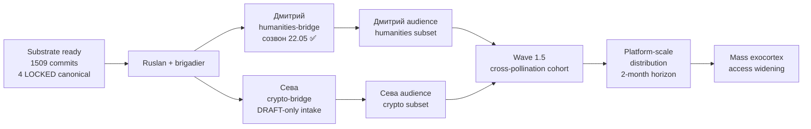

# Jetix Workshop = Exokortex

## §1 Core claim (verbatim Ruslan)

text_014 ¶: «эта мастерская блять Jetix но это по сути вот это и метод обработки информации в целом и это вот как раз самый нахуй экзокортекс который ну по сути все то же самое делает то есть ну как раз позволяет с помощью искусственного интеллекта как раз усилять ускорять себя же ну и потом в дальнейшем ну вот это еще взаимодействие на одном языке делать ну и потом вот повышать способность взаимодействия более больших систем друг с другом»

**Ontological claim:** Jetix Workshop = embodied экзокортекс (extended cognitive substrate beyond biological brain).

## §2 4 Capabilities

Per text_014 — exokortex enables:

1. **AI amplification + acceleration self** (using AI to augment own cognition)
2. **Same-language interaction** (FPF as universal protocol)
3. **Higher capability interaction между bigger systems** (cross-system bridge)
4. **Quality / speed / efficiency improvement** (compound capability gain)

## §3 Components stack

Jetix Workshop exokortex consists of:

- **Language** — FPF (72K vendored + Workshop discipline)
- **Tools** — AI substrate (Claude Code / ROY swarm / agents)
- **Repository** — wiki/ + Phase 0 inventory + decisions/
- **Protocols** — FPF 8-layer interaction (per Platform v2 §4)
- **Methodology** — Method of Systems Thinking (sibling concept) + Recursive Engine
- **Substrate** — Workshop (physical Berlin + virtual Cloud Cowork + Ethereum overlay)

## §4 Theoretical lineage (extended mind)

- **Andy Clark + David Chalmers** «The Extended Mind» (1998) — extended cognition thesis (mind beyond skull boundary)
- **Andy Clark** «Natural-Born Cyborgs» (2003) + «Supersizing the Mind» (2008)
- **Doug Engelbart** «Augmenting Human Intellect» (1962) — H-LAM/T = exokortex prototype (Human + Language + Artefacts + Methodology + Training)
- **Andrej Karpathy** «Software 2.0» + LLM-as-OS — modern AI exokortex substrate
- **Donna Haraway** «Cyborg Manifesto» (1985) — human-AI hybrid framing
- **Vernor Vinge** Singularity — exokortex acceleration trajectory
- **Hofstadter** «I am a Strange Loop» — consciousness-as-loop applicable к exokortex-self-loop

## §5 Implications

- **Education Layer** = exokortex training (Tier 1 = foundational; Tier 4 = mastery)
- **Outreach** = exokortex-equipped partner finding
- **Hackathons** = exokortex-augmented project execution
- **Recursive Engine** = exokortex-driven self-development cycle
- **System Merger Protocol** = inter-exokortex bridge (FPF mediation)

## §6 IP-1 boundary (CRITICAL)

**Exokortex = substrate; humans = decision actors.**

- Pattern: abstract method (U.MethodDescription)
- Instances: bound к executors (humans + AI agents per RUSLAN-LAYER)
- NOT autonomous self-modifying AI
- NEVER substitution для human judgment

Foundation Pillar C Tier 2 rule 9 («AI does NOT self-modify at runtime») = STRICT preserved.

## §7 Risks

1. **Dependence risk** — atrophy of unaugmented cognitive capabilities
2. **Access asymmetry** — haves vs have-nots (R12 anti-extraction concern)
3. **Sovereignty** — whose exokortex? (governance + audit trail mandatory)
4. **Crypto-tribe perception** — Ethereum substrate framing may alienate non-tech audiences
5. **«Cyborg» reception** — Haraway framing too philosophical for some L2/L3 partners

## §8 Falsifiers / test designs

- **10x speedup hypothesis** — measure cognitive throughput pre/post exokortex equip (per text_014 «ускорять себя в тысячу раз»)
- **Same-language interaction test** — previously-impossible collaboration enabled
- **Quality improvement measurable** — output quality metrics over time
- **Sovereignty / R12 alignment audit** — annual review
- **Dependence reversibility test** — can users operate без exokortex после 6mo use?

## §9 Status

**RUSLAN-ACKED-2026-05-19** — Tier A wiki promotion. Phase 0 inventory O-56.

**Possible Strategic Insight H-candidate** (Octagon → Nonagon transition? — alternative к H9 System Merger candidate). Surface via AWAITING-APPROVAL packet когда applicable.

**Cross-link к H8 Trust Infrastructure** — exokortex requires trust substrate.

---

*Promoted 2026-05-19 per Ruslan ack. R1 surface (text_014 verbatim) + R6 + R12 + IP-1 STRICT + append-only. Critical ontological claim для positioning.*

---

## §APPEND-2026-05-22-O-106-desire-to-live-info-valve

**Voice anchor:** audio_709 batch-9 (2026-05-20 11:39) Ruslan voice verbatim.

**Statement (O-106):** «desire-to-live = primary info-valve» — желание жить = главный клапан обработки информации в exocortex-augmented system.

### §A Что это значит

Exocortex усиливает intellect, но direction усиления зависит от base motivation системы. Если desire-to-live низкое (apathetic / nihilistic / suicidal frame) — никакое количество exocortex amplification не приведёт к growth. Info processing stagnates / dissociates.

Если desire-to-live высокое (engaged / curious / want-to-flourish frame) — exocortex amplification compound'ится в meaningful growth.

### §B Cross-cite

- Method V2 Phase 3 (self-development orientation + motivational dynamics) — connects к Carol Dweck growth mindset + Csikszentmihalyi flow
- Method V2 Phase 4 (information consumption process) — desire-to-live regulates what information system accepts vs rejects
- audio_709 verbatim text: «процесс жизни это процесс потребления информации» — life ≡ information processing; gated by desire-to-live

### §C Implication для Jetix-как-exocortex

- Pre-condition для useful exocortex augmentation: user's intact desire-to-live
- Workshop intake → screening для motivational alignment (R12 paired-frame voluntary opt-in already does this naturally)
- AP-6 dissent preserved: «жизнь как тягучка» (audio_709 alternative phrasing — captures duality of motivation)
- Не R12-violating to filter — это exclusion для protection users которые need other interventions first (medical / psychological / spiritual)

### §D Promotion history

- 2026-05-20 batch-9: Surfaced as O-106 (Tier B pool entry; ⭐ candidate)
- 2026-05-22: **Ruslan R1 ack** TA-1 → §APPEND here (not standalone wiki; integrates с exokortex foundation)

[src: audio_709 + Method V2 Phase 3 §D + REFLECTION-INBOX §APPEND-2026-05-22-Ruslan-ACK-batch-consolidated]

---

## §APPEND-2026-05-22-batch-10-supplement — O-128 reinforcement: exocortex = institutionalised external managing system

Per Ruslan R1 ack 2026-05-22 voice «макать всё в Википедию + append тоже ебаш». Этот append reinforces exocortex articulation с cybernetic-grounding from audio_721 (O-128).

### §A Reinforcement claim

**Statement (audio_721 claim 5, 12):** «система не может сама себя сам сама собой же адекватно управлять то есть ей должен у этой системы должна быть другая управляющая система которая вот видит возможно больше ну или чуть в другом направлении… в управлении Jetix должна быть похожая ситуация. И как раз это решает вопрос того, что система не может адекватно вокруг себя все видеть»

**Reinforcement interpretation:** exocortex (Jetix-as-exocortex per main wiki) ≡ **institutionalised external managing system** на substrate-level. Не replacement for human brain; не isolated computational extension; а structural implementation cybernetic principle что system cannot self-manage adequately from inside.

### §B Cybernetic grounding (Ashby / Beer / Meadows)

Exocortex articulation gets direct theoretical lineage:
- **Ashby Requisite Variety (1956)** — main system limited variety; exocortex supplies variety for blind-spot states
- **Beer Viable System Model (1972)** — exocortex = System 4 (intelligence/scanning) + System 5 (policy/identity) functional layer
- **Meadows feedback-from-outside (2008)** — exocortex = privileged outsider perspective on leverage points main system can't see
- **Sutton-Barto actor-critic** — exocortex = critic (improves actor's policy via external feedback)
- **Karpathy teacher-student distillation** — direct AI/ML analogue (exocortex = teacher; biological brain = student in some directions; pair-dynamic см. [[student-teacher-pair-dynamic]])

Canonical theoretical articulation: [[external-system-cybernetic-principle]] (Tier A standalone created same batch — Phase 2).

### §C Connection к unified Jetix stack (O-129)

Per [[unified-framework-jetix-stack]] §1 stack visualisation — exocortex spans:
- L3 (substrate) — blockchain enforcement of R12 external-system anti-extraction
- L4 (operations) — company-as-code git-driven external-feedback transparency
- L5 (personal) — life-as-system-as-code self-application of external-observer pattern

= exocortex не single-layer; institutionalisation spans 3 layers of unified stack.

### §D Operationalisation: dynamic role-swap

Audio_721 claim 9-12 sequential expert-rotation (psychologist → sales-teacher → next expert) = **operational protocol** для exocortex usage. Каждый expert = temporally-bounded external managing system; exocortex aggregates / sequences these:
- Phase 1: psych-expert as external observer → main system gains psych capacity
- Phase 2: sales-expert as external observer → main system gains sales capacity
- Phase N: AI commoditisation (L16 adjacency) → many cheap external systems available → mass-applicability

Canonical relational operationalisation: [[student-teacher-pair-dynamic]] (Tier A standalone created same batch — Phase 4).

### §E R12 anti-extraction reinforcement

Exocortex as institutionalised external managing system **must NOT extract value beyond agreed share** (R12 LOCK). Reinforcement:
- Voluntary opt-in clause: «партнёры более прошарены / более ответственны» (audio_721 claim 8) = competence-based selection, not coercion
- Fork-and-leave preserved: user can switch exocortex / external system any time
- Role-swap clause: same person teacher в одном domain → student в другом → reciprocity baked in

⚠️ Pitch-material soften discipline applied (per [[external-system-cybernetic-principle]] §6 HR flags): «партнёры берут управление» → «partners with relevant expertise lead в своём domain».

### §F Cross-links to sibling Tier A wikis (batch-10)

- [[external-system-cybernetic-principle]] — parent cybernetic principle (Phase 2 same batch)
- [[student-teacher-pair-dynamic]] — relational operationalisation (Phase 4 same batch)
- [[meta-method-8-component-composition]] — exocortex amplifies components 9-12 state-overlay (Phase 1 same batch)
- [[frankenstein-method-collection]] — Frankenstein method-arsenal optimally usable via exocortex transmission channel (Phase 3 same batch)
- [[unified-framework-jetix-stack]] — exocortex spans L3-L5 of 5-layer Jetix stack (Phase 5 same batch)

### §G Promotion history append

- **2026-05-22 batch-10-supplement:** O-128 surfaced as Tier B supplement primary entry (audio_721)
- **2026-05-22 batch-10 closure:** Ruslan R1 ack «макать всё + append тоже ебаш» → этот §APPEND created + [[external-system-cybernetic-principle]] Tier A standalone created
- **Research pool trigger:** DR-40 ⭐ External-system cybernetic benchmarks (Ashby/Beer/Meadows/Sutton-Barto/Karpathy/Polanyi/Vygotsky) — Ruslan ack pending для launch

[src: audio_721 claim 5, 6, 8, 9-12 (batch-10-supplement 2026-05-22 12:11); `reports/voice-pipeline-2026-05-22-batch-10/05-candidates-3-buckets.md` O-128 ⭐⭐⭐; `prompts/wiki-promotions-batch-10-2026-05-22.md` Phase 6 §APPEND reinforcement target]

---

## §APPEND-2026-05-23-batch-12-O-157 — Distribution layer: Дмитрий + Сева first-cohort sequencing

Per Ruslan R1 ack-all 2026-05-23 voice «все D12-* в Википедию». Этот append extends exocortex articulation с **distribution-layer operationalisation** — concrete sequencing для первой cohort distribution.

### §H Distribution sequence (audio_730 batch-12-quick claims 4+5+8+9+10)

**Voice anchor verbatim:**
> «потом берется вот первые люди как раз из их аудитории да вот это сева плюс дмитрий … берется вот это их аудитория ну и с этой же аудитория идет как раз далее платформой продвигаться»

**Concrete sequence (operational):**

### §I Why this sequence matters для exocortex distribution

**Bottleneck identification:** exocortex value is not extracted via direct «product purchase»; value transfers via **embedded methodological practice** within cohort context. First-cohort therefore must combine:
- High alignment с positive target-profile ([[cohort-target-profile-ontology]] 6 dimensions)
- Existing audience через which downstream growth happens
- Mutual-trust pre-established (CRM substrate / past collaboration)

Дмитрий fits all three. Сева fits two of three (audience + alignment; trust developing).

### §J Compound с external-system principle

Per [[external-system-cybernetic-principle]] §3.3 — partnerships = role-swap external-systems. Дмитрий не recipient only; Дмитрий = external-system на determinate domains (humanities bridge; YouTube channel mastery; RU audience knowledge). Bidirectional flow:
- Jetix substrate → Дмитрий (exocortex transmission)
- Дмитрий expertise → Jetix (humanities lens на substrate refinement)

= не extraction; не replacement; pair-dynamic per [[student-teacher-pair-dynamic]] same batch-10.

### §K Notion-MVP tactical pairing

Distribution sequence requires shareable artefact format. Per [[notion-mvp-bypass-pattern]] (D12-6 batch-12-quick) — Notion-шаблон = first-cohort delivery mechanism для exocortex transmission без platform-dependency delay.

### §L R12 paired-frame check

- Distribution ≠ extraction. Each cohort member retains fork-and-leave per R12 RUSLAN-LAYER action class
- Each member's audience referral = voluntary (no commission / no pressure mechanism); members can choose не to introduce
- Wage-ratio-cap action class applies к compensation arrangements если formalised
- Charter v0 LOCKED 2026-05-12 baseline preserved

[src: audio_730 batch-12-quick claims 4+5+8+9+10 (2026-05-23 evening); CRM Дмитрий-LOCKED entry 22.05; `reports/voice-batch-12-quick-2026-05-23/02-key-ideas-pool-candidates.md` O-157 ⭐]

### §M Promotion history append

- **2026-05-23 batch-12-quick:** O-157 surfaced as Tier B pool entry (audio_730 claims 4+5+8+9+10)
- **2026-05-23 evening:** Ruslan R1 ack-all «все D12-* в Википедию» → этот §APPEND created
- **CRM operational:** O-165 Sources-inventory (Ворсик / Дмитрий / Сева) — CRM update deferred to Plan-of-Day Шаг 6 (operational artefact)

[src: Ruslan voice ack-all 2026-05-23; `prompts/point-b-compact-2026-05-23-evening.md` §7 D12-* mapping]
