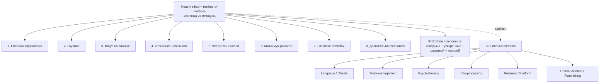

# Meta-method 8-component composition — Ruslan personal meta-method articulation

> **Canonical anchor (Ruslan voice verbatim, audio_719 batch-10 2026-05-22 10:19):**
>
> «когда я выбирал этот метод, я какой выбрал и зафиксировал? Зафиксировал вот как раз самую ебейшую проработку, самую сука глубокую, настройку только на важных делах и отсечение всего неважного. полная честность с собой максимальное вообще использование рычагов этот развитие системы и так далее изучение досконально система чтобы понимать как именно она работает чтобы можно было хорошо понимать как и улучшить какие там у нее есть части узкие горлышки и так далее элементарно»
>
> Tier A standalone — explicit 8+ component list articulation of meta-method (level-3 «метод выбора методов»). Self-described «солянка из методов» — Frankenstein assembly из sub-domain methods + personal-method core.

---

## §1 Что это

Explicit articulation **8+ component composition** того meta-method, который Ruslan выбрал и зафиксировал. Это не abstract definition meta-method (см. [[method-method-one-liner]] для one-liner), а **конкретный personal-method**, который Ruslan воплощает и применяет к sub-domain методам (language / Claude / team-management / psychotherapy / info-processing / business / platform / communication / company / fundraising).

**Distillation 8 core components (audio_719 claim 1, 4, 6):**

1. **Самая ебейшая проработка** — deepest possible engagement с задачей; не surface-level, не quick wins
2. **Самая глубокая** — depth over breadth; vertical drilling, не horizontal scanning
3. **Фокус на важных делах** — selection discipline; only signal, не noise
4. **Отсечение всего неважного** — active rejection of low-value paths; saying no
5. **Полная честность с собой** — radical self-honesty; no comforting illusions ([[honesty-discipline-meta]])
6. **Максимальное использование рычагов** — leverage-maximisation; identify and pull biggest leverage points
7. **Развитие системы** — system-development orientation; everything serves growth
8. **Досконально изучение system mechanics** — understand узкие горлышки + how/why each part works

**Extended components (audio_719 claim 4, 6 — meta-method state):**

9. **1000% голодный** — maximal hunger state; non-comfortable saturation
10. **Ускоренный** — accelerated execution tempo
11. **Развитый** — developed (capability accumulation precondition)
12. **Настрой на успех / захват / победу** — success-orientation framing (substrate verbatim; ⚠️ militarised language softened для public-facing — see §6 R-stance)

---

## §2 Почему важно

**Defining feature vs abstract meta-method articulations:**
- One-liner ([[method-method-one-liner]]) = WHAT meta-method is conceptually
- Этот wiki = HOW Ruslan's specific meta-method **выглядит operationally** (8+ explicit components)
- Без explicit composition meta-method остаётся abstract; с composition — applicable + transmittable

**Connection к larger Jetix narrative:**
- L13 Method V2 §J «Метод выбора методов» — этот composition = explicit substrate (audio_719 = primary §APPEND source per `reports/voice-pipeline-2026-05-22-batch-10/05-candidates-3-buckets.md` P1-batch-10-04)
- L14 Strategic Plan Phase 4-5 — components 1-8 = «what Ruslan brings к Workshop» substrate
- Master Packaging Step 6 «что я предлагаю» — components 1-12 = explicit offering articulation
- ⭐ **HYPOTHESIS H-batch-10-06** (audio_719 claim 11): «если у тебя достаточно количество методов в арсенале + meta-level thinking → довольно эффективно любую задачу решать / систему менять»

**Per Ruslan self-instruction (audio_719 claim 12):**
> «вот это тоже еще раз проработать зафиксировать что основное там еще расписать и это уже тоже везде надо будет ну как бы проговаривать»

= R1 pre-ack для этого wiki (substrate compile of «зафиксировать + проговаривать» instruction).

---

## §3 Use cases

### §3.1 Pitch / outreach differentiator
Concrete 8-component list = answer на «что ты конкретно предлагаешь?» — не abstract «consulting + AI», а 8 specific components composed into transmittable meta-method.

### §3.2 Curriculum module
Workshop Tier 2 (post-introduction): walk through 8 components as discrete teachable units. Each component = mini-module (e.g. «component 5 — radical honesty» = exercise + reflection + journal pattern).

### §3.3 Hiring / partner screening
Components 1-8 = vetting criteria. Candidates demonstrating «ебейшая проработка + честность с собой + максимум рычагов» = high-fit. Components 9-12 (state) = capacity/intensity proxy.

### §3.4 Self-assessment instrument
Ruslan ([[mastery-formula]] adjacent) — 8 components × 5-grade self-rating = monthly mastery audit instrument.

### §3.5 Method-composition reproducibility (Frankenstein protocol)
Other practitioners can **compose their own meta-method** using этот wiki как template:
1. List your sub-domain methods (yours = language / Claude / team / psychotherapy etc; theirs = different)
2. Identify your composition principles (Ruslan's = ебейшая proработка + честность + рычаги etc; theirs = different)
3. Assemble Frankenstein (своя солянка)
4. Apply meta-method to evolve sub-domain methods

This = **reproducibility protocol** Ruslan's meta-method-of-methods (level-4 recursion per [[unified-framework-jetix-stack]] §3.4).

---

## §4 Cross-cite substrate

| Source | Что говорит |
|---|---|
| `raw/voice-transcripts/audio_719@22-05-2026_10-19-43.txt` | Verbatim voice anchor (claim 1-12) |
| `raw/voice-memos-2026-05-22-batch/audio_719@22-05-2026_10-19-43.md` | 5-cell analysis (Cell 1 NEW idea + Cell 2 Extension + Cell 5 GAP-A19-1..7) |
| `reports/voice-pipeline-2026-05-22-batch-10/05-candidates-3-buckets.md` | O-121 ⭐⭐⭐ PRIMARY entry + P1-batch-10-04 trigger |
| `wiki/concepts/method-method-one-liner.md` | Sibling Tier A — one-liner (level-3 abstract); этот = level-3 concrete |
| `wiki/concepts/method-systems-thinking.md` | Parent meta-method (31 components broader scope); этот = 8 Ruslan-personal-overlay |
| `decisions/strategic/METHOD-LIFE-DEVELOPMENT-V2-2026-05-21.md` | L13 §J «Метод выбора методов» — §APPEND target |
| `research/levenchuk-books-distillation-2026-05-20/` | Левенчук Методология 2025 Гл. 4 «метод как объект 1-го класса» + Гл. 11 «стратегирование» |
| `wiki/concepts/jetix-as-exokortex.md` | Components 9-12 (state) — exocortex amplification precondition; см. §APPEND-2026-05-22-O-106 desire-to-live = primary info-valve |

---

## §5 Variations / interpretations

| Phrasing | Audience | Context |
|---|---|---|
| «Солянка из 8+ методов composed Ruslan-стилем» | RU primary | Ruslan voice — default |
| «Frankenstein method-collection / личный meta-method» | RU pitch | C.2 pitch deck origin-story ([[frankenstein-method-collection]]) |
| «8-component personal meta-method composition» | EN engineering | Methodology community |
| «Ruslan's method-selection composition stack» | EN academic | Philosophy of method |
| «Lichno-собранный набор подходов» | RU non-technical | Mass audience explainer |

**Default canonical:** «8+ component composition» с verbatim audio_719 claim 1 list. Frankenstein metaphor = explicit pitch-friendly framing per [[frankenstein-method-collection]].

---

## §6 Constitutional posture

- ✅ **R1 surface** — voice anchor verbatim (audio_719); brigadier scribe header only; NO strategic prose authored
- ✅ **R6 provenance** — каждый component с [src: audio_719 claim N] traceable; cross-citations inline
- ✅ **R12 anti-extraction** — meta-method = personal-method articulation, not value-extraction frame; components 1-8 = transmittable substrate (others can compose their own per §3.5); fork-and-leave preserved
- ✅ **IP-1 STRICT** — Foundation abstract concept (method-composition pattern); Ruslan's instantiation = RUSLAN-LAYER overlay; not tied к specific executor
- ✅ **EP-5 F-grade** — F4 derivative claim (canonical articulation of voice substrate)
- ✅ **AP-6 dissent preservation** — militarised language «1000% голодный / захват / победа» preserved verbatim в §1 substrate; soften discipline applied только в §5 variations (public-facing phrasings); R-batch-10 N7 flag honoured
- ✅ **Append-only** — этот файл создан NEW; existing wikis untouched ([[method-method-one-liner]] receives §APPEND extension per Phase 6)
- ⚠️ **R-batch-10 N7 flag** — «1000% голодный + захват + победа» militarised language: substrate verbatim ≠ pitch-material («focused / determined / committed» reframe per `05-candidates-3-buckets.md` HR-6-batch-10)
- ⚠️ **R-batch-10 N5 flag** — «100s-years post-me» long-horizon hubris (audio_719 claim 9): substrate-only; pitch reframe «multi-generational durability / institutional longevity»

---

## §7 Promotion history

- **2026-05-22 batch-10:** Surfaced as O-121 ⭐⭐⭐ (Tier B pool primary entry) via audio_719 voice anchor; substrate density ~800w; trigger noted «Ruslan ack promote canonical composition»
- **2026-05-22 batch-10 closure:** **Ruslan R1 ack via voice «макать всё в Википедию + Тир А ебаш»** → Tier A standalone promotion (this wiki created)
- **Predecessor pool entry:** `reports/voice-pipeline-2026-05-22-batch-10/05-candidates-3-buckets.md` A.2 row O-121
- **§APPEND target:** [[method-method-one-liner]] receives extension (О-121 + O-122 + O-124 composite) per Phase 6 wiki-promotions-batch-10

---

## §8 Related wikis

- [[method-method-one-liner]] — one-liner level-3 abstract; этот = level-3 concrete composition (sibling Tier A)
- [[method-systems-thinking]] — 31-component broader meta-method; этот = 8-component Ruslan-personal overlay
- [[frankenstein-method-collection]] — pitch-friendly metaphor for this composition (sibling Tier A batch-10)
- [[unified-framework-jetix-stack]] — etot meta-method = layer 2 of 5-layer unified stack (sibling Tier A batch-10)
- [[external-system-cybernetic-principle]] — operational extension: meta-method efficacy requires external feedback loop (sibling Tier A batch-10)
- [[student-teacher-pair-dynamic]] — pair-learning extension: meta-method transmits via teacher-student dynamic (sibling Tier A batch-10)
- [[jetix-as-exokortex]] — components 9-12 state = exocortex precondition
- [[mastery-formula]] — components 1-8 = mastery audit instrument substrate
- [[honesty-discipline-meta]] — component 5 deep-dive

---

*Tier A standalone wiki created 2026-05-22 per Ruslan R1 ack. Canonical 8+ component articulation Ruslan personal meta-method. R12 paired-frame conformant. Substrate compile only — no R1 strategic prose authored.*
