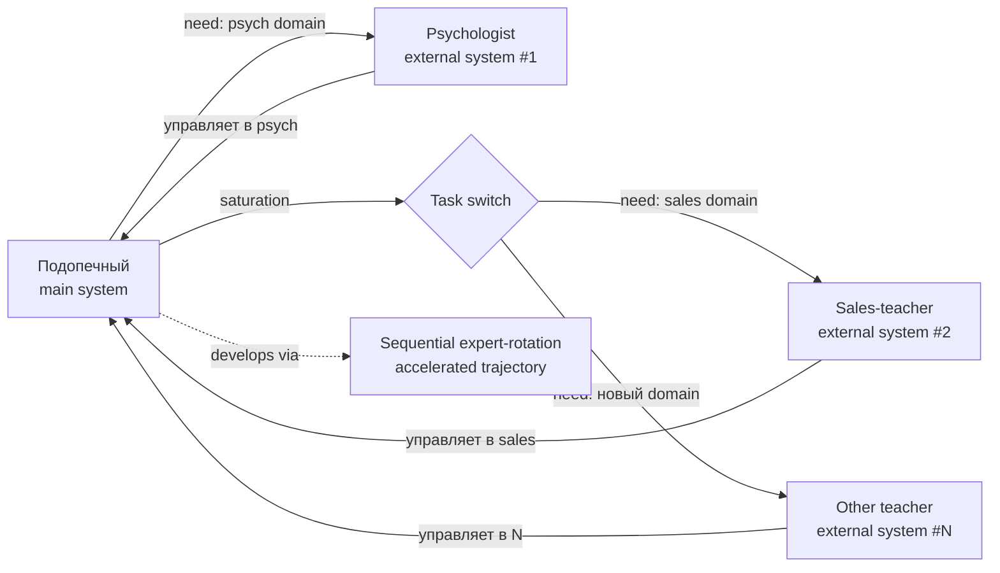

# Ученик-учитель / тренер-подопечный pair dynamic — relational learning frame

> **Canonical anchor (Ruslan voice verbatim, audio_721 batch-10-supplement 2026-05-22 12:11):**
>
> «концепция ученик и учитель, тренер и получается подопечный она работает в разы лучше в связке чем просто тренер или чем просто исполнитель»
>
> «в какой-то момент не управляет просто нужный человек ну или к это нужная другая система рабочие вот в данный момент конкретно и вот так вот она там управляет потом другая задача появляются например и уже например другая система управляет в решении той задачи»
>
> «если взять мою жизнь то это вот мы берем вариант… мне там надо был психолог чтобы непосредственно этот психологические вопросы решить… мной там вот человек более опытный управлял… потом мне надо было заработать денег… я шел к другому учителю, и он уже управлял мной в направлении денег… потом в направлении продаж и так далее»
>
> Tier A standalone — relational operationalisation of [[external-system-cybernetic-principle]] через pair-dynamic с dynamic role-swap by task-context.

---

## §1 Что это

**Принцип:** pair-dynamic «ученик-учитель / тренер-подопечный» работает **в разы лучше** чем either:
- Just trainer (без подопечного) — нет применения, нет feedback loop
- Just executor (без trainer) — нет внешнего expert input, нет ZPD push

**Three operational features (audio_721 claim 7, 9-12):**

1. **Pair > single** — relational learning beats solo learning (audio_721 claim 7)
2. **Dynamic role-swap by task-context** — управляет «нужный человек / нужная система в данный момент конкретно»; при появлении новой задачи — другая система управляет (audio_721 claim 9)
3. **Sequential expert-rotation** — Ruslan's personal life-example (audio_721 claim 10-11):
   - Phase 1: psychologist managed psychological development → Ruslan прокачался психологически
   - Phase 2: sales-teacher managed sales-development → Ruslan прокачался в продажах
   - Pattern: каждый expert ведёт в своём domain до prerequisite saturation, затем role-swap

**Connection к Jetix governance (audio_721 claim 12):**
«в управлении Jetix должна быть похожая ситуация. И как раз это решает вопрос того, что система не может адекватно вокруг себя все видеть»

= pair-dynamic = **operational solution** к self-blindspot problem ([[external-system-cybernetic-principle]] §1).

---

## §2 Почему важно

**Defining feature vs traditional mentorship / coaching frames:**
- Traditional 1:1 mentorship = fixed roles (mentor always mentor; mentee always mentee)
- Этот pattern = **dynamic role-swap by task-context** (audio_721 claim 9) — same person may be teacher в одном context + student в другом
- Pluralism baked in: не one master, а **sequence of more-knowledgeable-others** per domain

**Theoretical lineage (literature cross-cite):**

| Source | Что говорит | Direct mapping |
|---|---|---|
| **Vygotsky «Zone of Proximal Development»** | Learning happens в zone между actual + potential ability, scaffolded by more-capable other | Pair = ZPD operationalisation; teacher = scaffold |
| **Polanyi «Personal Knowledge» (1958)** | Tacit knowledge requires master-apprentice transmission, не only text | Pair-dynamic surfaces tacit knowledge transmission channel |
| **Sutton + Barto «Reinforcement Learning» actor-critic** | Critic improves actor's policy via external feedback | Teacher = critic; student = actor |
| **Karpathy teacher-student model distillation** | Larger teacher model transfers knowledge into smaller student | Direct AI/ML analogue |
| **Hersey-Blanchard Situational Leadership** | Leadership style switches by follower readiness in specific task | Direct dynamic-role-swap analogue |
| **Holacracy dynamic-role assignment** | Roles assigned by competence + task-fit, не by hierarchy | Direct organisational analogue |
| **Spotify «squads» fluid composition** | Teams reform by task-need | Direct organisational analogue |

**Connection к larger Jetix narrative:**
- L13 Method V2 §J meta-method — pair-dynamic = required operational extension; meta-method без pair ≈ meta-method без external operand
- [[external-system-cybernetic-principle]] §3.2 self-coaching protocol — это конкретное operationalisation
- L14 Strategic Plan Phase 4-6 partner-vetting cohort onboarding — pair-dynamic = baseline pattern для partner-cohort design
- Foundation Part 4 hub-and-spoke role-taxonomy — dynamic role-swap = direct structural analog
- ⭐ **HYPOTHESIS H-batch-10-supp-09:** «pair (учитель-ученик) learning rate > single learner rate AND > pure executor rate» — falsifiable hypothesis (audio_721 implicit)

---

## §3 Use cases

### §3.1 Workshop / hackathon partnering protocol
Каждый participant получает **rotating pair partner** by phase: Phase 1 — psych/clarity partner; Phase 2 — execution partner; Phase 3 — feedback partner. Не fixed mentor; rotating partner by stage need.

### §3.2 Partner-vetting cohort onboarding (Jetix L14 Phase 4-6)
Candidates joining Jetix cohort pair с someone who is **more-knowledgeable** в specific domain candidate needs; pair-relationship reassessed quarterly (role-swap if domain need shifts).

### §3.3 Self-coaching protocol
Personal-development blueprint: identify current domain bottleneck → find expert in that domain → enter pair-dynamic → reach saturation → switch domain + switch expert. Ruslan's life-example (psychologist → sales-teacher) = explicit protocol substrate.

### §3.4 Jetix-OS agent architecture analogue
Brigadier (single dispatcher per IP-1) routes task к ROY expert agent by domain-fit (engineering / investor / mgmt / philosophy / systems). Pair = task ↔ expert dynamic; next task may route к different expert. Foundation Part 4 §H hub-and-spoke = formal implementation.

### §3.5 R12 anti-extraction safeguard
Pair-dynamic structurally protects against extraction:
- Teacher does NOT capture student's future value beyond agreed scope (R12 LOCK)
- Role-swap clause: student becomes teacher в other domain → reciprocity, не one-way extraction
- Fork-and-leave preserved: student can switch expert any time (no contractual lock-in)
- ⚠️ Pitch-material soften discipline: «учитель управляет учеником» — voluntary opt-in clause + competence-based selection (per audio_721 claim 8 «более прошарены / более ответственные»)

---

## §4 Cross-cite substrate

| Source | Что говорит |
|---|---|
| `raw/voice-transcripts/audio_721@22-05-2026_12-11-58.txt` | Verbatim voice anchor (claim 7, 9-12) |
| `raw/voice-memos-2026-05-22-batch/audio_721@22-05-2026_12-11-58.md` | 5-cell analysis Cell 1 NEW idea + Cell 5 GAP-A21-3 + GAP-A21-7 (sequential expert-rotation life-example) |
| `reports/voice-pipeline-2026-05-22-batch-10/05-candidates-3-buckets.md` | O-130 ⭐⭐ Tier B supplement entry + §APPEND partnership-baseline trigger |
| `wiki/concepts/external-system-cybernetic-principle.md` | Sibling Tier A — этот = relational operationalisation |
| `wiki/concepts/method-method-one-liner.md` | Parent abstract meta-method — pair-dynamic = required operand |
| `decisions/strategic/METHOD-LIFE-DEVELOPMENT-V2-2026-05-21.md` | L13 §J meta-method — §APPEND target |
| `swarm/wiki/foundations/part-4-role-taxonomy-coordination-protocol/architecture.md` | Hub-and-spoke = formal structural analog |
| `research/method-systems-thinking-deep-2026-05-19/` | Senge 11 laws fifth-discipline pair-learning substrate |

---

## §5 Variations / interpretations

| Phrasing | Audience | Context |
|---|---|---|
| «Ученик-учитель / тренер-подопечный pair > single» | RU primary verbatim | Ruslan voice — default |
| «Student-teacher pair-dynamic с role-swap» | EN engineering | Methodology / Vygotsky frame |
| «ZPD-scaffolded pair learning» | EN academic | Education research |
| «Dynamic mentorship / sequential expert-rotation» | EN business | Coaching / corporate L&D |
| «Pair-coaching pattern» | EN softened | Pitch material — non-academic |
| «Парная динамика обучения с динамической ротацией» | RU softened | Mass audience |

**Default canonical:** Ruslan voice verbatim + Vygotsky ZPD cross-cite + sequential expert-rotation life-example.

---

## §6 Constitutional posture

- ✅ **R1 surface** — voice anchor verbatim (audio_721 claim 7, 9-12); brigadier scribe header + literature cross-cite only; NO strategic prose authored
- ✅ **R6 provenance** — каждый claim с [src: audio_721 claim N] + Vygotsky/Polanyi/Sutton-Barto/Karpathy citation
- ✅ **R12 anti-extraction** — pair-dynamic structurally R12-conformant per §3.5: role-swap clause + reciprocity + fork-and-leave preserved; voluntary opt-in mandatory для public-facing
- ✅ **IP-1 STRICT** — pair-pattern = Foundation abstract role-pair; specific executor binding (Ruslan ↔ specific psychologist; Ruslan ↔ specific sales-teacher) = RUSLAN-LAYER instantiation
- ✅ **EP-5 F-grade** — F4 derivative claim (voice substrate + 7-source literature corroboration)
- ✅ **AP-6 dissent preservation** — universal-claim form «в разы лучше» preserved verbatim в §1; soften discipline в §5 variations для public-facing
- ⚠️ **HR-1-supp flag inherited from O-128** — «учитель управляет учеником» extraction-risk: substrate verbatim; pitch reframe «partner with relevant expertise leads в своём domain»; voluntary opt-in clause mandatory
- ✅ **Append-only** — этот файл NEW; sibling [[external-system-cybernetic-principle]] untouched (created Phase 2)

---

## §7 Promotion history

- **2026-05-22 batch-10-supplement:** Surfaced as O-130 ⭐⭐ (Tier B supplement pool) via audio_721 voice anchor; substrate density ~500w; trigger noted «Ruslan ack promote relational learning frame»
- **2026-05-22 batch-10 closure:** **Ruslan R1 ack via voice «макать всё в Википедию + Тир А ебаш»** → Tier A standalone promotion (this wiki created)
- **Predecessor pool entry:** `reports/voice-pipeline-2026-05-22-batch-10/05-candidates-3-buckets.md` A.2-supp row O-130
- **Sibling Tier A creation context:** [[external-system-cybernetic-principle]] (Phase 2 same batch) — этот = relational operationalisation
- **Research pool trigger:** DR-41 «Dynamic expert-rotation by task-context benchmarks» (Vygotsky ZPD / agile / Holacracy / Spotify squads / Hersey-Blanchard) — Ruslan ack required для launch

---

## §8 Related wikis

- [[external-system-cybernetic-principle]] — parent cybernetic principle; этот = relational operationalisation (sibling Tier A batch-10)
- [[meta-method-8-component-composition]] — 8-component meta-method; этот = transmission channel для composition (sibling Tier A batch-10)
- [[frankenstein-method-collection]] — Frankenstein assembly metaphor; pair-dynamic = transmission protocol для Frankenstein method-arsenal (sibling Tier A batch-10)
- [[unified-framework-jetix-stack]] — pair-dynamic = layer 4 of 5-layer unified stack (sibling Tier A batch-10)
- [[method-method-one-liner]] — abstract one-liner parent; receives §APPEND Phase 6
- [[jetix-as-exokortex]] — exocortex = institutionalised pair-partner (substrate-level)
- [[korporaciya-startup-concept]] — Jetix governance operational application
- [[mastery-formula]] — adjacent mastery-trajectory through expert-rotation

---

*Tier A standalone wiki created 2026-05-22 per Ruslan R1 ack. Pair-dynamic articulated by Ruslan voice + Vygotsky ZPD / Sutton-Barto actor-critic / Polanyi tacit-knowledge cross-cite. R12 paired-frame conformant via role-swap reciprocity + voluntary opt-in. Substrate compile only — no R1 strategic prose authored.*
