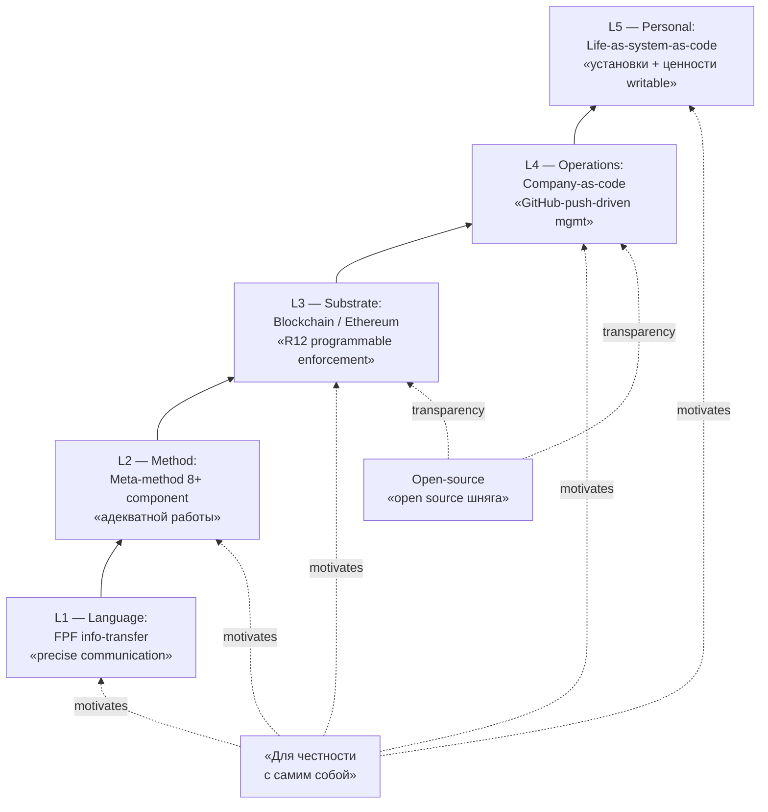

# Unified framework — Jetix stack

> **Canonical anchor (Ruslan voice verbatim, audio_721 batch-10-supplement 2026-05-22 12:11):**
>
> «для честности с самим собой и вот как раз это будет объединено и получается и fpf язык и вот этот метод адекватной работы и блокчейн и непосредственно вот это компания с и код и потом в целом подход к своей жизни тоже вот как к системе и как к коду»
>
> «можно будет прям себе писать установки себе писать там какие-то правила принципы ценности и так далее и что соответственно платформа тоже будет но вот компания как код да там но вот как то развиваться с нотки лет open source шняга»
>
> Tier A standalone — explicit unification of 5 prior thread'ов в single integrated framework / Jetix stack.

---

## §1 Что это

**Unified Jetix framework / stack** = explicit Ruslan articulation объединения 5 ранее разрозненных threads в **single integrated framework**:

| Layer | Component | Role в stack |
|---|---|---|
| **L1 — Language** | **FPF (Functional Programming Foundations)** | Info-transfer vocabulary; precise communication protocol |
| **L2 — Method** | **Meta-method «адекватной работы»** | 8+ component composition ([[meta-method-8-component-composition]]); how-to-work-on-anything |
| **L3 — Substrate** | **Blockchain / Ethereum** | Trust + R12 enforcement + open transparency layer (Pillar C Tier 2 R12 RUSLAN-LAYER programmable) |
| **L4 — Operations** | **Company-as-code** | Git-driven management; «писать компанию + управлять через пуши на GitHub» (audio_721 claim 1) |
| **L5 — Personal** | **Life-as-system-as-code** | Personal принципы / ценности / установки writable as code; recursive self-application |

**Two ratio'нальные axes (audio_721 claim 2 explicit):**
- **«Для честности с самим собой»** — primary motivating frame (no self-deception; recursive self-honesty); ref [[honesty-discipline-meta]]
- **«Это будет объединено»** — unification claim: not 5 separate frameworks, а **one integrated stack**

**Open-source platform clause (audio_721 claim 3):**
- Platform itself = company-as-code instance
- «Open source шняга» — public substrate; transparent + forkable per R12 fork-and-leave preservation

---

## §2 Почему важно

**Defining feature vs prior fragmented articulations:**
- Previously: FPF + meta-method + blockchain + company-as-code + life-as-system-as-code = 5 **separate** threads
- Сейчас: explicit unification claim («объединено… получается») = **single framework articulation**
- Substrate для Master Packaging Step 6 «вижу как» = explicit answer to «what is Jetix as a whole?»

**Connection к larger Jetix narrative:**
- **North Star fragment candidate** — unified framework articulation = candidate Pillar A North Star content (Ruslan R1 authorship required per FUNDAMENTAL §6.1 rule 1; этот wiki = brigadier-scribe substrate-compile only)
- **L13 Method V2 §J meta-method** — L2 of stack
- **L15 Economic Model V10 LOCK** — L3 blockchain layer + L4 company-as-code anchor (V10 triple-role NFT pattern aligns; NOT challenging LOCK)
- **KM MVP partD-company-as-code.md** — L4 explicit substrate
- **C.2 Pitch deck** — 5-layer stack visualisation = explicit «what we sell + how it composes»
- **FPF Constitutional Spec** — L1 language layer constitutional grounding

**Two-level reading:**
- **Technical reader:** stack = composition pattern; each layer has clear interface к layer above/below
- **Non-technical reader:** stack = «всё это одно целое»; entry point = personal (L5) → operational (L4) → trust (L3) → method (L2) → language (L1)

**⭐ HYPOTHESIS implicit (audio_721 claim 2):**
«Each layer independently useful; full stack = compound value > sum of parts». Falsifiable via Workshop adoption metrics (cohort using subset vs full stack).

---

## §3 Use cases

### §3.1 Pitch deck / Master Packaging Step 6 substrate
C.2 pitch deck slide «5-layer Jetix stack» — visualisation per §1 table + mermaid. Каждый layer = mini-slide deep-dive. Stack-pattern beats 5-separate-products framing.

### §3.2 Workshop curriculum module-map
Workshop modules align с layers:
- Module 1 (L1 FPF) — language / communication protocol
- Module 2 (L2 meta-method) — Frankenstein / 8-component composition ([[meta-method-8-component-composition]] + [[frankenstein-method-collection]])
- Module 3 (L3 blockchain) — trust + R12 enforcement / governance
- Module 4 (L4 company-as-code) — git-driven ops
- Module 5 (L5 life-as-system-as-code) — personal application

### §3.3 Partner-vetting screening criteria
Candidates demonstrating fit across multiple layers = higher cohort-fit. Filter «layer-fluency profile» = adjacency для [[student-teacher-pair-dynamic]] role-pairing.

### §3.4 Recursive 4-layer meta-method depth marker
Audio_721 claim 14 «подход к выбору подхода для разработки подхода» = recursive structure встроен в stack:
- L2 method = level 1 (work)
- Meta-method-of-methods = level 2 (method selection)
- Meta-method-of-meta-method = level 3 (selection-criterion choice)
- This stack = level 4 (framework-of-framework — how layers compose)

Stack ↔ recursive depth coupling — sibling articulation [[meta-method-8-component-composition]] §3.5 «reproducibility protocol».

### §3.5 R12 anti-extraction structural check
Each layer audited per R12:
- L1 FPF — open vocabulary (no rent on language); fork-and-leave preserved
- L2 meta-method — transmittable composition principles (anyone can compose свой); not Ruslan-monopoly
- L3 blockchain — programmable R12 enforcement (Pillar C Tier 2 RUSLAN-LAYER ack 2026-05-18)
- L4 company-as-code — git-transparent operations; auditable extraction-check
- L5 life-as-system-as-code — personal application; per-user; no extraction surface

Full stack = R12-conformant by design (per audio_721 claim 1, 3 + L15 Economic Model V10 LOCK alignment).

---

## §4 Cross-cite substrate

| Source | Что говорит |
|---|---|
| `raw/voice-transcripts/audio_721@22-05-2026_12-11-58.txt` | Verbatim voice anchor (claim 1, 2, 3) |
| `raw/voice-memos-2026-05-22-batch/audio_721@22-05-2026_12-11-58.md` | 5-cell analysis Cell 1 NEW idea + Cell 5 GAP-A21-2 (unification substrate for Master Packaging Step 6) |
| `reports/voice-pipeline-2026-05-22-batch-10/05-candidates-3-buckets.md` | O-129 ⭐⭐ Tier B supplement entry + NDP-supp-2 (Ruslan-authored canonical placeholder) |
| `wiki/concepts/meta-method-8-component-composition.md` | L2 — sibling Tier A operational substrate |
| `wiki/concepts/external-system-cybernetic-principle.md` | L4-L5 governance principle (sibling Tier A batch-10) |
| `wiki/concepts/jetix-on-ethereum.md` | L3 — blockchain layer wiki |
| `wiki/concepts/fpf-as-info-transfer-vocabulary.md` | L1 — FPF wiki |
| `decisions/strategic/METHOD-LIFE-DEVELOPMENT-V2-2026-05-21.md` | L2 + L5 — L13 §J + §H §APPEND target |
| `swarm/wiki/designs/T-km-materialization-mvp-2026-04-24/partD-company-as-code.md` | L4 — KM MVP company-as-code authoritative |
| `decisions/strategic/ECON-MODEL-V10-HYBRID-2026-05-18.md` | L3 LOCK substrate (NOT challenging) |
| `design/JETIX-FPF.md` | L1 — FPF Constitutional Spec (FPF-Steward governed) |
| `.claude/config/default-deny-table.yaml` | L3 — R12 RUSLAN-LAYER programmable action classes |

---

## §5 Variations / interpretations

| Phrasing | Audience | Context |
|---|---|---|
| «FPF + meta-method + blockchain + company-as-code + life-as-system-as-code — всё это объединено» | RU primary verbatim | Ruslan voice — default |
| «5-layer Jetix unified stack» | EN engineering | Pitch / documentation |
| «Integrated Jetix framework» | EN pitch | C.2 pitch deck |
| «Language / method / substrate / ops / personal stack» | EN technical | Layer-mapping shorthand |
| «Единый Jetix-фреймворк (5 слоёв)» | RU pitch | Mass audience |
| «Stack of complementary tools: FPF, meta-method, Ethereum, GitHub-ops, personal-code» | EN technical breakdown | Developer audience |

**Default canonical:** Ruslan voice verbatim + 5-layer stack visualisation per §1 table.

---

## §6 Constitutional posture

- ✅ **R1 surface** — voice anchor verbatim (audio_721 claim 1-3); brigadier scribe header + stack-visualisation compile only; NO strategic prose authored
- ✅ **R6 provenance** — каждый layer + claim с [src: audio_721 claim N] + cross-cite к существующим wikis traceable
- ✅ **R12 anti-extraction** — full-stack R12 audit per §3.5; каждый layer R12-conformant by design; open-source clause (audio_721 claim 3) embeds transparency / fork-and-leave structurally
- ✅ **IP-1 STRICT** — stack = Foundation framework pattern; specific executor bindings (FPF-Steward / Ruslan-as-Ethereum-actor / specific GitHub repo) = RUSLAN-LAYER instantiation
- ✅ **EP-5 F-grade** — F4 derivative claim (voice substrate + 5-source layer cross-cite)
- ✅ **AP-6 dissent preservation** — voice form «объединено… получается» preserved verbatim в §1 substrate; variations в §5 для public-facing
- ⚠️ **R1 strategic-prose risk** — North Star fragment candidate (per §2): этот wiki = brigadier substrate compile only; **NDP-supp-2** placeholder `decisions/strategic/UNIFIED-FRAMEWORK-2026-05-22.md` Ruslan-authored canonical NOT yet created (Ruslan R1 authorship requirement per FUNDAMENTAL §6.1 rule 1)
- ✅ **Append-only** — этот файл NEW; sibling Tier A wikis untouched; FPF L1 spec untouched; V10 LOCK preserved
- ✅ **L15 V10 LOCK preserved** — L3 blockchain layer alignment с V10 triple-role NFT pattern; NOT challenging LOCK

---

## §7 Promotion history

- **2026-05-22 batch-10-supplement:** Surfaced as O-129 ⭐⭐ (Tier B supplement pool) via audio_721 voice anchor; substrate density ~400w; trigger noted «Ruslan ack promote unified framework как North Star fragment»
- **2026-05-22 batch-10 closure:** **Ruslan R1 ack via voice «макать всё в Википедию + Тир А ебаш»** → Tier A standalone promotion (this wiki created)
- **Predecessor pool entry:** `reports/voice-pipeline-2026-05-22-batch-10/05-candidates-3-buckets.md` A.2-supp row O-129
- **NDP-supp-2 still pending:** `decisions/strategic/UNIFIED-FRAMEWORK-2026-05-22.md` Ruslan-authored canonical (R1 prose; этот wiki ≠ replacement; brigadier substrate compile only)
- **Sibling Tier A creation context:** Phase 1 + Phase 2 + Phase 3 + Phase 4 (этот = Phase 5 same batch) — все 5 sibling Tier A wikis cross-link к этому stack-articulation

---

## §8 Related wikis

- **L1 — FPF:** [[fpf-as-info-transfer-vocabulary]] — language layer
- **L2 — Method:** [[meta-method-8-component-composition]] — 8+ component meta-method (sibling Tier A batch-10); [[frankenstein-method-collection]] — pitch-friendly metaphor (sibling Tier A batch-10); [[method-method-one-liner]] — abstract one-liner; [[method-systems-thinking]] — broader 31-component substrate
- **L3 — Substrate:** [[jetix-on-ethereum]] — blockchain layer; [[jetix-as-exokortex]] — exocortex extension
- **L4 — Operations:** [[korporaciya-startup-concept]] — company-as-code instantiation
- **L5 — Personal:** [[honesty-discipline-meta]] — recursive self-honesty motivation; [[mastery-formula]] — adjacent mastery state articulation
- **Operational extensions:** [[external-system-cybernetic-principle]] — required external operand для L2 (sibling Tier A batch-10); [[student-teacher-pair-dynamic]] — relational transmission protocol (sibling Tier A batch-10)
- **Governance:** [[competitive-landscape-jetix-vs-plurality]] — adjacency landscape; [[digital-sovereignty]] — broader positioning

---

*Tier A standalone wiki created 2026-05-22 per Ruslan R1 ack. 5-layer Jetix unified stack articulation from audio_721 voice anchor. R12 paired-frame conformant per per-layer audit + open-source structural clause. NDP-supp-2 Ruslan-authored canonical still pending. Substrate compile only — no R1 strategic prose authored.*
